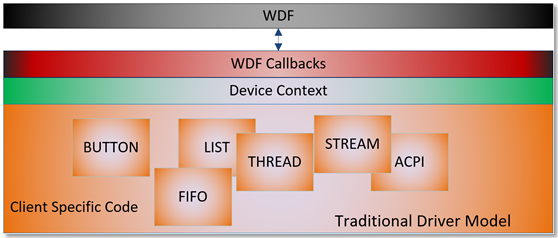
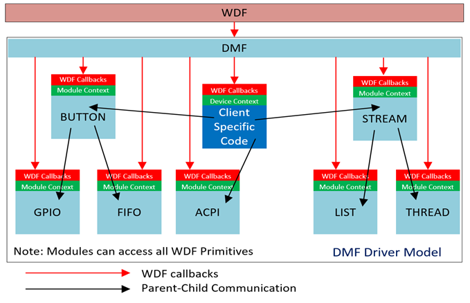

# Driver Module Framework (DMF)

Contents
========

[What is the Driver Module Framework (DMF)?](#what-is-the-driver-module-framework-dmf)

&nbsp;&nbsp;&nbsp;&nbsp;&nbsp;&nbsp;[Goals of DMF](#goals-of-dmf)

&nbsp;&nbsp;&nbsp;&nbsp;&nbsp;&nbsp;[How does DMF Achieve the Above Goals?](#how-does-dmf-achieve-the-above-goals)

[How DMF Works in a Client Driver](#how-dmf-works-in-a-client-driver)

&nbsp;&nbsp;&nbsp;&nbsp;&nbsp;&nbsp;[Differences between a DMF driver and a traditional (non-DMF) Driver.](#differences-between-a-dmf-driver-and-a-traditional-non-dmf-driver.)

&nbsp;&nbsp;&nbsp;&nbsp;&nbsp;&nbsp;&nbsp;&nbsp;&nbsp;&nbsp;&nbsp;&nbsp;[Traditional Driver](#traditional-driver)

&nbsp;&nbsp;&nbsp;&nbsp;&nbsp;&nbsp;&nbsp;&nbsp;&nbsp;&nbsp;&nbsp;&nbsp;[DMF Driver](#dmf-driver)

&nbsp;&nbsp;&nbsp;&nbsp;&nbsp;&nbsp;&nbsp;&nbsp;&nbsp;&nbsp;&nbsp;&nbsp;[Differences](#differences)

&nbsp;&nbsp;&nbsp;&nbsp;&nbsp;&nbsp;[DMF Container Driver](#dmf-container-driver)

&nbsp;&nbsp;&nbsp;&nbsp;&nbsp;&nbsp;[DMF Non-Container Driver](#dmf-non-container-driver)

&nbsp;&nbsp;&nbsp;&nbsp;&nbsp;&nbsp;[Examples of Modules](#examples-of-modules)

&nbsp;&nbsp;&nbsp;&nbsp;&nbsp;&nbsp;&nbsp;&nbsp;&nbsp;&nbsp;&nbsp;&nbsp;[Buffers](#buffers)

&nbsp;&nbsp;&nbsp;&nbsp;&nbsp;&nbsp;&nbsp;&nbsp;&nbsp;&nbsp;&nbsp;&nbsp;[Data Structures](#data-structures)

&nbsp;&nbsp;&nbsp;&nbsp;&nbsp;&nbsp;&nbsp;&nbsp;&nbsp;&nbsp;&nbsp;&nbsp;[Task Execution](#task-execution)

&nbsp;&nbsp;&nbsp;&nbsp;&nbsp;&nbsp;&nbsp;&nbsp;&nbsp;&nbsp;&nbsp;&nbsp;[Targets](#targets)

&nbsp;&nbsp;&nbsp;&nbsp;&nbsp;&nbsp;&nbsp;&nbsp;&nbsp;&nbsp;&nbsp;&nbsp;[User Notification](#user-notification)

&nbsp;&nbsp;&nbsp;&nbsp;&nbsp;&nbsp;&nbsp;&nbsp;&nbsp;&nbsp;&nbsp;&nbsp;[Driver Patterns](#driver-patterns)

&nbsp;&nbsp;&nbsp;&nbsp;&nbsp;&nbsp;[Properties of Modules](#properties-of-modules)

&nbsp;&nbsp;&nbsp;&nbsp;&nbsp;&nbsp;&nbsp;&nbsp;&nbsp;&nbsp;&nbsp;&nbsp;[DMFMODULE is of type WDFOBJECT](#dmfmodule-is-of-type-wdfobject)

&nbsp;&nbsp;&nbsp;&nbsp;&nbsp;&nbsp;&nbsp;&nbsp;&nbsp;&nbsp;&nbsp;&nbsp;[Module is Object Oriented](#module-is-object-oriented)

&nbsp;&nbsp;&nbsp;&nbsp;&nbsp;&nbsp;&nbsp;&nbsp;&nbsp;&nbsp;&nbsp;&nbsp;[Modules Have a Predefined life cycle](#modules-have-a-predefined-lifecyle)

&nbsp;&nbsp;&nbsp;&nbsp;&nbsp;&nbsp;&nbsp;&nbsp;&nbsp;&nbsp;&nbsp;&nbsp;[Modules Have a Hierarchy](#modules-have-a-hierarchy)

&nbsp;&nbsp;&nbsp;&nbsp;&nbsp;&nbsp;&nbsp;&nbsp;&nbsp;&nbsp;&nbsp;&nbsp;[Properties of Modules](#properties-of-modules-1)

&nbsp;&nbsp;&nbsp;&nbsp;&nbsp;&nbsp;[Properties of a DMF Driver](#properties-of-a-dmf-driver)

&nbsp;&nbsp;&nbsp;&nbsp;&nbsp;&nbsp;[Using DMF in an Existing Driver or a Driver that has a DeviceAdd callback](#using-dmf-in-an-existing-driver-or-a-driver-that-has-a-deviceadd-callback)

&nbsp;&nbsp;&nbsp;&nbsp;&nbsp;&nbsp;&nbsp;&nbsp;&nbsp;&nbsp;&nbsp;&nbsp;[Hook DMF into the driver.](#hook-dmf-into-the-driver.)

&nbsp;&nbsp;&nbsp;&nbsp;&nbsp;&nbsp;&nbsp;&nbsp;&nbsp;&nbsp;&nbsp;&nbsp;[Initialize DMF](#initialize-dmf)

&nbsp;&nbsp;&nbsp;&nbsp;&nbsp;&nbsp;[Using DMF in a Driver That Does Not Have a DeviceAdd callback](#using-dmf-in-a-driver-that-does-not-have-a-deviceadd-callback)

&nbsp;&nbsp;&nbsp;&nbsp;&nbsp;&nbsp;[Instantiating DMF Modules](#instantiating-dmf-modules)

&nbsp;&nbsp;&nbsp;&nbsp;&nbsp;&nbsp;[Instantiating Dynamic Modules](#instantiating-dynamic-modules)

&nbsp;&nbsp;&nbsp;&nbsp;&nbsp;&nbsp;&nbsp;&nbsp;&nbsp;&nbsp;&nbsp;&nbsp;[Synchronous Dynamic Instantiation](#synchronous-dynamic-instantiation)

&nbsp;&nbsp;&nbsp;&nbsp;&nbsp;&nbsp;&nbsp;&nbsp;&nbsp;&nbsp;&nbsp;&nbsp;[Asynchronous Notification Dynamic Instantiation](#asynchronous-notification-dynamic-instantiation)

&nbsp;&nbsp;&nbsp;&nbsp;&nbsp;&nbsp;&nbsp;&nbsp;&nbsp;&nbsp;&nbsp;&nbsp;[Destroying a Dynamic Module](#destroying-a-dynamic-module)

&nbsp;&nbsp;&nbsp;&nbsp;&nbsp;&nbsp;[Transport Modules](#transport-modules)

&nbsp;&nbsp;&nbsp;&nbsp;&nbsp;&nbsp;[Using Modules](#using-modules)

&nbsp;&nbsp;&nbsp;&nbsp;&nbsp;&nbsp;[WPP Tracing Module Traces From A Client Driver](#wpp-tracing-module-traces-from-a-client-driver)

&nbsp;&nbsp;&nbsp;&nbsp;&nbsp;&nbsp;&nbsp;&nbsp;&nbsp;&nbsp;&nbsp;&nbsp;[Filtering WPP Tracing](#filtering-wpp-tracing)

&nbsp;&nbsp;&nbsp;&nbsp;&nbsp;&nbsp;[In Flight Recording (IFR) Of Trace Messages From Modules](#in-flight-recording-ifr-of-trace-messages-from-modules)

[The Structure of a Module](#the-structure-of-a-module)

&nbsp;&nbsp;&nbsp;&nbsp;&nbsp;&nbsp;[The Module .h File](#the-module-.h-file)

&nbsp;&nbsp;&nbsp;&nbsp;&nbsp;&nbsp;[The Module .c File](#the-module-.c-file)

&nbsp;&nbsp;&nbsp;&nbsp;&nbsp;&nbsp;&nbsp;&nbsp;&nbsp;&nbsp;&nbsp;&nbsp;[Section 1: File Header](#section-1-file-header)

&nbsp;&nbsp;&nbsp;&nbsp;&nbsp;&nbsp;&nbsp;&nbsp;&nbsp;&nbsp;&nbsp;&nbsp;[Section 2: DMF Include](#section-2-dmf-include)

&nbsp;&nbsp;&nbsp;&nbsp;&nbsp;&nbsp;&nbsp;&nbsp;&nbsp;&nbsp;&nbsp;&nbsp;[Section 3: WPP Definitions](#section-3-wpp-definitions)

&nbsp;&nbsp;&nbsp;&nbsp;&nbsp;&nbsp;&nbsp;&nbsp;&nbsp;&nbsp;&nbsp;&nbsp;[Section 4: Module Private Enumerations and Structures](#section-4-module-private-enumerations-and-structures)

&nbsp;&nbsp;&nbsp;&nbsp;&nbsp;&nbsp;&nbsp;&nbsp;&nbsp;&nbsp;&nbsp;&nbsp;[Section 5: Module Private Context](#section-5-module-private-context)

&nbsp;&nbsp;&nbsp;&nbsp;&nbsp;&nbsp;&nbsp;&nbsp;&nbsp;&nbsp;&nbsp;&nbsp;[Section 6: Module Macros](#section-6-module-macros)

&nbsp;&nbsp;&nbsp;&nbsp;&nbsp;&nbsp;&nbsp;&nbsp;&nbsp;&nbsp;&nbsp;&nbsp;[Section 7: Module Private Code](#section-7-module-private-code)

&nbsp;&nbsp;&nbsp;&nbsp;&nbsp;&nbsp;&nbsp;&nbsp;&nbsp;&nbsp;&nbsp;&nbsp;[Section 8: Module WDF Callbacks](#_Toc526849347)

&nbsp;&nbsp;&nbsp;&nbsp;&nbsp;&nbsp;&nbsp;&nbsp;&nbsp;&nbsp;&nbsp;&nbsp;[Section 9: Module DMF Callbacks](#section-9-module-dmf-callbacks)

&nbsp;&nbsp;&nbsp;&nbsp;&nbsp;&nbsp;&nbsp;&nbsp;&nbsp;&nbsp;&nbsp;&nbsp;[Section 10: Module Descriptors](#section-10-module-descriptors)

&nbsp;&nbsp;&nbsp;&nbsp;&nbsp;&nbsp;&nbsp;&nbsp;&nbsp;&nbsp;&nbsp;&nbsp;[Section 11: Public Calls by Client (Includes Module Create
Function)](#section-11-public-calls-by-client-includes-module-create-function)

&nbsp;&nbsp;&nbsp;&nbsp;&nbsp;&nbsp;[The Module _Public.h File](#the-module-_public.h-file)

&nbsp;&nbsp;&nbsp;&nbsp;&nbsp;&nbsp;[The Module .txt File](#the-module-.txt-file)

&nbsp;&nbsp;&nbsp;&nbsp;&nbsp;&nbsp;[The Module .mc File](#the-module-.mc-file)

&nbsp;&nbsp;&nbsp;&nbsp;&nbsp;&nbsp;[The Module's Create Function](#the-modules-create-function)

&nbsp;&nbsp;&nbsp;&nbsp;&nbsp;&nbsp;&nbsp;&nbsp;&nbsp;&nbsp;&nbsp;&nbsp;[Contents of a Module's Create Function](#contents-of-a-modules-create-function)

&nbsp;&nbsp;&nbsp;&nbsp;&nbsp;&nbsp;&nbsp;&nbsp;&nbsp;&nbsp;&nbsp;&nbsp;[Annotated Module Create function](#annotated-module-create-function)

&nbsp;&nbsp;&nbsp;&nbsp;&nbsp;&nbsp;[How to Create One or More Child Modules](#how-to-create-one-or-more-child-modules)

&nbsp;&nbsp;&nbsp;&nbsp;&nbsp;&nbsp;&nbsp;&nbsp;&nbsp;&nbsp;&nbsp;&nbsp;[Contents of a Module's ChildModulesAdd Callback](#contents-of-a-modules-childmodulesadd-callback)

&nbsp;&nbsp;&nbsp;&nbsp;&nbsp;&nbsp;&nbsp;&nbsp;&nbsp;&nbsp;&nbsp;&nbsp;[Annotated ChildModulesAdd Callback](#annotated-childmodulesadd-callback)

[DMF Library Include File](#dmf-library-include-file)

&nbsp;&nbsp;&nbsp;&nbsp;&nbsp;&nbsp;[Library Include File](#library-include-file)

&nbsp;&nbsp;&nbsp;&nbsp;&nbsp;&nbsp;&nbsp;&nbsp;&nbsp;&nbsp;&nbsp;&nbsp;[Using the Library Include File](#using-the-library-include-file)

&nbsp;&nbsp;&nbsp;&nbsp;&nbsp;&nbsp;&nbsp;&nbsp;&nbsp;&nbsp;&nbsp;&nbsp;[Sample Library Include File](#sample-library-include-file)

&nbsp;&nbsp;&nbsp;&nbsp;&nbsp;&nbsp;[Module Dependencies](#module-dependencies)

[DMF Client Driver API Reference](#dmf-client-driver-api-reference)

&nbsp;&nbsp;&nbsp;&nbsp;&nbsp;&nbsp;[Client Driver DMF Structures](#client-driver-dmf-structures)

&nbsp;&nbsp;&nbsp;&nbsp;&nbsp;&nbsp;&nbsp;&nbsp;&nbsp;&nbsp;&nbsp;&nbsp;[PDMFDEVICE_INIT](#pdmfdevice_init)

&nbsp;&nbsp;&nbsp;&nbsp;&nbsp;&nbsp;&nbsp;&nbsp;&nbsp;&nbsp;&nbsp;&nbsp;[DMF_EVENT_CALLBACKS](#dmf_event_callbacks)

&nbsp;&nbsp;&nbsp;&nbsp;&nbsp;&nbsp;[Client Driver DMF Initialization Macros](#client-driver-dmf-initialization-macros)

&nbsp;&nbsp;&nbsp;&nbsp;&nbsp;&nbsp;&nbsp;&nbsp;&nbsp;&nbsp;&nbsp;&nbsp;[DMF_DEFAULT_DRIVERENTRY](#dmf_default_driverentry)

&nbsp;&nbsp;&nbsp;&nbsp;&nbsp;&nbsp;&nbsp;&nbsp;&nbsp;&nbsp;&nbsp;&nbsp;[DMF_DEFAULT_DEVICEADD](#dmf_default_deviceadd)

&nbsp;&nbsp;&nbsp;&nbsp;&nbsp;&nbsp;&nbsp;&nbsp;&nbsp;&nbsp;&nbsp;&nbsp;[DMF_DEFAULT_DRIVERCLEANUP](#dmf_default_drivercleanup)

&nbsp;&nbsp;&nbsp;&nbsp;&nbsp;&nbsp;[Client Driver DMF Initialization Functions](#client-driver-dmf-initialization-functions)

&nbsp;&nbsp;&nbsp;&nbsp;&nbsp;&nbsp;&nbsp;&nbsp;&nbsp;&nbsp;&nbsp;&nbsp;[DMF_DmfControlDeviceInitAllocate](#dmf_dmfcontroldeviceinitallocate)

&nbsp;&nbsp;&nbsp;&nbsp;&nbsp;&nbsp;&nbsp;&nbsp;&nbsp;&nbsp;&nbsp;&nbsp;[DMF_DmfControlDeviceInitFree](#dmf_dmfcontroldeviceinitfree)

&nbsp;&nbsp;&nbsp;&nbsp;&nbsp;&nbsp;&nbsp;&nbsp;&nbsp;&nbsp;&nbsp;&nbsp;[DMF_DmfDeviceInitAllocate](#dmf_dmfdeviceinitallocate)

&nbsp;&nbsp;&nbsp;&nbsp;&nbsp;&nbsp;&nbsp;&nbsp;&nbsp;&nbsp;&nbsp;&nbsp;[DMF_DmfDeviceInitFree](#dmf_dmfdeviceinitfree)

&nbsp;&nbsp;&nbsp;&nbsp;&nbsp;&nbsp;&nbsp;&nbsp;&nbsp;&nbsp;&nbsp;&nbsp;[DMF_DmfDeviceInitHookFileObjectConfig](#dmf_dmfdeviceinithookfileobjectconfig)

&nbsp;&nbsp;&nbsp;&nbsp;&nbsp;&nbsp;&nbsp;&nbsp;&nbsp;&nbsp;&nbsp;&nbsp;[DMF_DmfDeviceInitHookPnpPowerEventCallbacks](#dmf_dmfdeviceinithookpnppowereventcallbacks)

&nbsp;&nbsp;&nbsp;&nbsp;&nbsp;&nbsp;&nbsp;&nbsp;&nbsp;&nbsp;&nbsp;&nbsp;[DMF_DmfDeviceInitHookPowerPolicyEventCallbacks](#dmf_dmfdeviceinithookpowerpolicyeventcallbacks)

&nbsp;&nbsp;&nbsp;&nbsp;&nbsp;&nbsp;&nbsp;&nbsp;&nbsp;&nbsp;&nbsp;&nbsp;[DMF_DmfDeviceInitHookQueueConfig](#dmf_dmfdeviceinithookqueueconfig)

&nbsp;&nbsp;&nbsp;&nbsp;&nbsp;&nbsp;&nbsp;&nbsp;&nbsp;&nbsp;&nbsp;&nbsp;[DMF_DmfDeviceInitSetEventCallbacks](#dmf_dmfdeviceinitseteventcallbacks)

&nbsp;&nbsp;&nbsp;&nbsp;&nbsp;&nbsp;&nbsp;&nbsp;&nbsp;&nbsp;&nbsp;&nbsp;[DMF_DmfFdoSetFilter](#dmf_dmffdosetfilter)

&nbsp;&nbsp;&nbsp;&nbsp;&nbsp;&nbsp;&nbsp;&nbsp;&nbsp;&nbsp;&nbsp;&nbsp;[DMF_ModulesCreate](#dmf_modulescreate)

&nbsp;&nbsp;&nbsp;&nbsp;&nbsp;&nbsp;[Client Driver DMF Callbacks](#client-driver-dmf-callbacks)

&nbsp;&nbsp;&nbsp;&nbsp;&nbsp;&nbsp;&nbsp;&nbsp;&nbsp;&nbsp;&nbsp;&nbsp;[EVT_DMF_DEVICE_MODULES_ADD](#evt_dmf_device_modules_add)

[DMF Client API Reference](#dmf-client-api-reference)

&nbsp;&nbsp;&nbsp;&nbsp;&nbsp;&nbsp;[DMF Client Structures](#dmf-client-structures)

&nbsp;&nbsp;&nbsp;&nbsp;&nbsp;&nbsp;&nbsp;&nbsp;&nbsp;&nbsp;&nbsp;&nbsp;[DMF_CONFIG_[ModuleName]](#dmf_config_modulename)

&nbsp;&nbsp;&nbsp;&nbsp;&nbsp;&nbsp;&nbsp;&nbsp;&nbsp;&nbsp;&nbsp;&nbsp;[DMF_MODULE_ATTRIBUTES](#dmf_module_attributes)

&nbsp;&nbsp;&nbsp;&nbsp;&nbsp;&nbsp;&nbsp;&nbsp;&nbsp;&nbsp;&nbsp;&nbsp;[DMF_MODULE_EVENT_CALLBACKS](#dmf_module_event_callbacks)

&nbsp;&nbsp;&nbsp;&nbsp;&nbsp;&nbsp;[DMF Client API for Instantiating Modules](#dmf-client-api-for-instantiating-modules)

&nbsp;&nbsp;&nbsp;&nbsp;&nbsp;&nbsp;&nbsp;&nbsp;&nbsp;&nbsp;&nbsp;&nbsp;[DMF_CONFIG_[ModuleName]_AND_ATTRIBUTES_INIT](#dmf_config_modulename_and_attributes_init)

&nbsp;&nbsp;&nbsp;&nbsp;&nbsp;&nbsp;&nbsp;&nbsp;&nbsp;&nbsp;&nbsp;&nbsp;[DMF_[ModuleName]_AND_ATTRIBUTES_INIT](#dmf_modulename_and_attributes_init)

&nbsp;&nbsp;&nbsp;&nbsp;&nbsp;&nbsp;&nbsp;&nbsp;&nbsp;&nbsp;&nbsp;&nbsp;[DMF_MODULE_EVENT_CALLBACKS_INIT](#dmf_module_event_callbacks_init)

&nbsp;&nbsp;&nbsp;&nbsp;&nbsp;&nbsp;&nbsp;&nbsp;&nbsp;&nbsp;&nbsp;&nbsp;[DMF_DmfModuleAdd 103](#dmf_dmfmoduleadd)

[DMF Module API Reference 107](#dmf-module-api-reference)

&nbsp;&nbsp;&nbsp;&nbsp;&nbsp;&nbsp;[Module Enumerations 108](#module-enumerations)

&nbsp;&nbsp;&nbsp;&nbsp;&nbsp;&nbsp;&nbsp;&nbsp;&nbsp;&nbsp;&nbsp;&nbsp;[DmfModuleOpenOption 108](#dmfmoduleopenoption)

&nbsp;&nbsp;&nbsp;&nbsp;&nbsp;&nbsp;[Module Structures 110](#module-structures)

&nbsp;&nbsp;&nbsp;&nbsp;&nbsp;&nbsp;&nbsp;&nbsp;&nbsp;&nbsp;&nbsp;&nbsp;[DMF_MODULE_DESCRIPTOR 111](#dmf_module_descriptor)

&nbsp;&nbsp;&nbsp;&nbsp;&nbsp;&nbsp;&nbsp;&nbsp;&nbsp;&nbsp;&nbsp;&nbsp;[DMF_ENTRYPOINTS_DMF 113](#dmf_entrypoints_dmf)

&nbsp;&nbsp;&nbsp;&nbsp;&nbsp;&nbsp;&nbsp;&nbsp;&nbsp;&nbsp;&nbsp;&nbsp;[DMF_ENTRYPOINTS_WDF 114](#dmf_entrypoints_wdf)

&nbsp;&nbsp;&nbsp;&nbsp;&nbsp;&nbsp;[Module WDF Callbacks 116](#module-wdf-callbacks)

&nbsp;&nbsp;&nbsp;&nbsp;&nbsp;&nbsp;&nbsp;&nbsp;&nbsp;&nbsp;&nbsp;&nbsp;[DMF_[ModuleName]_ModulePrepareHardware](#dmf_modulename_modulepreparehardware)

&nbsp;&nbsp;&nbsp;&nbsp;&nbsp;&nbsp;&nbsp;&nbsp;&nbsp;&nbsp;&nbsp;&nbsp;[DMF_[ModuleName]_ModuleReleaseHardware](#dmf_modulename_modulereleasehardware)

&nbsp;&nbsp;&nbsp;&nbsp;&nbsp;&nbsp;&nbsp;&nbsp;&nbsp;&nbsp;&nbsp;&nbsp;[DMF_[ModuleName]_ModuleD0Entry](#dmf_modulename_moduled0entry)

&nbsp;&nbsp;&nbsp;&nbsp;&nbsp;&nbsp;&nbsp;&nbsp;&nbsp;&nbsp;&nbsp;&nbsp;[DMF_[ModuleName]_ModuleD0EntryPostInterruptsEnabled](#dmf_modulename_moduled0entrypostinterruptsenabled)

&nbsp;&nbsp;&nbsp;&nbsp;&nbsp;&nbsp;&nbsp;&nbsp;&nbsp;&nbsp;&nbsp;&nbsp;[DMF_[ModuleName]_ModuleD0Exit](#dmf_modulename_moduled0exit)

&nbsp;&nbsp;&nbsp;&nbsp;&nbsp;&nbsp;&nbsp;&nbsp;&nbsp;&nbsp;&nbsp;&nbsp;[DMF_[ModuleName]_ModuleD0ExitPreInterruptsDisabled](#dmf_modulename_moduled0exitpreinterruptsdisabled)

&nbsp;&nbsp;&nbsp;&nbsp;&nbsp;&nbsp;&nbsp;&nbsp;&nbsp;&nbsp;&nbsp;&nbsp;[DMF_[ModuleName]_ModuleDeviceIoControl](#dmf_modulename_moduledeviceiocontrol)

&nbsp;&nbsp;&nbsp;&nbsp;&nbsp;&nbsp;&nbsp;&nbsp;&nbsp;&nbsp;&nbsp;&nbsp;[DMF_[ModuleName]_ModuleInternalDeviceIoControl](#dmf_modulename_moduleinternaldeviceiocontrol)

&nbsp;&nbsp;&nbsp;&nbsp;&nbsp;&nbsp;&nbsp;&nbsp;&nbsp;&nbsp;&nbsp;&nbsp;[DMF_[ModuleName]_ModuleSelfManagedIoCleanup](#dmf_modulename_moduleselfmanagediocleanup)

&nbsp;&nbsp;&nbsp;&nbsp;&nbsp;&nbsp;&nbsp;&nbsp;&nbsp;&nbsp;&nbsp;&nbsp;[DMF_[ModuleName]_ModuleSelfManagedIoFlush](#dmf_modulename_moduleselfmanagedioflush)

&nbsp;&nbsp;&nbsp;&nbsp;&nbsp;&nbsp;&nbsp;&nbsp;&nbsp;&nbsp;&nbsp;&nbsp;[DMF_[ModuleName]_ModuleSelfManagedIoInit](#dmf_modulename_moduleselfmanagedioinit)

&nbsp;&nbsp;&nbsp;&nbsp;&nbsp;&nbsp;&nbsp;&nbsp;&nbsp;&nbsp;&nbsp;&nbsp;[DMF_[ModuleName]_ModuleSelfManagedIoSuspend](#dmf_modulename_moduleselfmanagediosuspend)

&nbsp;&nbsp;&nbsp;&nbsp;&nbsp;&nbsp;&nbsp;&nbsp;&nbsp;&nbsp;&nbsp;&nbsp;[DMF_[ModuleName]_ModuleSelfManagedIoRestart](#dmf_modulename_moduleselfmanagediorestart)

&nbsp;&nbsp;&nbsp;&nbsp;&nbsp;&nbsp;&nbsp;&nbsp;&nbsp;&nbsp;&nbsp;&nbsp;[DMF_[ModuleName]_ModuleSurpriseRemoval](#dmf_modulename_modulesurpriseremoval)

&nbsp;&nbsp;&nbsp;&nbsp;&nbsp;&nbsp;&nbsp;&nbsp;&nbsp;&nbsp;&nbsp;&nbsp;[DMF_[ModuleName]_ModuleQueryRemove](#dmf_modulename_modulequeryremove)

&nbsp;&nbsp;&nbsp;&nbsp;&nbsp;&nbsp;&nbsp;&nbsp;&nbsp;&nbsp;&nbsp;&nbsp;[DMF_[ModuleName]_ModuleQueryStop](#dmf_modulename_modulequerystop)

&nbsp;&nbsp;&nbsp;&nbsp;&nbsp;&nbsp;&nbsp;&nbsp;&nbsp;&nbsp;&nbsp;&nbsp;[DMF_[ModuleName]_ModuleRelationsQuery](#dmf_modulename_modulerelationsquery)

&nbsp;&nbsp;&nbsp;&nbsp;&nbsp;&nbsp;&nbsp;&nbsp;&nbsp;&nbsp;&nbsp;&nbsp;[DMF_[ModuleName]_ModuleUsageNotificationEx](#dmf_modulename_moduleusagenotificationex)

&nbsp;&nbsp;&nbsp;&nbsp;&nbsp;&nbsp;&nbsp;&nbsp;&nbsp;&nbsp;&nbsp;&nbsp;[DMF_[ModuleName]_ModuleArmWakeFromS0](#dmf_modulename_modulearmwakefroms0)

&nbsp;&nbsp;&nbsp;&nbsp;&nbsp;&nbsp;&nbsp;&nbsp;&nbsp;&nbsp;&nbsp;&nbsp;[DMF_[ModuleName]_ModuleDisarmWakeFromS0](#dmf_modulename_moduledisarmwakefroms0)

&nbsp;&nbsp;&nbsp;&nbsp;&nbsp;&nbsp;&nbsp;&nbsp;&nbsp;&nbsp;&nbsp;&nbsp;[DMF_[ModuleName]_ModuleWakeFromS0Triggered](#dmf_modulename_modulewakefroms0triggered)

&nbsp;&nbsp;&nbsp;&nbsp;&nbsp;&nbsp;&nbsp;&nbsp;&nbsp;&nbsp;&nbsp;&nbsp;[DMF_[ModuleName]_ModuleArmWakeFromSxWithReason](#dmf_modulename_modulearmwakefromsxwithreason)

&nbsp;&nbsp;&nbsp;&nbsp;&nbsp;&nbsp;&nbsp;&nbsp;&nbsp;&nbsp;&nbsp;&nbsp;[DMF_[ModuleName]_ModuleDisarmWakeFromSx](#dmf_modulename_moduledisarmwakefromsx)

&nbsp;&nbsp;&nbsp;&nbsp;&nbsp;&nbsp;&nbsp;&nbsp;&nbsp;&nbsp;&nbsp;&nbsp;[DMF_[ModuleName]_ModuleWakeFromSxTriggered](#dmf_modulename_modulewakefromsxtriggered)

&nbsp;&nbsp;&nbsp;&nbsp;&nbsp;&nbsp;&nbsp;&nbsp;&nbsp;&nbsp;&nbsp;&nbsp;[DMF_[ModuleName]_ModuleFileCreate](#dmf_modulename_modulefilecreate)

&nbsp;&nbsp;&nbsp;&nbsp;&nbsp;&nbsp;&nbsp;&nbsp;&nbsp;&nbsp;&nbsp;&nbsp;[DMF_[ModuleName]_ModuleFileCleanup](#dmf_modulename_modulefilecleanup)

&nbsp;&nbsp;&nbsp;&nbsp;&nbsp;&nbsp;&nbsp;&nbsp;&nbsp;&nbsp;&nbsp;&nbsp;[DMF_[ModuleName]_ModuleFileClose](#dmf_modulename_modulefileclose)

&nbsp;&nbsp;&nbsp;&nbsp;&nbsp;&nbsp;&nbsp;&nbsp;&nbsp;&nbsp;&nbsp;&nbsp;[DMF_[ModuleName]_ModuleQueueIoRead](#dmf_modulename_modulequeueioread)

&nbsp;&nbsp;&nbsp;&nbsp;&nbsp;&nbsp;&nbsp;&nbsp;&nbsp;&nbsp;&nbsp;&nbsp;[DMF_[ModuleName]_ModuleQueueIoWrite](#dmf_modulename_modulequeueiowrite)

&nbsp;&nbsp;&nbsp;&nbsp;&nbsp;&nbsp;[Module DMF Callbacks 146](#module-dmf-callbacks)

&nbsp;&nbsp;&nbsp;&nbsp;&nbsp;&nbsp;&nbsp;&nbsp;&nbsp;&nbsp;&nbsp;&nbsp;[DMF_[ModuleName]_ChildModulesAdd](#dmf_modulename_childmodulesadd)

&nbsp;&nbsp;&nbsp;&nbsp;&nbsp;&nbsp;&nbsp;&nbsp;&nbsp;&nbsp;&nbsp;&nbsp;[DMF_[ModuleName]_ResourcesAssign](#dmf_modulename_resourcesassign)

&nbsp;&nbsp;&nbsp;&nbsp;&nbsp;&nbsp;&nbsp;&nbsp;&nbsp;&nbsp;&nbsp;&nbsp;[DMF_[ModuleName]_Open 149](#dmf_modulename_open)

&nbsp;&nbsp;&nbsp;&nbsp;&nbsp;&nbsp;&nbsp;&nbsp;&nbsp;&nbsp;&nbsp;&nbsp;[DMF_[ModuleName]_Close 152](#dmf_modulename_close)

&nbsp;&nbsp;&nbsp;&nbsp;&nbsp;&nbsp;&nbsp;&nbsp;&nbsp;&nbsp;&nbsp;&nbsp;[DMF_[ModuleName]_NotificationRegister](#dmf_modulename_notificationregister)

&nbsp;&nbsp;&nbsp;&nbsp;&nbsp;&nbsp;&nbsp;&nbsp;&nbsp;&nbsp;&nbsp;&nbsp;[DMF_[ModuleName]_NotificationUnregister](#dmf_modulename_notificationunregister)

&nbsp;&nbsp;&nbsp;&nbsp;&nbsp;&nbsp;&nbsp;&nbsp;&nbsp;&nbsp;&nbsp;&nbsp;[DMF_[ModuleName]_Destroy 159](#dmf_modulename_destroy)

&nbsp;&nbsp;&nbsp;&nbsp;&nbsp;&nbsp;[Module API 160](#module-api)

&nbsp;&nbsp;&nbsp;&nbsp;&nbsp;&nbsp;&nbsp;&nbsp;&nbsp;&nbsp;&nbsp;&nbsp;[The Module Create Function 161](#the-module-create-function)

&nbsp;&nbsp;&nbsp;&nbsp;&nbsp;&nbsp;&nbsp;&nbsp;&nbsp;&nbsp;&nbsp;&nbsp;[DECLARE_DMF_MODULE 162](#declare_dmf_module)

&nbsp;&nbsp;&nbsp;&nbsp;&nbsp;&nbsp;&nbsp;&nbsp;&nbsp;&nbsp;&nbsp;&nbsp;[DECLARE_DMF_MODULE_NO_CONFIG](#declare_dmf_module_no_config)

&nbsp;&nbsp;&nbsp;&nbsp;&nbsp;&nbsp;&nbsp;&nbsp;&nbsp;&nbsp;&nbsp;&nbsp;[DMF_ENTRYPOINTS_DMF_INIT 164](#dmf_entrypoints_dmf_init)

&nbsp;&nbsp;&nbsp;&nbsp;&nbsp;&nbsp;&nbsp;&nbsp;&nbsp;&nbsp;&nbsp;&nbsp;[DMF_ENTRYPOINTS_WDF_INIT 165](#dmf_entrypoints_wdf_init)

&nbsp;&nbsp;&nbsp;&nbsp;&nbsp;&nbsp;&nbsp;&nbsp;&nbsp;&nbsp;&nbsp;&nbsp;[DMF_MODULE_DESCRIPTOR_INIT 166](#dmf_module_descriptor_init)

&nbsp;&nbsp;&nbsp;&nbsp;&nbsp;&nbsp;&nbsp;&nbsp;&nbsp;&nbsp;&nbsp;&nbsp;[DMF_MODULE_DESCRIPTOR_INIT_CONTEXT_TYPE](#dmf_module_descriptor_init_context_type)

&nbsp;&nbsp;&nbsp;&nbsp;&nbsp;&nbsp;&nbsp;&nbsp;&nbsp;&nbsp;&nbsp;&nbsp;[DMF_CONFIG_GET 170](#dmf_config_get)

&nbsp;&nbsp;&nbsp;&nbsp;&nbsp;&nbsp;&nbsp;&nbsp;&nbsp;&nbsp;&nbsp;&nbsp;[DMF_CONTEXT_GET 171](#dmf_context_get)

&nbsp;&nbsp;&nbsp;&nbsp;&nbsp;&nbsp;&nbsp;&nbsp;&nbsp;&nbsp;&nbsp;&nbsp;[DMF_ModuleCreate 172](#dmf_modulecreate)

&nbsp;&nbsp;&nbsp;&nbsp;&nbsp;&nbsp;&nbsp;&nbsp;&nbsp;&nbsp;&nbsp;&nbsp;[DMF_ModuleOpen 173](#dmf_moduleopen)

&nbsp;&nbsp;&nbsp;&nbsp;&nbsp;&nbsp;&nbsp;&nbsp;&nbsp;&nbsp;&nbsp;&nbsp;[DMF_ModuleClose 174](#dmf_moduleclose)

&nbsp;&nbsp;&nbsp;&nbsp;&nbsp;&nbsp;&nbsp;&nbsp;&nbsp;&nbsp;&nbsp;&nbsp;[DMF_ModuleAcquire 175](#dmf_moduleacquire)

&nbsp;&nbsp;&nbsp;&nbsp;&nbsp;&nbsp;&nbsp;&nbsp;&nbsp;&nbsp;&nbsp;&nbsp;[DMF_ModuleRelease 176](#dmf_modulerelease)

&nbsp;&nbsp;&nbsp;&nbsp;&nbsp;&nbsp;&nbsp;&nbsp;&nbsp;&nbsp;&nbsp;&nbsp;[DMF_ModuleDestroy 177](#dmf_moduledestroy-1)

&nbsp;&nbsp;&nbsp;&nbsp;&nbsp;&nbsp;&nbsp;&nbsp;&nbsp;&nbsp;&nbsp;&nbsp;[DMF_ModuleIsInFilterDriver 178](#dmf_moduleisinfilterdriver)

&nbsp;&nbsp;&nbsp;&nbsp;&nbsp;&nbsp;&nbsp;&nbsp;&nbsp;&nbsp;&nbsp;&nbsp;[DMF_ModuleRequestCompleteOrForward](#dmf_modulerequestcompleteorforward)

&nbsp;&nbsp;&nbsp;&nbsp;&nbsp;&nbsp;&nbsp;&nbsp;&nbsp;&nbsp;&nbsp;&nbsp;[DMF_[ModuleName]_TransportMethod](#dmf_modulename_transportmethod)

[Feature Module Access API 181](#feature-module-access-api)

&nbsp;&nbsp;&nbsp;&nbsp;&nbsp;&nbsp;&nbsp;&nbsp;&nbsp;&nbsp;&nbsp;&nbsp;[DMF_FeatureModuleGetFromDevice](#dmf_featuremodulegetfromdevice)

&nbsp;&nbsp;&nbsp;&nbsp;&nbsp;&nbsp;&nbsp;&nbsp;&nbsp;&nbsp;&nbsp;&nbsp;[DMF_FeatureModuleGetFromModule](#dmf_featuremodulegetfrommodule)

[General DMF API 184](#general-dmf-api)

&nbsp;&nbsp;&nbsp;&nbsp;&nbsp;&nbsp;[Module Parent Device 185](#module-parent-device)

&nbsp;&nbsp;&nbsp;&nbsp;&nbsp;&nbsp;&nbsp;&nbsp;&nbsp;&nbsp;&nbsp;&nbsp;[DMF_ParentDeviceGet 186](#dmf_parentdeviceget)

&nbsp;&nbsp;&nbsp;&nbsp;&nbsp;&nbsp;&nbsp;&nbsp;&nbsp;&nbsp;&nbsp;&nbsp;[DMF_FilterDeviceGet 187](#dmf_filterdeviceget)

&nbsp;&nbsp;&nbsp;&nbsp;&nbsp;&nbsp;&nbsp;&nbsp;&nbsp;&nbsp;&nbsp;&nbsp;[WdfObjectGet_DMFMODULE 188](#wdfobjectget_dmfmodule)

&nbsp;&nbsp;&nbsp;&nbsp;&nbsp;&nbsp;[Portable API 189](#portable-api)

&nbsp;&nbsp;&nbsp;&nbsp;&nbsp;&nbsp;&nbsp;&nbsp;&nbsp;&nbsp;&nbsp;&nbsp;[DMF_Portable_EventCreate 190](#dmf_portable_eventcreate)

&nbsp;&nbsp;&nbsp;&nbsp;&nbsp;&nbsp;&nbsp;&nbsp;&nbsp;&nbsp;&nbsp;&nbsp;[DMF_Portable_EventSet 191](#dmf_portable_eventset)

&nbsp;&nbsp;&nbsp;&nbsp;&nbsp;&nbsp;&nbsp;&nbsp;&nbsp;&nbsp;&nbsp;&nbsp;[DMF_Portable_EventReset 192](#dmf_portable_eventreset)

&nbsp;&nbsp;&nbsp;&nbsp;&nbsp;&nbsp;&nbsp;&nbsp;&nbsp;&nbsp;&nbsp;&nbsp;[DMF_Portable_EventWaitForSingle](#dmf_portable_eventwaitforsingle)

&nbsp;&nbsp;&nbsp;&nbsp;&nbsp;&nbsp;&nbsp;&nbsp;&nbsp;&nbsp;&nbsp;&nbsp;[DMF_Portable_EventClose 194](#dmf_portable_eventclose)

&nbsp;&nbsp;&nbsp;&nbsp;&nbsp;&nbsp;&nbsp;&nbsp;&nbsp;&nbsp;&nbsp;&nbsp;[DMF_Portable_LookasideListCreate](#dmf_portable_lookasidelistcreate)

&nbsp;&nbsp;&nbsp;&nbsp;&nbsp;&nbsp;&nbsp;&nbsp;&nbsp;&nbsp;&nbsp;&nbsp;[DMF_Portable_LookasideListCreateMemory](#dmf_portable_lookasidelistcreatememory)

&nbsp;&nbsp;&nbsp;&nbsp;&nbsp;&nbsp;[Utility API 197](#utility-api)

&nbsp;&nbsp;&nbsp;&nbsp;&nbsp;&nbsp;&nbsp;&nbsp;&nbsp;&nbsp;&nbsp;&nbsp;[DMF_Utility_AclPropagateInDeviceStack](#dmf_utility_aclpropagateindevicestack)

&nbsp;&nbsp;&nbsp;&nbsp;&nbsp;&nbsp;&nbsp;&nbsp;&nbsp;&nbsp;&nbsp;&nbsp;[DMF_Utility_ActivityIdFromDevice](#dmf_utility_activityidfromdevice)

&nbsp;&nbsp;&nbsp;&nbsp;&nbsp;&nbsp;&nbsp;&nbsp;&nbsp;&nbsp;&nbsp;&nbsp;[DMF_Utility_ActivityIdFromRequest](#dmf_utility_activityidfromrequest)

&nbsp;&nbsp;&nbsp;&nbsp;&nbsp;&nbsp;&nbsp;&nbsp;&nbsp;&nbsp;&nbsp;&nbsp;[DMF_Utility_DelayMilliseconds](#dmf_utility_delaymilliseconds)

&nbsp;&nbsp;&nbsp;&nbsp;&nbsp;&nbsp;&nbsp;&nbsp;&nbsp;&nbsp;&nbsp;&nbsp;[DMF_Utility_EventLogEntryWriteDriverObject](#dmf_utility_eventlogentrywritedriverobject)

&nbsp;&nbsp;&nbsp;&nbsp;&nbsp;&nbsp;&nbsp;&nbsp;&nbsp;&nbsp;&nbsp;&nbsp;[DMF_Utility_EventLogEntryWriteDriver](#dmf_utility_eventlogentrywritedriver)

&nbsp;&nbsp;&nbsp;&nbsp;&nbsp;&nbsp;&nbsp;&nbsp;&nbsp;&nbsp;&nbsp;&nbsp;[DMF_Utility_EventLogEntryWriteDevice](#dmf_utility_eventlogentrywritedevice)

&nbsp;&nbsp;&nbsp;&nbsp;&nbsp;&nbsp;&nbsp;&nbsp;&nbsp;&nbsp;&nbsp;&nbsp;[DMF_Utility_EventLogEntryWriteDmfModule](#dmf_utility_eventlogentrywritedmfmodule)

&nbsp;&nbsp;&nbsp;&nbsp;&nbsp;&nbsp;&nbsp;&nbsp;&nbsp;&nbsp;&nbsp;&nbsp;[DMF_Utility_EventLogEntryWriteUserMode](#dmf_utility_eventlogentrywriteusermode)

&nbsp;&nbsp;&nbsp;&nbsp;&nbsp;&nbsp;&nbsp;&nbsp;&nbsp;&nbsp;&nbsp;&nbsp;[DMF_Utility_IsEqualGUID 211](#dmf_utility_isequalguid)

&nbsp;&nbsp;&nbsp;&nbsp;&nbsp;&nbsp;&nbsp;&nbsp;&nbsp;&nbsp;&nbsp;&nbsp;[DMF_Utility_UserModeAccessCreate](#dmf_utility_usermodeaccesscreate)

[DMF Coding Conventions 213](#dmf-coding-conventions)

&nbsp;&nbsp;&nbsp;&nbsp;&nbsp;&nbsp;[Conventions 213](#conventions)

&nbsp;&nbsp;&nbsp;&nbsp;&nbsp;&nbsp;&nbsp;&nbsp;&nbsp;&nbsp;&nbsp;&nbsp;[Do: 213](#do)

&nbsp;&nbsp;&nbsp;&nbsp;&nbsp;&nbsp;&nbsp;&nbsp;&nbsp;&nbsp;&nbsp;&nbsp;[Do Not: 213](#do-not)

[Additional Information 214](#additional-information)

&nbsp;&nbsp;&nbsp;&nbsp;&nbsp;&nbsp;[Git Repository 214](#git-repository)

&nbsp;&nbsp;&nbsp;&nbsp;&nbsp;&nbsp;[Contributors 214](#contributors)

[DMF API Tables 215](#dmf-api-tables)

&nbsp;&nbsp;&nbsp;&nbsp;&nbsp;&nbsp;[Client Driver Facing DMF APIs 216](#client-driver-facing-dmf-apis)

&nbsp;&nbsp;&nbsp;&nbsp;&nbsp;&nbsp;[Module Facing DMF APIs 218](#module-facing-dmf-apis)

&nbsp;&nbsp;&nbsp;&nbsp;&nbsp;&nbsp;[DMF Utility and Portable APIs 220](#dmf-utility-and-portable-apis)

 Document Information
 ====================

Document Conventions

  **Convention**         | **Meaning**
  ---------------------- | --------------------------------------------------------------------------------------------------------------------------------------
  DMF                    | Driver Module Framework
  WDF                    | Windows Driver Framework (KMDF or UMDF).
  WDM                    | Windows Driver Model. The layered driver model that the Windows operating system uses to organize device drivers.
  Module                 | A DMF Module. A set of code that has a specific structure that is compatible with the DMF framework.
  Child Module           | A Module that is instantiated by another Module.
  Parent Module          | A Module that instantiates a Child Module.
  Client Driver          | A WDF device driver that uses DMF.
  Client                 | The user of a Module; the code being served by a Module. It can either be a Parent Module or a Client Driver.
  Library                | A library of DMF Modules. It differs from "library" which is an arbitrary .lib file which contains reusable code in a binary format.
  Module Include File    | An .h file that contains all the information needed for a Client to instantiate and use a Module.
  Library Include File   | An .h file that contains all the information needed for a Client to instantiate and use Modules in a specific Library.


Documentation Guide
This document is part of a family of documents that explain DMF...

  **Document Title**                                              |  **Purpose**
  ----------------------------------------------------------------|  --------------------------------------------------------------------------------------------------------------------------------------------------------------------------------------------------------------------
  *Device Driver Writing Considerations: An Introduction to DMF*  |  This document discusses issues device driver authors need to consider when writing device drivers. Furthermore, this document lays out the case for why DMF exists and why it can help device driver programmers.
  *Driver Module Framework (DMF)* (this document)                 |  This document explains the DMF API and how to use it. As you read this document, please have access to the source code so you can have a better view of how the APIs are used.
  *BranchTrack*                                                   |  This document explains what BranchTrack is and how to use it. (BranchTrack requires DMF.) As you read this document, please have access to the source code so you can have a better view of how the APIs are used.


 What is the Driver Module Framework (DMF)?
===========================================

DMF is a framework designed for Windows device driver developers.

Goals of DMF
------------

The goals of DMF are:

-   Give programmers a framework so they can design and implement
    encapsulated blocks of code, termed **Modules,** inside their device
    drivers. These Modules act like small device drivers inside the
    driver that is built and installed.

-   True code sharing made possible by reusable Modules. *Eliminate
    "copy (from original driver) and change (in new driver)" method of
    sharing code*.

-   Related to the above item, one of the goals of DMF is to reduce the
    number of lines of code a programmer needs to write in a driver. The
    goal for programmers to only need to write "business logic" of the
    driver. In some cases, this number of lines of unique code (that
    performs the "business logic" of the driver) has been shown to be as
    low as **0.07% of the total lines of code in the driver**.

-   Continue the layering architecture of Windows Kernel inside the
    device driver.

-   Use object-oriented programming constructs without being forced to
    use an object-oriented programming language. Modules have attributes
    that are similar to attributes that C++ classes have: Private data,
    private methods, public methods, a constructor and destructor.
    Modules also support the idea of inheritance. [However, they have
    additional attributes that make these "objects" suitable for device
    driver programming].

-   Make it easier for individual contributors to work in parallel on
    different aspects of a given driver's tasks. This is possible
    because each Module is totally self-contained, and the programmer
    only needs to consider that Module.

-   Make device driver programming for Windows easier, cheaper and more
    fun, while at the same time increasing code quality.

-   Help programmers address device driver development issues discussed
    in *Device Driver Consideration: An Introduction to DMF*.

How does DMF Achieve the Above Goals?
-------------------------------------

DMF tries to achieve the goals above by doing the following:

-   DMF, regardless of the Module's functionality, provides a consistent
    interface to create and manage the Module.

-   DMF allows programmers to reuse existing Modules directly, subclass
    Modules, modify existing Modules and create new Modules.

-   DMF provides runtime lifetime management of the Modules as well as
    features like memory allocation, synchronization and others.

-   DMF automatically dispatches all the callbacks from WDF into the
    device driver to each of its instantiated Modules.

-   DMF allows Modules to easily contain other Modules which in turn can
    contain other Modules.

-   DMF allows all of the driver's functionality to be in one or more
    Modules. In this case, no driver specific code is needed.

-   Every Module is directly usable by any driver that uses DMF or by
    another Module.

-   DMF allows for a Module to have its own context (similar to a device
    drivers Device Context) and Module specific configuration.

-   Modules can perform any function. A Module can expose data
    structures (e.g. hash table), programming patterns (e.g. continuous
    reader or IOCTL handling), devices (e.g. virtual keyboard) and
    hardware buses (e.g. I2c or HID).

-   DMF is **[not]** a wrapper around WDF. DMF uses WDF to
    create objects (Modules) from common *driver patterns*.

-   DMF makes it easy for common device driver programming patterns to
    be converted into objects, and thus Modules which can then be easily
    reused.

Henceforth, in this document...

-   "Small driver" referenced above is called a **Module**. It can be
    considered to be an object per the object-oriented programming
    model.

-   The "(device) driver" is called the Client Driver.

-   A Client is **either** a Client Driver or another Module. [A Module
    is agnostic about whether its parent is a Client Driver or another
    Module].

How DMF Works in a Client Driver
================================

This section provides a bird's eye view of how DMF fits in the device
driver ecosystem.

Differences between a DMF driver and a traditional (non-DMF) Driver.
--------------------------------------------------------------------

These diagrams pictorially show the differences between a hypothetical
driver that uses DMF and a hypothetical driver that does not.

### Traditional Driver



### DMF Driver
     


*Note: The Modules listed above are a subset of the all the available
Modules. Any Client Driver can use any number of Modules. Currently,
about 50 Modules are available. Also, it is easy (and encouraged) for
programmers to write new Modules.*

### Differences

This table lists the differences between the two drivers:

**Task**                               | **Traditional**                                                                                                                                                       | **DMF**
-------------------------------------- | --------------------------------------------------------------------------------------------------------------------------------------------------------------------- | ------------------------------------------------------------------------------------------------------------------------------------------------------------------------------------------------------------------------------------------------------------------------------------
Data used by Driver (Device Context)   | All data is held in the Device Context and accessible to all code.                                                                                                    | Each Module can only access its own data. The Client specific code and other Modules cannot access other Modules' data. Modules cannot access the Client Driver's data.
Callbacks                              | Callbacks are sent by WDF to the Client Driver which then must execute proper code for each code block as needed.                                                     | Callbacks are sent by WDF to DMF. DMF dispatches those callbacks to each Module as well as the Client Driver. Each Module is responsible for handling the callback for its own needs. The Client Driver and other Modules do not have any idea if or how Modules handle callbacks.
Locking                                | The Client Driver is responsible for locking and synchronizing all the code blocks and the Device Context. The Client Driver is responsible for creating the locks.   | The Client Driver is only responsible for locking its own code and data in its Device Context. Each Module has its own lock and is responsible for locking its own code and data.
Code Visibility                        | Any code can easily call any code block in any order.                                                                                                                 | Client Driver can **only** call the top-level Modules. Child Modules can **only** be called directly by immediate Parent Modules.
WDF/WDM access                         | Full access.                                                                                                                                                          | Full access.
Code reuse                             | Difficult and requires careful planning. Interfaces will most likely not be the same.                                                                                 | Easy and requires does no additional planning. Interfaces are already defined and always the same.

Of course, it is possible to design a traditional driver that acts like
a DMF driver. It requires careful planning and expert device driver
programmers. Also, it requires a lot of code to be written that would
not normally be present in a device driver. For this reason, drivers are
rarely designed with all the above features that a DMF driver has.

DMF Container Driver
--------------------

In this type of driver, there is no specific Client Driver code other than to
instantiate DMF Modules and potentially handle Module specific
callbacks. There is no Device Context. The DMF Modules act *like* small
drivers and perform all their work (driver's "business logic")
individually without knowledge of the other Modules. All the Modules
receive WDF callbacks as if they were a normal WDF driver. *Note: This
type of Client Driver has **no** Device Context. However, each Module
has its own Private Context.*

DMF Non-Container Driver
------------------------

In this type of driver, the Client Driver has a Device Context. The Client Driver
instantiates Modules and uses them to perform work (device driver's
"business logic"). But there is also unique driver code that is not part
of any Module. It is a classic WDF driver except that it uses DMF
Modules to offload some of its code and work. *Note: This type of Client
Driver has a Device Context*.

(In the above diagrams, the blue boxes contain code that performs the
work ("business logic") of the Client Driver.)

WDF driver that uses only Dynamic DMF Modules
---------------------------------------------

In this type of driver, the Client driver only uses Dynamic Modules. Dynamic Modules do not
support WDF callbacks, so these kinds of Modules can be instantiated at any time. (Static Modules
must be instantiated in the `DmfModulesAdd` callback during `DeviceAd`d so that they are able to
receive any WDF callback starting with `EvtDevicePrepareHardware`.) Both Static and Dynamic Modules
may be instantiated in `DmfModulesAdd`, but only Dynamic Modules can be instantiated after DeviceAdd.
**Note: In drivers that only use Dynamic Modules, it is not necessary to call the DMF hooking functions or to call
DMF_ModulesCreate().**


Examples of Modules
-------------------

Here are examples of Modules. This is only a partial list of generic
Modules as the number of Modules keeps increasing. More Modules exist
that perform more complex tasks that are driver/platform specific. For
the complete list and an explanation of what each Module does, see the
document, *DMF Modules Overview*.

#### Buffers

-   DMF_BufferPool

-   DMF_BufferQueue

-   DMF_PingPongBuffer

-   DMF_RingBuffer

-   DMF_ThreadedBufferQueue

#### Data Structures

-   DMF_HashTable

#### Task Execution

-   DMF_QueuedWorkitem

-   DMF_ScheduledTask

-   DMF_Thread

#### Targets

-   DMF_AcpiTarget

-   DMF_ContinuousRequestTarget

-   DMF_DeviceInterfaceTarget

-   DMF_GpioTarget

-   DMF_HidTarget

-   DMF_I2cTarget

-   DMF_ResourceHub

-   DMF_SelfTarget

-   DMF_SerialTarget

-   DMF_SpiTarget

#### User Notification

-   DMF_NotifyUserWithEvent

-   DMF_NotifyUserWithRequest

#### Driver Patterns

-   DMF_AcpiNotification

-   DMF_AlertableSleep

-   DMF_CrashDump

-   DMF_IoctlHandler

-   DMF_Pdo

Properties of Modules
---------------------

This is an overview of what DMF Modules are:

### DMFMODULE is of type WDFOBJECT

A Module is declared in code using DMFMODULE. Like WDFDEVICE which
inherits from WDFOBJECT, DMFMODULE also inherits from WDFOBJECT.
Therefore, DMFMODULE has all the characteristics of a WDFOBJECT such as
Reference Count, Context Space, Parent Object and so on. In addition,
functions that act upon WDFOBJECT also act upon DMFMODULE.

### Module is Object Oriented

Modules have private and public data and methods much like C++ objects.
Module specifically contain:

-   Module Config: A structure specific to the Module which allows the
    Client to configure the Module using Module specific parameters.

-   Module Methods: Allows a Client to execute Module specific functions
    using Module and Method specific parameters.

-   Module Callbacks: Callback functions from DMF and/or WDF into the
    Module so it can perform actions necessary at that time.

-   Module Attributes: Indicates the Module's parent.

-   Private Context: Contains data that the Module needs while it is
    instantiated. This is similar to a device driver's Device Context.

-   Private Methods: Code which is internal to the Module and not
    exposed to Clients. These are private and are called by the Module's
    Methods and internal callbacks.

### Modules Have a Predefined Lifecyle

-   Create: DMF resources are allocated and prepared.

-   Open: Module specific resources are allocated and prepared. Also,
    the Module's work may happen here.

-   Use: Modules can perform work completely on their own as well as
    handle requests and do work on behalf of the Client.

-   Close: Module specific resources are released.

-   Destroy: DMF resources are released.

### Modules Have a Hierarchy

-   Modules can only communicate with each other when they are in a
    parent child relationship.

-   Modules can never communicate with each other when they are
    siblings.

-   Modules can be extended by using other Modules and using
    inheritance.

-   Client driver may not use Modules that are not properly
    instantiated.

### Properties of Modules

The above generic properties that make Modules object oriented are used
to give Modules these properties that are specifically useful in
drivers:

1.  Clients access Modules via Module instance handles. Each Module is
    responsible for managing its own state using its own Module Private
    Context (similar to a Device Context). However, this Module Private
    Context is only accessible and visible by the Module itself. Neither
    the Client nor any other Module has access to that Module Private
    Context.

2.  Each Module receives all WDF callbacks, such as
    **EvtDevicePrepareHardware**.

3.  Modules can, and usually do, use other Child Modules. This allows
    the layered architecture in WDM to exist inside the Client Driver.
    (The driver's author designs the layering.)

4.  DMF is responsible for the direct creation and destruction of all
    Modules. DMF is responsible for allocating memory for DMF specific
    resources for each instantiated Module. DMF also allocates the
    Module's Private Context.

5.  DMF is responsible for dispatching all WDF callbacks that WDF sends
    to the Client Driver to each Module and its Child Modules
    recursively. The dispatching to Modules happens before the callback
    is dispatched to the Client Driver's callbacks. (Client Driver WDF
    callbacks occur after all the instantiated Modules' WDF callbacks
    have occurred except during the unwinding path, in which case they
    happen in reverse order.)

6.  Modules may only talk to each other via a parent-child relationship.
    Modules are specifically prevented from communicating in a
    sibling-sibling relationship. This is necessarily true because of
    point 1.

7.  DMF provides a common manner to instantiate and initialize a Module.
    This makes it easier and less error prone for the driver writer to
    incorporate a Module. It also makes it easier for the Module creator
    to create the Module as there are many existing samples to learn
    from and the interface to Clients is well defined.

8.  The Client does not need to lock Module data because each Module is
    responsible for locking its own data using its own locks (which are
    provided for each Module by DMF).

9.  The Client does not need to handle asynchronous arrival/removal of
    Module resources because each Module is responsible for properly
    handling asynchronous arrival/removal of its underlying resources.
    DMF has APIs that help the Module author handle these issues
    robustly.

10. A Module can instantiate up to 16 Child Modules.

11. DMF Modules can be written and used in C or C++.

12. DMF Modules can be written and used in both Kernel and User-mode
    drivers.

Properties of a DMF Driver
--------------------------

DMF drivers have the following properties:

1.  DMF Drivers consist of zero or more (usually more than zero)
    instantiated Modules.

2.  There may or may not be Client Driver specific code that interacts
    with the instantiated Modules.

3.  DMF Drivers are WDF Drivers that add the DMF framework by adding a
    few extra steps when the Client Driver creates its WDFDEVICE.

4.  Using predefined macros, it is possible to easily create a DMF
    Driver without writing any of the code to initialize the driver
    and/or the Client Driver's WDFDEVICE.

5.  DMF Drivers can be any type of device driver including Function
    Driver, Filter Driver, Bus Driver, Kernel Mode Driver or User Mode
    Drivers.

6.  A Client Driver can instantiate any number of Modules.

7.  DMF Drivers do not prevent the Client Driver from using any WDF or
    WDM primitives.

Using DMF in an Existing Driver or a Driver that has a DeviceAdd callback
-------------------------------------------------------------------------

**Note: In drivers that only use Dynamic Modules, it is not necessary to call the DMF hooking functions or to call
DMF_ModulesCreate().**

Aside from including the appropriate headers and libraries, there are
four specific steps to using DMF in a driver that has a **DeviceAdd**
callback (usually so it can have its own Device Context):

1.  Hook DMF into the driver.

2.  Initialize DMF.

3.  Instantiate DMF Modules.

4.  Use Modules.

This section explains steps 1 and 2 in detail with examples. Later
sections explain steps 3 and 4 which are common for all drivers that use
DMF. They are "Instantiating DMF Modules" and "Using DMF Modules".

### Hook DMF into the driver.

**Note: In drivers that only use Dynamic Modules, it is not necessary to call the DMF hooking functions or to call
DMF_ModulesCreate().**

It is necessary to "hook" DMF into the driver so that DMF can perform
two important tasks:

-   Dispatch all WDF callbacks to each instantiated DMF Module while
    still allowing the Client Driver's callbacks to execute.

-   Manage the creation, destruction and operation of each instantiated
    Module.

To accomplish task 1 above, DMF needs to tell WDF to call DMF for all
possible WDF callbacks and it needs to know what callbacks the Client
Driver supports. This is accomplished using a set of calls into DMF that
map directly to the types of WDF callbacks that exist.

Follow these steps:

First, include the DMF support as well as the definitions needed to use
Modules in a specific Library by including the relevant Library Include
File. The Library Include File, **DmfModules.Library.h**, contains all
the definitions needed to use DMF as well as all the definitions for the
Modules that come with the Framework.
```
#include "DmfModules.Library.h
```
Next, write the DriverEntry function as you would normally---it has
nothing that is DMF specific.

In the Client Driver's DeviceAdd callback, allocate an opaque DMF
structure that is used later during initialization:
```
PDMFDEVICE_INIT dmfDeviceInit;
dmfDeviceInit = DMF_DmfDeviceInitAllocate(DeviceInit);
```
This structure is used to gather information about how the Client Driver
operates and is used later to initialize DMF.

Next, the Client Driver must tell DMF what WDF callbacks it will use.
There are four sets of WDF callbacks, each set corresponding to a DMF
call.

-   Pnp Power Events

-   Pnp Power Policy Events

-   File Object Events

-   Default Queue Events

Each type of callback must be hooked. This is because DMF needs to chain
the Module's callbacks to the Client Driver's callbacks. [Note: The
Client Driver must first call the DMF API **before** calling the WDF API
to set the Client Driver callbacks. ]

Pnp Power Event callbacks:
```
WDF_PNPPOWER_EVENT_CALLBACKS_INIT(&Pnp);
Pnp.EvtDeviceD0Entry = DmfSampleEvtDeviceD0Entry;
Pnp.EvtDeviceD0Exit = DmfSampleEvtDeviceD0Exit;
Pnp.EvtDevicePrepareHardware = DmfSampleEvtDevicePrepareHardware;
Pnp.EvtDeviceReleaseHardware = DmfSampleEvtDeviceReleaseHardware;
DMF_DmfDeviceInitHookPnpPowerEventCallbacks(dmfDeviceInit, &Pnp);
WdfDeviceInitSetPnpPowerEventCallbacks(DeviceInit, &Pnp);
```
Pnp Power Policy callbacks:
```
DMF_DmfDeviceInitHookPowerPolicyEventCallbacks(dmfDeviceInit, NULL);
```
File Object Event callbacks:
```
DMF_DmfDeviceInitHookFileObjectConfig(dmfDeviceInit, NULL);
```
In the above example, the Client Driver does not register for any Power
Policy or PnP Power Event callbacks, but the DMF API must still be
called. This is mandatory because the Client Driver does not know what
callbacks are supported by each Module.

[Note: The Client Driver must call the above three functions regardless
of whether or not the Client Driver supports the corresponding
callbacks.]

There is one more set of important callbacks that must be hooked: The
**WDFQUEUE** callbacks for the default queue:
```
WDF_IO_QUEUE_Config_INIT_DEFAULT_QUEUE(&queueConfig, WdfIoQueueDispatchParallel);
queueConfig.PowerManaged = WdfTrue;
queueConfig.EvtIoDeviceControl = DmfSampleEvtIoDeviceControl;
queueConfig.EvtIoInternalDeviceControl = DmfSampleEvtIoDeviceControl;
DMF_DmfDeviceInitHookQueueConfig(dmfDeviceInit, &queueConfig);
ntStatus = WdfIoQueueCreate(device, &queueConfig, WDF_NO_OBJECT_ATTRIBUTES, &queue);
```
If the Client Driver has no queue, there is no need to call this
function. In this case, DMF will create a default queue so that any
Modules that support IOCTLs (which need the default queue) will function
properly.

#### Filter Drivers

WDF Client drivers that are filter drivers must tell WDF they are filter
drivers by calling **WdfFdoInitSetFilter()**. Similarly, when a Client
driver makes that call, a Client driver must also tell DMF that it is a
filter by calling **DMF_DmfFdoSetFilter()**.

There are two reasons for this:

1.  DMF is able to comply with the WDF's rules that WDFREQUESTS should
    be passed down the stack in filter drivers.

2.  Modules that handle WDFREQUESTS are able to comply with WDF's rules
    for filter drivers.

Here is an example of this sequence:
```
// This is a filter driver that loads on OSRUSBFX2 driver.
//
WdfFdoInitSetFilter(DeviceInit);

// DMF Client drivers that are filter drivers must also make this call.
//
DMF_DmfFdoSetFilter(dmfDeviceInit);
```
Finally, with regard to filter drivers, note the following:

-   In filter drivers, DMF automatically passes any **WDFREQUEST** that
    Modules (or the Client driver) does not handle.

-   In non-filter drivers, DMF returns **STATUS_NOT_SUPPORTED** for
    any **WDFREQUEST** that Modules (or the Client driver) do not
    handle.

### Initialize DMF

**Note: In drivers that only use Dynamic Modules, it is not necessary to call the DMF hooking functions or to call
DMF_ModulesCreate().**

Using the above steps, DMF is hooked into the Client Driver but is not
yet initialized. The next step is to initialize DMF.
```
DMF_EVENT_CALLBACKS dmfEventCallbacks;
DMF_EVENT_CALLBACKS_INIT(&dmfEventCallbacks);
dmfEventCallbacks.EvtDmfDeviceModulesAdd = DmfDeviceModulesAdd;
DMF_DmfDeviceInitSetEventCallbacks(dmfDeviceInit,
                                   &dmfEventCallbacks);
ntStatus = DMF_ModulesCreate(device,
                             &dmfDeviceInit);
if (!NT_SUCCESS(ntStatus))
{
    goto Exit;
}
```
The above code does the following:

1.  Set a callback that DMF will call when it is ready to instantiate
    Modules. This tells DMF to know what Modules to instantiate.

2.  Initialize DMF itself.

In the above example, **DmfDeviceModulesAdd** is the function that DMF
will call to get the list of Modules that the Client Driver will use.
This function is where the Client Driver configures each of the Modules
that it uses.

Now the Client Driver is ready to instantiate Modules. See the section
"Instantiating DMF Modules".

Using DMF in a Driver That Does Not Have a DeviceAdd callback
-------------------------------------------------------------

The preferred way to use DMF is for all work in a Client Driver to be
done by the Modules and corresponding Client Driver callbacks. In this
case, the Client Driver is a "container" of Modules. These types of
Client Drivers do not have their own Device Context. They do not need to
create the typical DriverEntry and Device Add functions and all the
Client Driver code is in a single file called DmfInterface.c.

All DMF drivers are WDF drivers, therefore they must follow WDF rules.
One of those rules is to declare function prototypes for callbacks prior
to their use so that SAL can properly analyze code. In the code snippet
below you can see those lines.

DMF provides macros that make it simple to initialize a DMF driver.
These macros provide standard code that most DMF drivers need to
initialize WDF and connect WDF to DMF. See the section, "Client Driver
Initialization Macros". In some cases, the code the macros provide may
not be adequate. In that case it is not necessary to use the macros. In
that case, the programmer must write the WDF initialization code
directly and write the code to connect WDF to DMF. See "Client Driver
DFM Initialization Functions".

These macros are:

-   **DMF_DEFAULT_DRIVERENTRY**

-   **DMF_DEFAULT_DRIVERCLEANUP**

-   **DMF_DEFAULT_DEVICEADD**

To initialize a DMF driver that does not have its own Device Context,
follow these steps:

1.  First, include the DMF support as well as the definitions needed to
    use Modules in a specific Library by including the relevant Library
    Include File. The Library Include File, **DmfModules.Library.h**,
    contains all the definitions needed to use DMF as well as all the
    definitions for the Modules that come with the Framework.

2.  Declare WDF function prototypes.

3.  Write the comment that the WPP scanner needs.

4.  Use the above macros to define DriverEntry, Driver Cleanup and
    Device Add.

The following code example shows the above steps:
```
#include "DmfModules.Library.h"
DRIVER_INITIALIZE DriverEntry;
EVT_WDF_DRIVER_DEVICE_ADD StorageFwUpdateDeviceAdd;
EVT_WDF_OBJECT_CONTEXT_CLEANUP StorageFwUpdateDriverContextCleanup;
EVT_DMF_DEVICE_MODULES_ADD DmfDeviceModulesAdd;

/*WPP_INIT_TRACING(); (This comment is necessary for WPP Scanner.)*/
#pragma code_seg("INIT")
DMF_DEFAULT_DRIVERENTRY(DriverEntry, 
                        StorageFwUpdateDriverContextCleanup,
                        StorageFwUpdateDeviceAdd)
#pragma code_seg()

#pragma code_seg("PAGED")
DMF_DEFAULT_DRIVERCLEANUP(StorageFwUpdateDriverContextCleanup)
DMF_DEFAULT_DEVICEADD(StorageFwUpdateDeviceAdd,
                      DmfDeviceModulesAdd)
#pragma code_seg()
```
In this case DMF will perform all the hooking in addition to creating
the driver's **WDFDEVICE** and initializing DMF. Now, you only need to
write the function that instantiates the Modules. In the above example,
it is called **DmfDeviceModulesAdd**.

If your file is a C++ file, you need to surround the prototypes with
extern "C" as in this example:
```
#include "DmfModules.Library.h"

extern "C"
{
DRIVER_INITIALIZE DriverEntry;
EVT_WDF_DRIVER_DEVICE_ADD StorageFwUpdateDeviceAdd;
EVT_WDF_OBJECT_CONTEXT_CLEANUP StorageFwUpdateDriverContextCleanup;
EVT_DMF_DEVICE_MODULES_ADD DmfDeviceModulesAdd;
}

/*WPP_INIT_TRACING(); (This comment is necessary for WPP Scanner.)*/
#pragma code_seg("INIT")
DMF_DEFAULT_DRIVERENTRY(DriverEntry,
                        StorageFwUpdateDriverContextCleanup,
                        StorageFwUpdateDeviceAdd)
#pragma code_seg()

#pragma code_seg("PAGED")
DMF_DEFAULT_DRIVERCLEANUP(StorageFwUpdateDriverContextCleanup)
DMF_DEFAULT_DEVICEADD(StorageFwUpdateDeviceAdd,
                      DmfDeviceModulesAdd)
#pragma code_seg()
```
Now the Client Driver is ready to instantiate Modules. See the section
"Instantiating DMF Modules".

Instantiating DMF Modules
-------------------------

**Note: In drivers that only use Dynamic Modules, it is not necessary to call the DMF hooking functions or to call
DMF_ModulesCreate().**

This section is common to all types of DMF drivers. Most DMF drivers
will instantiate at least one Module. If you have followed the steps
above, DMF will call the callback function that allows the Client Driver
to list and configure the Modules to be used:

This is the signature for that function:
```
#pragma code_seg("PAGED")
_IRQL_requires_max_(PASSIVE_LEVEL)
VOID
DmfDeviceModulesAdd(
    _In_ WDFDEVICE Device,
    _In_ PDMFMODULE_INIT DmfModuleInit
    )
```
Recall that most Modules have Module specific configuration parameters.
It is the job of the Client Driver to set the configuration of each
Module and then call a DMF API that adds that Module to a list of
Modules that will be instantiated. To do so, follow this example:

First, declare a single local structure (on the stack) that stores the
Module Attributes. Note: You only need a single instance of this
structure for all modules that are instantiated.
```
DMF_MODULE_ATTRIBUTES moduleAttributes;
```
Next, declare a Module specific Config structure for each Module that
will be instantiated. Look at the Module's header file to know what
structure to use. Here is shown the Config structure for the BufferList
Module. Not all Modules require a Config structure and not all
parameters of a Config structure are necessarily required. See the
Module documentation for details.
```
DMF_CONFIG_BufferPool bufferPoolModuleConfig;
```
Next, initialize and populate the Module's Config and Attributes
structure. It takes as parameters the Module specific Config structure
and the Module Attributes structure.
```
DMF_CONFIG_BufferPool_AND_ATTRIBUTES_INIT(&moduleConfigBufferPool,
                                          &moduleAttributes);
moduleConfigBufferPool.BufferPoolMode = BufferPool_Mode_Source;
moduleConfigBufferPool.Mode.SourceSettings.EnableLookAside = TRUE;
moduleConfigBufferPool.Mode.SourceSettings.BufferCount = BRANCHTRACK_NUMBER_OF_BUFFERS;
moduleConfigBufferPool.Mode.SourceSettings.PoolType = NonPagedPoolNx;
moduleConfigBufferPool.Mode.SourceSettings.BufferSize = moduleConfigHashTable.MaximumKeyLength;
moduleConfigBufferPool.Mode.SourceSettings.BufferContextSize = 0;
```
Finally, add the Module to the list of Modules that will be
instantiated. This API allows the Client Driver to save a copy of the
Module handle for later use. If the Client Driver has no Device Context
or does not need to save the Module handle, then the last argument can
be NULL.
```
DMF_DmfModuleAdd(DmfModuleInit,
                 &moduleAttributes,
                 WDF_NO_OBJECT_ATTRIBUTES,
                 &moduleContext->DmfObjectBufferPool);
```
Follow the above steps for each Module that is to be instantiated. Here
are more examples:
```
// AcpiTarget
// ----------
//

DMF_CONFIG_AcpiTarget_AND_ATTRIBUTES_INIT(&moduleConfigAcpiTarget,
                                          &moduleAttributes);
moduleConfigAcpiTarget.DsmRevision = 1;
moduleConfigAcpiTarget.Guid = GUID_DSM_PCIE;
DMF_DmfModuleAdd(DmfModuleInit,
                 &moduleAttributes,
                 WDF_NO_OBJECT_ATTRIBUTES,
                 &deviceContext->DmfModuleAcpiTarget);

// CrashDump
// ---------
//
DMF_CONFIG_CrashDump_AND_ATTRIBUTES_INIT(&moduleConfigCrashDump,
                                         &moduleAttributes);
moduleConfigCrashDump.ComponentName = CRASH_DUMP_COMPONENT_NAME;
// This driver only uses its FIFO Crash Dump buffer.
//
moduleConfigCrashDump.BufferSize = CRASH_DUMP_DATA_FIFO_SIZE_OF_BUFFER;
moduleConfigCrashDump.BufferCount = CRASH_DUMP_DATA_FIFO_NUMBER_OF_BUFFERS;
// The ring buffer which contains the log.
//
moduleConfigCrashDump.RingBufferDataGuid = DmfSampleDriver_CrashDump_GUID_Fifo;
DMF_DmfModuleAdd(DmfModuleInit,
                 &moduleAttributes,
                 WDF_NO_OBJECT_ATTRIBUTES,
                 &deviceContext->DmfModuleCrashDump);

// HidPortableDeviceButtons
// -----------------------
//
DMF_CONFIG_HidPortableDeviceButtons_AND_ATTRIBUTES_INIT(&moduleConfigHidPortableDeviceButtons,
                                                        &moduleAttributes);
moduleConfigHidPortableDeviceButtons.ProductId = HIDID_PRODUCT_VHF_BUTTONS;
moduleConfigHidPortableDeviceButtons.VendorId =	HIDID_VENDOR_MICROSOFT;
moduleConfigHidPortableDeviceButtons.VersionNumber = 0x0002;
DMF_DmfModuleAdd(DmfModuleInit, 
                 &moduleAttributes,
                 WDF_NO_OBJECT_ATTRIBUTES,
                 &deviceContext->DmfModuleHidPortableDeviceButtons);

// RingBuffer
// ----------
//
DMF_CONFIG_RingBuffer_AND_ATTRIBUTES_INIT(&moduleConfigRingBuffer,
                                          &moduleAttributes);
moduleConfigRingBuffer.ItemCount = RING_BUFFER_MAXIMUM_NUMBER_OF_ENTRIES;
moduleConfigRingBuffer.ItemSize = sizeof( BUTTON_DATA );
DMF_DmfModuleAdd(DmfModuleInit,
                 &moduleAttributes,
                 WDF_NO_OBJECT_ATTRIBUTES,
                 &deviceContext->DmfModuleButtonFifo);
```
That is all you need to do to instantiate a Module. When this callback
function returns, DMF will actually instantiate the Modules that have
been added to the list.

If the Client Driver has a Device Context and it saved a copy of the
Module handle, then the Client Driver can start using the Modules
directly. See the section below called, "Using Modules". If the Client
Driver has no Device Context, then the Modules are not directly used;
they just operate on their own.

Instantiating Dynamic Modules
-----------------------------

In some rare cases, a Client may instantiate a Module directly without
using the DmfModulesAdd callback. For example, a Client (driver or
Module) may want to use a Module to perform a query before instantiating
other Modules. DMF supports this ability. However, there is one
restriction: It is only possible to open a Module dynamically if the
Module does not support WDF callbacks. This makes sense because if the
Module is created, opened and used dynamically it means it can happen at
any time. In this case, the Module cannot operate as intended by the
Module author because there is no guarantee that its WDF callbacks will
be called.

To open a Module dynamically, follow these steps:

### Synchronous Dynamic Instantiation

*Use these steps to open a Module that does not register for a
DMF_[ModuleName]_NotificationRegister callback*.

1.  Declare a **DMF_MODULE_ATTRIBUTES** structure.

2.  Declare a **DMF_CONFIG_[ModuleName]** if the Module has a Config
    structure.

3.  Populate the above two structures properly. (Parent object is the
    Client Driver's **WDFDEVICE**.)

4.  Declare a **DMFMODULE** object.

5.  Prepare to call the Module's Create function by using
    **DMF_CONFIG_[ModuleName]_AND_ATTRIBUTES_INIT()** or
    **DMF_[ModuleName]_AND_ATTRIBUTES_INIT()**. *See the section,
    Dynamic Module Access API*.

6.  Call the Module's Create function using the above two structures and
    retrieve a **DMFMODULE** and save it in the variable declared in
    step 4. [See the section, *The Module Create Function*.]

7.  Call the Module's Methods as needed passing the **DMFMODULE** from
    step 6.

8.  Finally, destroy the **DMFMODULE** using `WdfObjectDelete()` or let WDF
    delete it automatically when its parent WDFOBJECT is deleted.

### Asynchronous Notification Dynamic Instantiation

*Use these steps to dynamically instantiate a Module that registers for
a DMF_[ModuleName]_NotificationRegister callback.*

1.  Declare a **DMF_MODULE_ATTRIBUTES** structure. You must set its
    **DMF_MODULE_EVENT_CALLBACKS** structure's
    **EvtModuleOnDeviceNotificationOpen** callback (and optionally the
    **EvtModuleOnDeviceNotificationPostOpen** callback).

2.  Declare a **DMF_CONFIG_[ModuleName]** if the Module has a Config
    structure.

3.  Populate the above two structures properly. (Parent object is the
    Client Driver's **WDFDEVICE**.)

4.  Declare a **DMFMODULE** object.

5.  Prepare to call the Module's Create function by using
    **DMF_CONFIG_[ModuleName]_AND_ATTRIBUTES_INIT()** or
    **DMF_[ModuleName]_AND_ATTRIBUTES_INIT()**. [See the section,
    *Dynamic Module Access API*].

6.  Call the Module's Create function using the above two structures and
    retrieve a **DMFMODULE** and save it in the variable declared in
    step 4. [See the section, *The Module Create Function*.]

7.  ***[Wait for the callback set in step 1 to occur.]***
    Now, the rest of the driver can use the Module. Note: The Client may
    also register for notification that the underlying device is removed
    and stop using the Module. If the Client calls a Module's method
    while or after the underlying target has been removed, an error is
    gracefully returned to the Client.

8.  Call the Module's Methods as needed passing the **DMFMODULE** from
    step 7.

9.  Finally, destroy the **DMFMODULE** using `WdfObjectDelete()` or let WDF
    delete it automatically when its parent WDFOBJECT is deleted.

### Destroying a Dynamic Module

It is not necessary to immediately destroy a Dynamic Module after it is created and
its Methods are called. If the Module's parent **WDFOBJECT** is a **WDFDEVICE** or
some other **WDFOBJECT**, the Module will be automatically destroyed when its
parent **WDFOBJECT** is destroyed, similar to all other WDF objects. Likewise,
the Client can call `WdfObjectDelete()` passing the **DMFMODULE** handle of the
Dynamic Module at any time.

Here is an example of the above sequence showing the **Dmf_AcpiTarget**
Module dynamically instantiated:
```
NTSTATUS
ConfigurationDetermine(
    DEVICE_CONTEXT* DeviceContext
    )
{

    NTSTATUS ntStatus;
    DMF_MODULE_ATTRIBUTES moduleAttributes;
    DMF_CONFIG_AcpiTarget acpiTargetModuleConfig;
    DMFMODULE dmfModuleAcpiTarget;
    ULONG returnBufferSize;
    WDF_OBJECT_ATTRIBUTES attributes;

    dmfModuleAcpiTarget = NULL;

    WDF_OBJECT_ATTRIBUTES_INIT(&attributes);
    attributes.ParentObject = DeviceContext->WdfDevice;

    DMF_CONFIG_AcpiTarget_AND_ATTRIBUTES_INIT(&acpiTargetModuleConfig,
                                              &moduleAttributes);
    acpiTargetModuleConfig.DsmRevision = 1;
    acpiTargetModuleConfig.Guid = GUID_DSM_CONFIGURATION;

    // Create a Dynamic Module.
    //
    ntStatus = DMF_AcpiTarget_Create(DeviceContext->WdfDevice,
                                     &moduleAttributes,
                                     &attributes,
                                     &dmfModuleAcpiTarget);

    if (!NT_SUCCESS(ntStatus))
    {
        goto Exit;
    }
    
    // Get configuration information using the Dynamic Module's Methods.
    //
    ntStatus = DMF_AcpiTarget_InvokeDsm(dmfModuleAcpiTarget,
                                        CONFIGURATION_INFORMATION,
                                        0,
                                        &DeviceContext->ConfigurationInformation,
                                        &returnBufferSize);
    if (!NT_SUCCESS(ntStatus))
    {
        DeviceContext->ConfigurationInformation = 0;
    }
Exit:
    if (dmfModuleAcpiTarget != NULL)
    {
        WdfObjectDelete(dmfModuleAcpiTarget);
    }
    return ntStatus;
}
```
Transport Modules
-----------------

One of the most powerful features of DMF is that it allows programmers
to easily implement an important programming paradigm, namely the idea
of a Protocol-Transport. Using this paradigm, one can implement the
important object-oriented programming pattern known as Composition.

The Protocol-Transport paradigm is useful when one has a Protocol that
is to be implemented on several types of Transports. It is useful, in
this case, to write the Protocol one time using a common lower
interface. Then, each of the multiple Transports are written using the
same upper interface.

In DMF, this is accomplished using Parent-Child Modules. In this case,
the Protocol is located in the Parent Module. The Transports are located
in multiple Child Modules.

Normally, Child Modules are statically created by the Parent during
Module creation. The Client of the Parent has no knowledge of the Child
Modules instantiated by the Parent Module.

However, using DMF's Transport Module concept, the Client has the
ability to determine a Child Module that the Parent Module will
instantiate. In this way, the Client decides the underlying transport
the Parent Module uses.

A Transport Module is the same as any other Modules, except that it
implements a Method using a specific signature. Transport Modules can be
used both as normal (non-Transport Modules) and as Transport Modules.

A Parent Module that needs to use a Transport Module must always use a
Transport Module. In this case, when the Module is created the
**MODULE_OPTIONS_TRANSPORT_REQUIRED** bit must be set in the Module
Options. When this bit is set, just after the Module (and any Child
Modules) have been created, DMF will call a callback function that
allows the Client of the Module to create the required Transport Module.
DMF will then add that additional Child Module to the list of Child
Modules.

Finally, when the Parent Module needs to call the Transport Module, it
does so using the Transport Module's Transport Method. This Method has
the same signature for all Transport Modules which allows the C compiler
to compile correctly.

Using Modules
-------------

Once a Module is instantiated there are three ways the Client uses the
Module.

1.  The Module operates on its own by directly receiving WDF callbacks
    via DMF.

2.  The Module operates on its own by directly receiving DMF callbacks
    that are sent by DMF.

3.  The Clients calls Module Methods. These Methods are specific to the
    Module and perform work that only that Module understands.

Note that the options above are not mutually exclusive. Modules can
expose any combination of DMF and WDF callbacks as well as Module
methods.

The Client need not be concerned about items 1 and 2 above. Those two
paths are the responsibility of the Module author. It goes without
saying that this also means that the Module author does not need to be
concerned with what the Client or any other Module does. [All actors are
only concerned and responsible for their own code and there exists a
strong boundary between Modules and Client code]. Simply
instantiating the Module allows paths 1 and 2 to happen automatically
and independently without further interaction from the Client.

The Client Driver's direct interaction with Module is via the Module's
Methods (if any) and Client Callbacks (if any). If the Module has no
Methods or Client Callbacks, then the Client Driver does not, and
[cannot], interact with the Module directly.

When a Client wants to know what Module Methods the Module exposes, the
author simply refers to the Module's .h file, which has the publicly
available Methods listed. Each Module also has a corresponding .txt file
that explains all the Methods the Module exposes.

All Module Methods require that the Module's handle be sent as the first
parameter. The Client receives this handle when the Module is
instantiated. It is up to the Client to store this handle for later use.

Here is an example of a Module Method:
```
NTSTATUS
DMF_RingBuffer_Write(
    _In_ DMFMODULE DmfModule,
    _In_reads_(SourceBufferSize) UCHAR* SourceBuffer,
    _In_ ULONG SourceBufferSize
    );
```
This Method receives the instantiated Module handle for a Module that
exposes a FIFO. It also accepts an address of a buffer and the length of
that buffer. This Method reads the next entry in the Module's FIFO and
returns it to the caller.

Here is an example of a how a Client uses a Method:
```
ntStatus = DMF_RingBuffer_Write(deviceContext->DmfModuleButtonFifo,
                                ( PUCHAR )&buttonData,
                                sizeof( buttonData ));
```
The first parameter is the Module's handle. This handle is obtained when
the Module is instantiated. The rest of the parameters are specific to
that Module's Method. Methods can have any number of parameters.

It is not possible to use a Module's Method without a valid handle to an
instance of the Module. This guarantees that when the Module's Method is
called, the Module's internal data structures are ready to be used. It
is the responsibility of the Module's author to make sure that as long
as a valid Module handle is passed, the Method must operate gracefully.

Note the separation of work between Modules and the Clients. This
separation limits the number of code paths and eliminates dependencies
that may be difficult to see or understand. In turn, it makes code
easier to write, understand, maintain and reuse.

WPP Tracing Module Traces From A Client Driver
----------------------------------------------

DMF Modules emit WPP trace statements using WPP logging. The Client
driver can cause those statements to emit along with the Client driver's
own tracing. To do so, the Client driver must define a
WPP_CONTROL_GUID and WPP Control Bit in addition to the
WPP_CONTROL_GUID and WPP Control Bits defined by the Client driver.

Specifically, the Client driver must define the above in this manner:
```
// NOTE: Each Client must create a unique GUID. Do not use the GUID in this sample.
//
WPP_DEFINE_CONTROL_GUID( \
    DmfLibraryTraceGuid, (74DC7AB3,690B,480A,87A4,3627882A831C), \
    WPP_DEFINE_BIT(DMF_TRACE) \
) 
```
For example, here is how a Client driver defines the above GUID along
with the Client driver's GUIDs.
```
// Define the tracing flags.
//
// Tracing GUID - {1AE05C6D-9140-41DC-BFBD-C8C4391FD95F}
//
#define WPP_CONTROL_GUIDS \
WPP_DEFINE_CONTROL_GUID( \
    DmfLibraryTraceGuid, (74DC7AB3,690B,480A,87A4,3627882A831C), \
    WPP_DEFINE_BIT(DMF_TRACE) \
) \
WPP_DEFINE_CONTROL_GUID( \
    DmfSampleDriverTraceGuid, {1AE05C6D,9140,41DC,BFBD,C8C4391FD95F} \
    WPP_DEFINE_BIT(MYDRIVER_ALL_INFO) \
    WPP_DEFINE_BIT(TRACE_DRIVER) \
    WPP_DEFINE_BIT(TRACE_DEVICE) \
    WPP_DEFINE_BIT(TRACE_QUEUE) \
    WPP_DEFINE_BIT(TRACE_USP) \
)

// This comment block is scanned by the trace preprocessor to define our
// Trace function.
//
// USEPREFIX and USESUFFIX strip all trailing whitespace, so we need to surround
// FuncExit messages with brackets
//
// begin_wpp config
// FUNC Trace{FLAG=MYDRIVER_ALL_INFO}(LEVEL, MSG, \...);
// FUNC TraceEvents(LEVEL, FLAGS, MSG, \...);
// FUNC FuncEntry{LEVEL=TRACE_LEVEL_VERBOSE}(FLAGS);
// FUNC FuncEntryArguments{LEVEL=TRACE_LEVEL_VERBOSE}(FLAGS, MSG, \...);
// FUNC FuncExit{LEVEL=TRACE_LEVEL_VERBOSE}(FLAGS, MSG, \...);
// FUNC FuncExitVoid{LEVEL=TRACE_LEVEL_VERBOSE}(FLAGS);
// FUNC TraceError{LEVEL=TRACE_LEVEL_ERROR}(FLAGS, MSG, \...);
// FUNC TraceInformation{LEVEL=TRACE_LEVEL_INFORMATION}(FLAGS, MSG, \...);
// FUNC TraceVerbose{LEVEL=TRACE_LEVEL_VERBOSE}(FLAGS, MSG, \...);
// FUNC FuncExitNoReturn{LEVEL=TRACE_LEVEL_VERBOSE}(FLAGS);
// USEPREFIX(FuncEntry, "%!STDPREFIX! [%!FUNC!] --> Entry");
// USEPREFIX(FuncEntryArguments, "%!STDPREFIX! [%!FUNC!] --> Entry <");
// USEPREFIX(FuncExit, "%!STDPREFIX! [%!FUNC!] <-- Exit <");
// USESUFFIX(FuncExit, ">");
// USEPREFIX(FuncExitVoid, "%!STDPREFIX! [%!FUNC!] <-- Exit");
// USEPREFIX(TraceError, "%!STDPREFIX! [%!FUNC!] ERROR:");
// USEPREFIX(TraceEvents, "%!STDPREFIX! [%!FUNC!] ");
// USEPREFIX(TraceInformation, "%!STDPREFIX! [%!FUNC!] ");
// USEPREFIX(TraceVerbose, "%!STDPREFIX! [%!FUNC!] ");
// USEPREFIX(FuncExitNoReturn, "%!STDPREFIX! [%!FUNC!] <--");
// end_wpp
```
### Filtering WPP Tracing

Due to the fact that much of WPP functionality is determined at compile
time, it is not possible to easily add fine control of WPP tracing of
code inside DMF Modules using WPP Control Bits. Thus, the single bit,
DMF_TRACE, emits all DMF related tracing.

It is possible to turn on/off DMF tracing by enabling/disabling the DMF
tracing GUID in TraceView.exe. It is also possible to filter tracing by
filtering on the many available fields available for each trace.

In Flight Recording (IFR) Of Trace Messages From Modules
--------------------------------------------------------

DMF enables In Flight Recording (IFR) of trace messages by default. This
ensures that trace messages from all DMF Modules are continuously
recorded in the default trace buffer associated with the client driver
with minimal setup.

However, it is possible for trace messages from one Module to overwrite
trace messages from another Module. In these cases, it is useful to use
the custom IFR feature, provided by WDF for kernel mode drivers to
create separate trace buffers for each Module. This can be easily done
in DMF by setting a non-zero value for the InFlightRecorderSize field in
the Module's descriptor while creating the Module.

For example:
```
// Module must provide a non-zero size for its custom IFR buffer before
calling DMF_ModuleCreate.
//
DmfModuleDescriptor_BufferPool.InFlightRecorderSize = DMF_IN_FLIGHT_RECORDER_SIZE_DEFAULT;
```
Once this value is set, DMF creates a custom buffer of the specified
size when the Module is created and stores its handle in the DMF_OBJECT
structure. DMF also takes care of deleting this buffer when the Module
is destroyed. The Module can obtain a handle to the custom buffer by
calling the DMF_InFlightRecorderGet function. Once the Module has a
handle to the buffer, it can pass this handle to the LogEvents function
(instead of TraceEvents) to trace messages that will be recorded as part
of the custom log buffer.
```
// Example of tracing with the IFR Log handle.
//
RECORDER_LOG inFlightRecorder = DMF_InFlightRecorderGet(DmfModule);
```
LogEvents(inFlightRecorder, TRACE_LEVEL_VERBOSE, DMF_TRACE, "This
trace messages will be logged in the Module's IFR buffer");

For more information on IFR feature provided by WDF, please refer to:

<https://docs.microsoft.com/en-us/windows-hardware/drivers/devtest/using-wpp-recorder>

<https://docs.microsoft.com/en-us/windows-hardware/drivers/wdf/using-wpp-software-tracing-in-kmdf-and-umdf-2-drivers>

The Structure of a Module
=========================

The structure of a Module is consistent among all Modules. This
consistency is important because the Module is designed to be easily
shareable and readable by many people.

Every Module has three mandatory files:

-   Module's .c file

-   Module's .h file

-   Module's .txt file

In addition, Modules may have two optional files:

-   Module's _Public.h file

-   Module's .mc file

The Module .h File
------------------

This file contains information that allows Clients to use the Module.
Specifically, it contains the following in this order:

1.  Enumerations and structures used in the Module Config.

2.  The Module Config.

3.  The Module macros' definitions.

4.  Prototypes of the Module's Methods.

Private definitions used only by the Module are [not] placed
in this file. Definitions necessary for user-mode interaction (such as
IOCTLS and their corresponding data structures) are [not]
placed in this file.

In the following example, note the use of the **DECLARE_DMF_MODULE**
macro. This macro automatically defines all the public functions that
Clients use to instantiate the Module.
```
/*++

Copyright (c) Microsoft Corporation. All rights reserved.

Licensed under the MIT license.

Module Name:

    Dmf_ResourceHub.h

Abstract:

    Companion file to Dmf_ResourceHub.c.

Environment:

    Kernel-mode Driver Framework
    User-mode Driver Framework

--*/

#pragma once

#if !defined(DMF_USER_MODE)

// Client Driver callback to get TransferList from Spb.
//
typedef
_Function_class_(EVT_DMF_ResourceHub_DispatchTransferList)
_IRQL_requires_max_(DISPATCH_LEVEL)
_IRQL_requires_same_
NTSTATUS
EVT_DMF_ResourceHub_DispatchTransferList(_In_ DMFMODULE DmfModule,
                                         _In_ SPB_TRANSFER_LIST* SpbTransferListBuffer,
                                         _In_ size_t SpbTransferListBufferSize,
                                         _In_ USHORT I2CSecondaryDeviceAddress,
                                         _Out_ size_t *TotalTransferLength);

typedef enum
{
    Reserved = 0,
    I2C,
    SPI,
    UART
} DIRECTFW_SERIAL_BUS_TYPE;

// Client uses this structure to configure the Module specific parameters.
//
typedef struct
{
    // TODO: Currently only I2C is supported.
    //
    DIRECTFW_SERIAL_BUS_TYPE TargetBusType;

    // Callback to get TransferList from Spb.
    //
    EVT_DMF_ResourceHub_DispatchTransferList* EvtResourceHubDispatchTransferList;
} DMF_CONFIG_ResourceHub;

// This macro declares the following functions:
// DMF_ResourceHub_ATTRIBUTES_INIT()
// DMF_CONFIG_ResourceHub_AND_ATTRIBUTES_INIT()
// DMF_ResourceHub_Create()
//
DECLARE_DMF_MODULE(ResourceHub)

// Module Methods
//
#endif // !defined(DMF_USER_MODE)

// eof: Dmf_ResourceHub.h
//
```
The Module .c File
------------------

Every Module has all its code in a single .c or .cpp file. This file
also contains all the private code and data structures the Module uses.

Each Module consists of ***these sections in this order***: (Note: Even
if the Module has no code in a section, always include the section
headers.)

-   File Header

-   DMF Include

-   WPP Definitions

-   Module Private Enumerations and Structures

-   Module Private Context

-   Module Macros

-   Module Private Code

-   Module WDF Callbacks

-   Module DMF Callbacks

-   Module Descriptors

-   Public Calls by Client (Includes Module Create Function)

    -   Module Create Function (more in section 3.6)

    -   Module Methods

### Section 1: File Header

The file header section contains the copyright notice, the file name, a
short description of the purpose of the Module and the environment it is
designed to work in.
```
/*++

Copyright (c) Microsoft Corporation. All rights reserved.

Licensed under the MIT license.

Module Name:

    Dmf_ResourceHub.c

Abstract:

    Resource Hub support code.

Environment:

    Kernel-mode Driver Framework
    User-mode Driver Framework

--*/
```

### Section 2: DMF Include

Every Module always includes the include file for the Library in which
the Module is located. This include file always includes the DMF core
include files as well as the Library include file for the Library it
depends on. Since every Library is a superset of all the Libraries it
depends on, the Client need only include the name of a single Library:
```
// DMF and this Module's Library specific definitions.
//
#include "DmfModules.Library.h"
#include "DmfModules.Library.Trace.h"
```
### Section 3: WPP Definitions

A corresponding include file which contains definitions needed for WPP
tracing which must also be included. Finally, the corresponding .tmh
file for the .c/.cpp file must be included:
```
#include "Dmf_[ModuleName].tmh"
```
### Section 4: Module Private Enumerations and Structures

If the Module's private code uses enumerations and data structures, they
are placed here. These are not accessible outside of this Module.
Non-DMF specific include files which contain definitions needed by the
Module are also included here:
```
/////////////////////////////////////////////////////////////////////////////////////////////////
// Module Private Enumerations and Structures
/////////////////////////////////////////////////////////////////////////////////////////////////
//

#define RESHUB_USE_HELPER_ROUTINES
#include "reshub.h"
#include <Spb.h>

typedef struct _RESOURCEHUB_FILEOBJECT_CONTEXT
{
    USHORT SecondaryDeviceAddress;
    WDFMEMORY ConnectionProperties;
} RESOURCEHUB_FILEOBJECT_CONTEXT;

WDF_DECLARE_CONTEXT_TYPE_WITH_NAME(RESOURCEHUB_FILEOBJECT_CONTEXT,
                                   ResourceHub_FileContextGet);
```
### Section 5: Module Private Context

The Module's Private Context is similar to a driver's device context.
This data structure contains all the information needed while the Module
is running. For example, it may contain handles to Child Modules or
timers or other WDF primitives as well as flags and buffers. This
structure is only visible to this file. Place the definition of the
Module's Private Context in this section. It may use enumerations and
structures defined above.
```
/////////////////////////////////////////////////////////////////////////////////////////////////
// Module Private Context
/////////////////////////////////////////////////////////////////////////////////////////////////
//

// Contains the WDF IO Target as well as all the structures needed for
// streaming requests.
//
typedef struct
{
    WDFIOTARGET ResourceHubTarget;
} DMF_CONTEXT_ResourceHub;
```
### Section 6: Module Macros

This section contains definitions that standardize the way Modules
access the Private Context and Config. Each Module always has exactly
two macros that automatically define macros that allow the Module to
access its Context and its Config. The macros are always used even if
there is no Context and/or Config because the macros also define other
functions that are used internally by DMF.

[Note: Always use these macros in the Module's .c file, not the Module's
.h file to ensure they are private to the Module. Clients should never
have access to functions defined by these macros.]

#### DMF_MODULE_DECLARE_CONTEXT

This macro indicates that the [Module has a Context (define just above
this macro)]. It automatically defines a function called
**DMF_CONTEXT_GET()** which allows Modules to access their Context
given a **DMFMODULE**:
```
// This macro declares the following function:
// DMF_CONTEXT_GET()
//
DMF_MODULE_DECLARE_CONTEXT(ResourceHub)
```
#### DMF_MODULE_DECLARE_CONFIG

This macro indicates that the [Module has a Config (defined in the
Module's .h file)]. It automatically defines a function
called **DMF_CONFIG_GET()** which allows Modules to access their
Config given a **DMFMODULE**:
```
// This macro declares the following function:
// DMF_CONFIG_GET()
//
DMF_MODULE_DECLARE_CONFIG(ResourceHub)
```
#### DMF_MODULE_DECLARE_NO_CONTEXT

This macro indicates that the [Module has no Context]. Use
this macro to make the Module standard and for possible additional
features in the future. This macro also defines other definitions used
internally by DMF.
```
// This Module has no Context.
//
DMF_MODULE_DECLARE_NO_CONTEXT(PdoCreate)
```
#### DMF_MODULE_DECLARE_NO_CONFIG

This macro indicates that the [Module has no Config]. Use
this macro to make the Module standard and for possible additional
features in the future.
```
// This Module has no Config.
//
DMF_MODULE_DECLARE_NO_CONFIG(Registry)
```
### Section 7: Module Private Code

This section contains functions that are called by the Module's
callbacks and Methods. This code contains the Module's functionality and
is very specific to this Module. Note there may be zero, one or more
than one function in this section.

This code is only ever called by Module's callbacks or Module Methods.
DMF and Clients never call this code.
```
///////////////////////////////////////////////////////////////////////////////////////////////////////
// DMF Module Support Code
///////////////////////////////////////////////////////////////////////////////////////////////////////
//
#define INTERNAL_SERIAL_BUS_SIZE(Desc) ((ULONG)(Desc)->Length + \
                                         RTL_SIZEOF_THROUGH_FIELD(PNP_SERIAL_BUS_DESCRIPTOR, Length))

#include "pshpack1.h"
typedef struct _DIRECTFW_I2C_CONNECTION_DESCRIPTOR_SUBTYPE
{
    UINT32 ConnectionSpeed;
    USHORT SecondaryDeviceAddress;
    UCHAR VendorDefinedData[ANYSIZE_ARRAY];
} DIRECTFW_I2C_CONNECTION_DESCRIPTOR_SUBTYPE;

#include "poppack.h"
#pragma code_seg("PAGE")
NTSTATUS
ResourceHub_ConnectResourceHubIoTarget(
    _Inout_ DMFMODULE DmfModule,
    _In_opt_ PLARGE_INTEGER Id,
    _Out_ WDFIOTARGET * RootHubIoTarget
    )
/*++

Routine Description:

    Opens an I/O target to the Resource Hub.
    If Id is left NULL, the target is opened to the Resource Hub directly,
    and can then be used to query for connection properties.
    If Id is specified, the target is opened to the RH with this Id as the
    filename. Internally the RH redirects the I/O target such that requests made
    against the target are sent to the device represented by that Id.

Arguments:

    DmfModule - This Module's handle.
    Id - Connection ID received as part of FileCreate callback or PrepareHardware resources.
    RootHubIoTarget - Opened I/O target to the Resource Hub, using a filename constructed from the value Id.

Return Value:

    NTSTATUS

--*/
{
    NTSTATUS ntStatus;
    WDF_OBJECT_ATTRIBUTES attributes;
    DECLARE_UNICODE_STRING_SIZE(resourceHubFileName,
                                RESOURCE_HUB_PATH_SIZE);
    WDF_IO_TARGET_OPEN_PARAMS openParameters;

    PAGED_CODE();

    ASSERT(DmfModule != NULL);
    ASSERT(RootHubIoTarget != NULL);

    // Create an IO target to the controller driver via the resource hub.
    //
    WDF_OBJECT_ATTRIBUTES_INIT(&attributes);
    attributes.ParentObject = DmfModule;

    ntStatus = WdfIoTargetCreate(DMF_AttachedDeviceGet(DmfModule),
                                 &attributes,
                                 RootHubIoTarget);
    if (! NT_SUCCESS(ntStatus))
    {
        TraceEvents(TRACE_LEVEL_ERROR, DMF_TRACE_ResourceHub,
                    "WdfIoTargetCreate fails: ntStatus=%!STATUS!", ntStatus);
        *RootHubIoTarget = NULL;
        goto Exit;
    }
    // Create controller driver string from descriptor information.
    //
    if (Id != NULL)
    {
        RESOURCE_HUB_CREATE_PATH_FROM_ID(&resourceHubFileName,
                                         Id->LowPart,
                                         Id->HighPart);
    }
    else
    {
        RtlInitUnicodeString(&resourceHubFileName,
                             RESOURCE_HUB_DEVICE_NAME);
    }

    WDF_IO_TARGET_OPEN_PARAMS_INIT_OPEN_BY_NAME(&openParameters,
                                                &resourceHubFileName,
                                                STANDARD_RIGHTS_ALL);

    // Open the controller driver / Resource Hub I/O target.
    //
    ntStatus = WdfIoTargetOpen(*RootHubIoTarget,
                               &openParameters);

    if (! NT_SUCCESS(ntStatus))
    {
        TraceEvents(TRACE_LEVEL_ERROR, DMF_TRACE_ResourceHub,
                    "WdfIoTargetOpen fails: ntStatus=%!STATUS!", ntStatus);
        goto Exit;
    }

Exit:

    if (! NT_SUCCESS(ntStatus) &&
        (*RootHubIoTarget != NULL))
    {
        WdfObjectDelete(*RootHubIoTarget);
        *RootHubIoTarget = NULL;
    }

    FuncExit(DMF_TRACE_ResourceHub, "ntStatus=%!STATUS!", ntStatus);
    return ntStatus;
}
#pragma code_seg()
```
NOTE: See Dmf_ResourceHub.c to see the rest of the code in this section.

### Section 8: Module WDF Callbacks

This section contains definitions of all the WDF callbacks that the
Module supports. Only callbacks that the Module supports are listed.
Unsupported callbacks use DMF's generic version of those callbacks which
in most (but not all) cases, simply perform validation in DEBUG build.

(*Callbacks in italics* indicate callbacks that are almost never used
because DMF contains special support which generally eliminates the need
for these specific callbacks.) See the table below for more information
about the callbacks in *italics*.

This is the list of WDF callbacks that DMF supports:

-   ***DMF_[ModuleName]_PrepareHardware***

-   ***DMF_[ModuleName]_ReleaseHardware***

-   **DMF_[ModuleName]_D0Entry**

-   **DMF_[ModuleName]_D0EntryPostInterruptsEnabled**

-   **DMF_[ModuleName]_D0ExitPreInterruptsDisabled**

-   **DMF_[ModuleName]_D0Exit**

-   ***DMF_[ModuleName]_DeviceIoControl***

-   ***DMF_[ModuleName]_InternalDeviceIoControl***

-   **DMF_[ModuleName]_SelfManagedIoCleanup**

-   **DMF_[ModuleName]_SelfManagedIoFlush**

-   **DMF_[ModuleName]_SelfManagedIoInit**

-   **DMF_[ModuleName]_SelfManagedIoSuspend**

-   **DMF_[ModuleName]_SelfManagedIoRestart**

-   **DMF_[ModuleName]_SurpriseRemoval**

-   **DMF_[ModuleName]_QueryRemove**

-   **DMF_[ModuleName]_QueryStop**

-   **DMF_[ModuleName]_RelationsQuery**

-   **DMF_[ModuleName]_UsageNotificationEx**

-   **DMF_[ModuleName]_ArmWakeFromS0**

-   **DMF_[ModuleName]_WakeFromS0Triggered**

-   **DMF_[ModuleName]_ArmWakeFromSxWithReason**

-   **DMF_[ModuleName]_DisarmWakeFromSx**

-   **DMF_[ModuleName]_WakeFromSxTriggered**

-   **DMF_[ModuleName]_FileCreate**

-   **DMF_[ModuleName]_FileCleanup**

-   **DMF_[ModuleName]_FileClose**

-   **DMF_[ModuleName]_QueueIoRead**

-   **DMF_[ModuleName]_QueueIoWrite**

#### Rarely Used Callbacks

This section contains notes about the entries in the above table that
are in *italics*.

Module | Notes
----------------------------------- | -----------------------------------
**DMF_[ModuleName]_PrepareHardware** and **DMF_[ModuleName]_ReleaseHardware**         | Modules should generally not   support **DMF_[ModuleName]_PrepareHardware** and **DMF_[ModuleName]_ReleaseHardware**. Instead, set the Module Open Option to indicate when the Modules' **DMF_[ModuleName]_Open** and **DMF_[ModuleName]_Close** callbacks are be called. Also, Modules that need resources define **DMF_[ModuleName]_ResourcesAssign**. For more information about why **DMF_[ModuleName]_PrepareHardware** and **DMF_[ModuleName]_ReleaseHardware** are rarely used, please see 7.3.1 and 7.3.2. Also, please see section 7.1.1 which describes Module Open Options.              
**DMF_[ModuleName]_DeviceIoControl** and **DMF_[ModuleName]_InternalDeviceIoControl** | Instead of using these callbacks, it is much easier to use **DMF_IoctlHandler**. This Module is designed to easily manage the routing of IOCTLs between the different Modules and Client driver code. Also, this Module will perform validation and access control based on table of supported IOCTLs. For more information please see **DMF_IoctlHandler.txt**. Also, please see 7.3.7 and 7.3.8.      

```
///////////////////////////////////////////////////////////////////////////////////////////////////////
// Wdf Module Callbacks
///////////////////////////////////////////////////////////////////////////////////////////////////////
//

#pragma code_seg("PAGE")
_IRQL_requires_max_(PASSIVE_LEVEL)
static
BOOLEAN
DMF_ResourceHub_ModuleFileCreate(
    _In_ DMFMODULE DmfModule,
    _In_ WDFDEVICE Device,
    _In_ WDFREQUEST Request,
    _In_ WDFFILEOBJECT FileObject
    )
/*++

Routine Description:

    File Create callback. Use this callback to open a connection to ACPI.

Arguments:

    DmfModule - The given DMF Module.
    Device - WDF device object.
    Request - WDF Request with IOCTL parameters.
    FileObject - WDF file object that describes a file that is being opened for the specified request.

Return Value:

    TRUE if this Module handled the callback; false, otherwise.

--*/
{
    BOOLEAN handled;
    DMF_CONTEXT_ResourceHub* moduleContext;
    PUNICODE_STRING fileName;
    UNICODE_STRING filePart;
    LARGE_INTEGER id;
    NTSTATUS ntStatus;
    WDFMEMORY connectionProperties;
    VOID* connectionPropertiesBuffer;
    size_t connectionPropertiesLength;
    DIRECTFW_SERIAL_BUS_TYPE serialBusType;
    VOID* typeSpecificData;
    ULONG typeSpecificDataLength;
    USHORT secondaryDeviceAddress;
    size_t filenameLength;
    WDF_OBJECT_ATTRIBUTES attributes;
    RESOURCEHUB_FILEOBJECT_CONTEXT* fileContext;

    PAGED_CODE();

    UNREFERENCED_PARAMETER(Device);

    FuncEntry(DMF_TRACE_ResourceHub);

    ASSERT(Device == DMF_AttachedDeviceGet(DmfModule));
    ASSERT(Request != NULL);
    ASSERT(FileObject != NULL);

    moduleContext = DMF_CONTEXT_GET(DmfModule);

    WDF_OBJECT_ATTRIBUTES_INIT_CONTEXT_TYPE(&attributes,
                                            RESOURCEHUB_FILEOBJECT_CONTEXT);

    ntStatus = WdfObjectAllocateContext(FileObject,
                                        &attributes,
                                        (VOID**)&fileContext);

    fileContext = ResourceHub_FileContextGet(FileObject);
    handled = FALSE;
    ntStatus = STATUS_SUCCESS;
    connectionProperties = NULL;
    filenameLength = 0;
    fileName = WdfFileObjectGetFileName(FileObject);
    if ((fileName != NULL) &&
        (fileName->Length != 0))
    {
        //If the string is null-terminated, Length does not include the trailing null character.
        //So use MaximumLength field instead.
        //
        RtlInitEmptyUnicodeString(&filePart,
                                  fileName->Buffer,
                                  fileName->MaximumLength);

        // The file-name part received may begin with a leading backslash
        // in the form "\0000000012345678". If the first character is a
        // backslash, skip it.
        //
        filePart.Length = fileName->Length;
        if (filePart.Length >= sizeof(WCHAR) && filePart.Buffer[0] == L'\\')
        {
            ++filePart.Buffer;
            filePart.Length -= sizeof(WCHAR);
            filePart.MaximumLength -= sizeof(WCHAR);
        }

        if (filePart.Length < sizeof(WCHAR))
        {
            TraceEvents(TRACE_LEVEL_ERROR, DMF_TRACE_ResourceHub, "Invalid fileName parameter");
            ntStatus = STATUS_INVALID_PARAMETER;
            goto Exit;
        }

        filePart.MaximumLength = sizeof(WCHAR);
        ntStatus = RtlStringCchLengthW(filePart.Buffer,
                                       filePart.MaximumLength,
                                       &filenameLength);
        if (! NT_SUCCESS(ntStatus))
        {
            TraceEvents(TRACE_LEVEL_ERROR, DMF_TRACE_ResourceHub, "Invalid fileName parameter");
            goto Exit;
        }

        // Retrieve ACPI resource descriptor for this connection from Resource Hub.
        //
        RESOURCE_HUB_ID_FROM_FILE_NAME(filePart.Buffer,
                                       &id);

        ntStatus = ResourceHub_QueryConnectionProperties(DmfModule,
                                                         &id,
                                                         FileObject,
                                                         &connectionProperties);
        if (! NT_SUCCESS(ntStatus))
        {
            TraceEvents(TRACE_LEVEL_ERROR, DMF_TRACE_ResourceHub,
                        "ResourceHub_QueryConnectionProperties fails: ntStatus=%!STATUS!",
                        ntStatus);
            goto Exit;
        }

        // Only I2C GenericSerialBus descriptors are supported. Extract the secondaryDevice address.
        //
        connectionPropertiesBuffer = WdfMemoryGetBuffer(connectionProperties,
                                                        &connectionPropertiesLength);
        if (connectionPropertiesBuffer == NULL)
        {
            ntStatus = STATUS_UNSUCCESSFUL;
            TraceEvents(TRACE_LEVEL_ERROR, DMF_TRACE_ResourceHub, "No resources	returned from RH query");
            goto Exit;
        }

        ntStatus = ResourceHub_ParseGenericSerialBusDescriptor(DmfModule,
                                                               connectionPropertiesBuffer,
                                                               connectionPropertiesLength,
                                                               &serialBusType,
                                                               &typeSpecificData,
                                                               &typeSpecificDataLength,
                                                               NULL);
        if (! NT_SUCCESS(ntStatus))
        {
            TraceEvents(TRACE_LEVEL_ERROR, DMF_TRACE_ResourceHub,
                        "ResourceHub_ParseGenericSerialBusDescriptor fails:
                        ntStatus=%!STATUS!", ntStatus);
            goto Exit;
        }

        if (serialBusType != I2C)
        {
            ntStatus = STATUS_UNSUCCESSFUL;
            TraceEvents(TRACE_LEVEL_ERROR, DMF_TRACE_ResourceHub,
                        "GenericSerialBus descriptor subtype not I2C: 0x%x
                        ntStatus=%!STATUS!", serialBusType, ntStatus);
            goto Exit;
        }

        ntStatus = ResourceHub_ParseI2CSerialBusDescriptorSubtype(DmfModule,
                                                                  typeSpecificData,
                                                                  typeSpecificDataLength,
                                                                  &secondaryDeviceAddress);
        if (! NT_SUCCESS(ntStatus))
        {
            TraceEvents(TRACE_LEVEL_ERROR, DMF_TRACE_ResourceHub,
                        "ResourceHub_ParseI2CSerialBusDescriptorSubtype fails:
                        ntStatus=%!STATUS!", ntStatus);
            goto Exit;
        }

        // Success.
        //
        TraceEvents(TRACE_LEVEL_INFORMATION, DMF_TRACE_ResourceHub,
                    "secondaryDeviceAddress=0x%X request=0x%p", secondaryDeviceAddress,
                    Request);
        fileContext->SecondaryDeviceAddress = secondaryDeviceAddress;
        WdfRequestComplete(Request,
                           ntStatus);
        handled = TRUE;
    }

Exit:

    if (connectionProperties != NULL)
    {
        WdfObjectDelete(connectionProperties);
    }

    FuncExit(DMF_TRACE_ResourceHub, "ntStatus=%!STATUS!", ntStatus);

    return handled;
}
#pragma code_seg()
```
NOTE: See Dmf_ResourceHub.c to see the rest of the code in this section.

### Section 9: Module DMF Callbacks

This section contains definitions of all the DMF callbacks that the
Module supports. See section "Module DMF Callbacks" for the full list.
```
///////////////////////////////////////////////////////////////////////////////////////////////////////
// DMF Module Callbacks
///////////////////////////////////////////////////////////////////////////////////////////////////////
//

IoctlHandler_IoctlRecord ResourceHub_IoctlSpecification[] =
{
    { IOCTL_SPB_EXECUTE_SEQUENCE, sizeof(SPB_TRANSFER_LIST), 0, ResourceHub_IoctlClientCallback_SpbExecuteSequence }
};

#pragma code_seg("PAGE")
_IRQL_requires_max_(PASSIVE_LEVEL)
VOID
DMF_ResourceHub_ChildModulesAdd(
    _In_ DMFMODULE DmfModule,
    _In_ DMF_MODULE_ATTRIBUTES* DmfParentModuleAttributes,
    _In_ PDMFMODULE_INIT DmfModuleInit
    )
/*++

Routine Description:

    Configure and add the required Child Modules to the given Parent Module.

Arguments:

    DmfModule - The given Parent Module.
    DmfParentModuleAttributes - Pointer to the parent DMF_MODULE_ATTRIBUTES structure.
    DmfModuleInit - Opaque structure to be passed to DMF_DmfModuleAdd.

Return Value:

    None

--*/
{
    DMF_MODULE_ATTRIBUTES moduleAttributes;
    DMF_CONFIG_IoctlHandler ioctlHandlerModuleConfig;

    UNREFERENCED_PARAMETER(DmfParentModuleAttributes);
    UNREFERENCED_PARAMETER(DmfModule);

    PAGED_CODE();

    FuncEntry(DMF_TRACE_ResourceHub);

    // IoctlHandler
    // ------------
    //
    DMF_CONFIG_IoctlHandler_AND_ATTRIBUTES_INIT(&ioctlHandlerModuleConfig,
                                                &moduleAttributes);
    // NOTE: No GUID is necessary because device interface is not created.
    //
    ioctlHandlerModuleConfig.AccessModeFilter = IoctlHandler_AccessModeDefault;
    ioctlHandlerModuleConfig.EvtIoctlHandlerAccessModeFilter = NULL;
    ioctlHandlerModuleConfig.IoctlRecordCount = ARRAYSIZE(ResourceHub_IoctlSpecification);
    ioctlHandlerModuleConfig.IoctlRecords = ResourceHub_IoctlSpecification;
    DMF_DmfModuleAdd(DmfModuleInit,
                     &moduleAttributes,
                     WDF_NO_OBJECT_ATTRIBUTES,
                     NULL);

    FuncExitVoid(DMF_TRACE_ResourceHub);
}
#pragma code_seg()

#pragma code_seg("PAGE")
_IRQL_requires_max_(PASSIVE_LEVEL)
_Must_inspect_result_
static
NTSTATUS
DMF_ResourceHub_Open(
    _In_ DMFMODULE DmfModule
    )
/*++

Routine Description:

    Initialize an instance of a DMF Module of type ResourceHub.

Arguments:

    DmfModule - This Module's handle.

Return Value:

    NTSTATUS

--*/
{
    NTSTATUS ntStatus;
    DMF_CONTEXT_ResourceHub* moduleContext;

    PAGED_CODE();

    FuncEntry(DMF_TRACE_ResourceHub);

    ntStatus = STATUS_SUCCESS;

    moduleContext = DMF_CONTEXT_GET(DmfModule);

    // Create SPB Resource Hub target to receive messages sent by ACPI.
    //
    ntStatus = ResourceHub_RegisterForAcpiNotifications(DmfModule);
    if (! NT_SUCCESS(ntStatus))
    {
    TraceEvents(TRACE_LEVEL_ERROR, DMF_TRACE_ResourceHub,
                "ResourceHub_RegisterForAcpiNotifications fails: ntStatus=%!STATUS!",
                ntStatus);
    }

    FuncExit(DMF_TRACE_ResourceHub, "ntStatus=%!STATUS!", ntStatus);

    return ntStatus;
}
#pragma code_seg()

#pragma code_seg("PAGE")
_IRQL_requires_max_(PASSIVE_LEVEL)
static
VOID
DMF_ResourceHub_Close(
    _In_ DMFMODULE DmfModule
    )
/*++

Routine Description:

    Uninitialize an instance of a DMF Module of type ResourceHub.

Arguments:

    DmfModule - This Module's handle.

Return Value:

    NTSTATUS

--*/
{
    DMF_CONTEXT_ResourceHub* moduleContext;

    PAGED_CODE();

    FuncEntry(DMF_TRACE_ResourceHub);

    moduleContext = DMF_CONTEXT_GET(DmfModule);

    FuncExitVoid(DMF_TRACE_ResourceHub);
}
#pragma code_seg()
```
### Section 10: Public Calls by Client (Includes Module Create Function)

This section contains all the code that is callable by Clients:

1.  Module Create Function (see the section "The Module's Create
    Function").

2.  Module Methods.

The prototype for the Create function is in the Module's .h file and is
generated by a DMF macro. The prototypes for the Module Methods are also
in the Module's .h file.
```
///////////////////////////////////////////////////////////////////////////////////////////////////////
// Public Calls by Client
///////////////////////////////////////////////////////////////////////////////////////////////////////
//

#pragma code_seg("PAGE")
_IRQL_requires_max_(PASSIVE_LEVEL)
_Must_inspect_result_
NTSTATUS
DMF_ResourceHub_Create(
    _In_ WDFDEVICE Device,
    _In_ DMF_MODULE_ATTRIBUTES* DmfModuleAttributes,
    _In_ WDF_OBJECT_ATTRIBUTES* ObjectAttributes,
    _Out_ DMFMODULE* DmfModule
    )
/*++

Routine Description:

    Create an instance of a DMF Module of type ResourceHub.

Arguments:

    Device - Client driver's WDFDEVICE object.
    DmfModuleAttributes - Opaque structure that contains parameters DMF needs to initialize the Module.
    ObjectAttributes - WDF object attributes for DMFMODULE.
    DmfModule - Address of the location where the created DMFMODULE handle is returned.

Return Value:

    NTSTATUS

--*/
{
    NTSTATUS ntStatus;
    DMF_MODULE_DESCRIPTOR dmfModuleDescriptor_ResourceHub;
    DMF_CALLBACKS_DMF dmfCallbacksDmf_ResourceHub;
    DMF_CALLBACKS_WDF dmfCallbacksWdf_ResourceHub;

    PAGED_CODE();

    FuncEntry(DMF_TRACE_ResourceHub);

    DMF_CALLBACKS_DMF_INIT(&dmfCallbacksDmf_ResourceHub);

    dmfCallbacksDmf_ResourceHub.DeviceOpen = DMF_ResourceHub_Open;
    dmfCallbacksDmf_ResourceHub.DeviceClose = DMF_ResourceHub_Close;
    dmfCallbacksDmf_ResourceHub.ChildModulesAdd = DMF_ResourceHub_ChildModulesAdd;

    DMF_CALLBACKS_WDF_INIT(&dmfCallbacksWdf_ResourceHub);

    dmfCallbacksWdf_ResourceHub.ModuleFileCreate = DMF_ResourceHub_ModuleFileCreate;

    DMF_MODULE_DESCRIPTOR_INIT_CONTEXT_TYPE(dmfModuleDescriptor_ResourceHub,
                                            ResourceHub,
                                            DMF_CONTEXT_ResourceHub,
                                            DMF_MODULE_OPTIONS_DISPATCH,
                                            DMF_MODULE_OPEN_OPTION_OPEN_PrepareHardware);

    dmfModuleDescriptor_ResourceHub.CallbacksDmf = &dmfCallbacksDmf_ResourceHub;
    dmfModuleDescriptor_ResourceHub.CallbacksWdf = &dmfCallbacksWdf_ResourceHub;

    ntStatus = DMF_ModuleCreate(Device,
                                DmfModuleAttributes,
                                ObjectAttributes,
                                &dmfModuleDescriptor_ResourceHub,
                                DmfModule);
    if (! NT_SUCCESS(ntStatus))
    {
        TraceEvents(TRACE_LEVEL_ERROR, DMF_TRACE_ResourceHub,
                    "DMF_ModuleCreate fails: ntStatus=%!STATUS!", ntStatus);
    }

    FuncExit(DMF_TRACE_ResourceHub, "ntStatus=%!STATUS!", ntStatus);

    return(ntStatus);
}
#pragma code_seg()

// Module Methods

//

// NOTE: This example does not list any Module Methods.

//

// eof: Dmf_ResourceHub.c

//
```

The Module _Public.h File
--------------------------

This file contains only definitions necessary for user-mode programs or
other kernel-mode drivers to interact with the Module. Specifically,
this file contains the IOCTL definitions and any enumerations and
structures that are transferred to/from the Module.

Usually this file has:

-   The device interface GUID or the symbolic link name that the Module
    exposes.

-   The IOCTL definitions for the IOCTLs that the Module supports.

-   Enumerations and data structures transferred to/from the Module via
    IOCTLs.

This file must not contain any DMF specific references because this file
may be used in environments where DMF is not available. For example, a
user-mode application may include this file and try to compile it using
only the Windows SDK.

If a Module does not expose a device interface or a symbolic link, then
this file is not necessary.

The Module .md File
--------------------

This file contains the documentation for the Module. Like the Module
code, this file has a specific format so that all Modules are documented
in a consistent manner.

Example: Link a Module md file. [TODO]

The Module .mc File
-------------------

*NOTE: This concept will be eliminated in the near future. Instead
callbacks to the Client will happen where Client can output event
logging information itself.*

Modules may write to the Event Log. (There are some DMF APIs that
simplify writing to the Event Log).

The .mc file contains definitions that must be copied into the Client
Driver's .mc file in order for the Event Log entries that the Module
writes to appear properly formed in the Event Log.

Due to how the compiler works, it is not possible to directly include
the .mc file into the Client Driver project.

If a Module does not write to the Event Log, this file is not necessary.

The Module's Create Function
----------------------------

Every Module has a Create function. This is the function that
initializes the structures that are necessary for a Module to be
instantiated. Every Module Create function contains code specific to the
Module.

The Module's Create function optionally performs another important task:
It instantiates the Module's Child Modules (if any).

When a Module is created in a Client Driver via the **DmfModulesAdd**
callback, the Module's Create function is called by DMF after
**DmfModulesAdd** returns control to DMF.

Module Create functions are usually called by DMF, either when the
Collection of Modules is created or when Child Modules are created. In
some cases, it is possible for a Client, either a Module or Client
driver, to call a Module's Create function directly. In this case, the
Module is referred to as a Dynamic Module.

See **DMF_[ModuleName]_Create** for more information about the
Module's Create function. This function is always the first function in
the section named, "Public Calls by Client".

### Contents of a Module's Create Function

These are the steps a Module's Create function should perform:

1.  Define the Module's DMF callbacks. This step is optional if the
    Module does not support DMF callbacks. If the Module has Child
    Modules, it is in this structure where the callback that adds Child
    Modules is set.

2.  Define the Module's WDF callbacks. This step is optional if the
    Module does not support WDF callbacks.

3.  Define the Module's descriptor. This step is mandatory for all
    Modules. This descriptor also holds the DMF and WDF callback
    structures that are defined in the above steps.

4.  Define the Module's Private Context. This step is mandatory for all
    Modules even if the Module does not define a Private Context. Use
    **DMF_WDF_OBJECT_ATTRIBUTES_INIT_CONTEXT_TYPE** if the Module
    has a Private Context. Use **DMF_WDF_OBJECT_ATTRIBUTES_INIT** if
    the Module does not have a Private Context.

5.  Call the DMF API that creates an instance of the Module using all
    the definitions in the above steps.

The Module's Create function should [not] talk to hardware.
Generally speaking, it should only perform the above steps. Allocation
of Module specific resources such as memory and timers should be done in
the Module's **DMF_[ModuleName]_Open** callback.

### Annotated Module Create function

Here is an example of a Module's Create function that shows the above
steps. All Modules follow this pattern omitting steps as needed.

Note that this is an example of a Module that creates Child Modules. The
callback function that adds the Child Modules
(**DMF_ResourceHub_ChildModulesAdd**) is annotated afterward.
```
#pragma code_seg("PAGE")
_IRQL_requires_max_(PASSIVE_LEVEL)
_Must_inspect_result_
NTSTATUS
DMF_ResourceHub_Create(
    _In_ WDFDEVICE Device,
    _In_ DMF_MODULE_ATTRIBUTES* DmfModuleAttributes,
    _In_ WDF_OBJECT_ATTRIBUTES* ObjectAttributes,
    _Out_ DMFMODULE* DmfModule
    )
/*++

Routine Description:

    Create an instance of a DMF Module of type ResourceHub.

Arguments:

    Device - Client driver's WDFDEVICE object.
    DmfModuleAttributes - Opaque structure that contains parameters DMF needs to initialize the Module.
    ObjectAttributes - WDF object attributes for DMFMODULE.
    DmfModule - Address of the location where the created DMFMODULE handle is returned.

Return Value:

    NTSTATUS

--*/
{
    NTSTATUS ntStatus;

    PAGED_CODE();

    FuncEntry(DMF_TRACE_ResourceHub);

    // Step 1: Define Module's DMF callbacks.
    //

    DMF_CALLBACKS_DMF_INIT(&dmfCallbacksDmf_ResourceHub);
    dmfCallbacksDmf_ResourceHub.DeviceOpen = DMF_ResourceHub_Open;
    dmfCallbacksDmf_ResourceHub.DeviceClose = DMF_ResourceHub_Close;
    dmfCallbacksDmf_ResourceHub.ChildModulesAdd = DMF_ResourceHub_ChildModulesAdd;

    // Step 2: Define Module's WDF callbacks.
    //
    DMF_CALLBACKS_WDF_INIT(&dmfCallbacksWdf_ResourceHub);
    dmfCallbacksWdf_ResourceHub.ModuleFileCreate = DMF_ResourceHub_ModuleFileCreate;

    // Steps 3 and 4: Define Module's Descriptor.
    //
    DMF_MODULE_DESCRIPTOR_INIT_CONTEXT_TYPE(dmfModuleDescriptor_ResourceHub,
                                            ResourceHub,
                                            DMF_CONTEXT_ResourceHub,
                                            DMF_MODULE_OPTIONS_DISPATCH,
                                            DMF_MODULE_OPEN_OPTION_OPEN_PrepareHardware);
    dmfModuleDescriptor_ResourceHub.CallbacksDmf = &dmfCallbacksDmf_ResourceHub;
    dmfModuleDescriptor_ResourceHub.CallbacksWdf = &dmfCallbacksWdf_ResourceHub;

    // Step 5: Tell DMF to create the Module.
    //
    ntStatus = DMF_ModuleCreate(Device,
                                DmfModuleAttributes,
                                ObjectAttributes,
                                &dmfModuleDescriptor_ResourceHub,
                                DmfModule);
    if (! NT_SUCCESS(ntStatus))
    {
        TraceEvents(TRACE_LEVEL_ERROR, DMF_TRACE_ResourceHub,
                    "DMF_ModuleCreate fails: ntStatus=%!STATUS!", ntStatus);
    }

    FuncExit(DMF_TRACE_ResourceHub, "ntStatus=%!STATUS!", ntStatus);

    return(ntStatus);
}
#pragma code_seg()
```

How to Create One or More Child Modules
---------------------------------------

Child Modules are optionally created by a Module (the Parent Module) so
that the Parent Module can use the Child Module's functionality or even
create a superset of the Child Module's functionality. There are
numerous examples of Modules that create Child Modules. For example,
Dmf_ThreadedBufferQueue has two Child Modules, DMF_Thread and
DMF_BufferQueue. DMF_BufferQueue, in turn, has two Child Modules of
type DMF_BufferPool.

To review, here are some general notes about Child Modules:

-   There is no limit to the number of Child Modules a Module can have.
    Child Modules, in turn, can have any number of Child Modules.

-   Any Module an instantiate any other Module. Any Module can be
    instantiated by any other Module. (Of course, in practice there
    should be a logical and functional reason for doing so.)

-   Of course, a Module may not instantiate itself as a Child Module.

-   Child Modules are agnostic about their Parent Modules or whether
    their Parents are the Client Driver or another Module.

-   The code needed to add Child Modules is very similar to the code a
    Client Driver uses to instantiate a Modules.

### Contents of a Module's ChildModulesAdd Callback

This callback is very similar to the callback used by Client drivers to
instantiate Modules. This callback performs the following steps:

1.  In the Parent Module's DMF_CALLBACKS_DMF structure set the
    **ChildModulesAdd** callback.

2.  Define the callback function in the section of the file where DMF
    callback functions are defined.

3.  DMF will call this callback when it is ready to get the list of
    Child Modules to add to the Parent.

4.  Inside the callback, declare a DMF_MODULE_ATTRIBUTES structure.
    **Important: Only declare a [single instance] of this
    structure. You must reuse this same instance for every Child Module.
    Keep passing the same instance to the functions in step 5. This
    structure maintains a list of all the Child Modules added in this
    callback.**

5.  For each Child Module to be added, declare and initialize that
    Module's corresponding Config structure and the
    DMF_MODULE_ATTRIBUTES using the Module's corresponding
    initialization macro. If the Module has no Config structure,
    initialize the DMF_MODULE_ATTRIBUTES using the Module's
    corresponding initialization macro.

6.  If necessary, declare and initialize a DMF_MODULE_EVENT_CALLBACKS
    structure using DMF_MODULE_EVENT_CALLBACKS_INIT(). This allows
    the Parent Module to know when the Child Module opens and closes.

7.  Finally, call DMF_DmfModuleAdd() using the above structures.

8.  Perform the above steps for every Child Module that is to be added
    to the Parent Module.

9.  After the callback returns, DMF will create and attach the Child
    Modules to the Parent Module. DMF will then dispatch callbacks to
    all the Modules in the tree as needed.

### Annotated ChildModulesAdd Callback

This example shows the callback referenced above. This callback function
adds a single Child Module to its Parent Module. There are many examples
of Modules that have Child Modules in the Library.
```
#pragma code_seg("PAGE")
_IRQL_requires_max_(PASSIVE_LEVEL)
VOID
DMF_ResourceHub_ChildModulesAdd(
    _In_ DMFMODULE DmfModule,
    _In_ DMF_MODULE_ATTRIBUTES* DmfParentModuleAttributes,
    _In_ PDMFMODULE_INIT DmfModuleInit
    )
/*++

Routine Description:

    Configure and add the required Child Modules to the given Parent Module.

Arguments:

    DmfModule - The given Parent Module.
    DmfParentModuleAttributes - Pointer to the parent DMF_MODULE_ATTRIBUTES structure.
    DmfModuleInit - Opaque structure to be passed to DMF_DmfModuleAdd.

Return Value:

    None

--*/

{
    // Steps 1 to 3 happen in the Module's create function.
    //

    // Step 4: Declare an instance of DMF_MODULE_ATTRIBUTES.
    //
    DMF_MODULE_ATTRIBUTES moduleAttributes;
    DMF_CONFIG_IoctlHandler ioctlHandlerModuleConfig;

    UNREFERENCED_PARAMETER(DmfParentModuleAttributes);
    UNREFERENCED_PARAMETER(DmfModule);

    PAGED_CODE();

    FuncEntry(DMF_TRACE_ResourceHub);

    // Steps 5: Inititialize the DMF_MODULE_ATTRIBUTES and the Module's CONFIG structure.
    //

    // IoctlHandler
    // ------------
    //

    DMF_CONFIG_IoctlHandler_AND_ATTRIBUTES_INIT(&ioctlHandlerModuleConfig, &moduleAttributes);
    // NOTE: No GUID is necessary because device interface is not created.
    //
    ioctlHandlerModuleConfig.AccessModeFilter = IoctlHandler_AccessModeDefault;
    ioctlHandlerModuleConfig.EvtIoctlHandlerAccessModeFilter = NULL;
    ioctlHandlerModuleConfig.IoctlRecordCount = ARRAYSIZE(ResourceHub_IoctlSpecification);
    ioctlHandlerModuleConfig.IoctlRecords = ResourceHub_IoctlSpecification;
    // Step 6: Set callbacks to Parent. (Ommited as it is not necessary in this example.)
    //

    // Step 7: Tell DMF to add this Module as a Child Module of the Parent Module.
    //
    DMF_DmfModuleAdd(DmfModuleInit,
                     &moduleAttributes,
                     WDF_NO_OBJECT_ATTRIBUTES,
                     NULL);

    FuncExitVoid(DMF_TRACE_ResourceHub);
}
#pragma code_seg()
```

DMF Library Include File
========================

DMF is designed so that Modules can be easily packaged and, optionally,
distributed to external teams. DMF itself contains the core framework
files, as well as a Library that contains Modules that are useful for
many driver developers.

Generally, speaking, a team that uses DMF will create their own Library
of Modules that contain code that is specific for the device drivers
they work on. These Modules, of course, can be built using preexisting
Modules in DMF or, even Modules distributed by 3^rd^ parties.

It is a best practice for each team to build their own Library of
Modules. To do so is easy as a template Library exists. That template
Library has a project file as well as a Library Include File that are
copied to make the initial project for the new Library.

Library Include File
--------------------

Every Library has a Library Include File. This is a crucial file that
contains the following:

1.  DMF framework definitions.

2.  Definitions needed to use Modules that come with DMF.

3.  Definitions needed to use Modules in the (new) Library.

4.  Includes for every Module in the (new) Library.

It is important to not that items one and two above are already included
in **DmfModules.Library.h**. So, a Library Include File generally
includes that file to satisfy requirements one and two above.

### Using the Library Include File

Any Client that wants to use a Module in a specific Library needs to
include that Library's Library Include File. This is true for both
Module authors writing Modules for that Library as well as Client
drivers that want to use Modules in the specific Library. When any
Client includes the Library Include File, all of DMF as well as the
Modules that come with DMF are accessible.

### Sample Library Include File

It is critical that new Library Include Files contain exactly the same
structure as other Library Include Files in order to ensure that Modules
in the new Library work seamlessly with various Clients, including both
C and C++ Clients.

Here is an example of a hypothetical Library which depends on the DMF
Library and contains 3 Modules:
```
/*++

Copyright (c) Microsoft Corporation. All rights reserved.

Module Name:

    DmfModules.NewLibrary.h

Abstract:

    Definitions specific for the "NewLibrary" DMF Library.

Environment:

    Kernel/User mode

--*/

#pragma once

// NOTE: The definitions in this file must be surrounded by this annotation to ensure
// that both C and C++ Clients can easily compile and link with Modules in this Library.
//

#if defined(__cplusplus)
extern "C"
{
#endif

// Include DMF Framework and Public Modules.
//
#include "..\Modules.Library\DmfModules.Library.h"

// Other library specific includes.
//

// All the Modules in this Library.
//

#include "Dmf_NewModule0.h"
#include "Dmf_NewModule1.h"
#include "Dmf_NewModule2.h"

#if defined(__cplusplus)
}
#endif

// eof: DmfModules.NewLibrary.h
//
```

Module Dependencies
-------------------

Note that there may be dependencies between different Modules in a
Library. In that case, the order of the includes for each Module is set
by the author to resolve those dependencies so that Clients do not need
to so. 

In the example above, since **Dmf_NewModule2.h** needs
definitions in **Dmf_NewModule1.h**, **Dmf_NewModule1.h** is listed
before **Dmf_NewModule2.h**.

This is often the case when, for example,
**Dmf_NewModule2** instantiates a Child Module of type
**Dmf_NewModule1** and the Config for **Dmf_NewModule2** contains
definitions in **Dmf_NewModule1**.

DMF Client Driver API Reference
===============================

This section lists and explains all the structures and functions that
DMF Client Drivers use to work with DMF.

DMF Client Drivers that have a Device Context need to perform the
following tasks:

1.  Hook DMF into WDF.

2.  Create the DMF Device.

3.  Tell DMF what Modules to use.

DMF Client Drivers that do not have a Device Context only need to
perform step 3 above.

After that, the Client Driver is free to use the Modules via the Module
Methods.

The APIs in this section allow a Client Driver to perform these steps.

Client Driver DMF Structures
----------------------------

This section lists and explains all the structures that DMF Client
Drivers use to work with DMF.

### PDMFDEVICE_INIT

A data structure allocated using DMF_DmfDeviceInitAllocate(). This
structure is used by other DMF APIs in order to initialize DMF in a
Client Driver. This is an opaque structure that the Client does not need
to set directly. DMF will set the elements of this structure as its APIs
are called.

### DMF_EVENT_CALLBACKS

This structure tells DMF how to initialize. Specifically, it tells DMF
the name of the function that DMF will call when it is ready to get the
list of Modules to instantiate.

Use **DMF_EVENT_CALLBACKS_INIT()** to initialize this structure.
Next, set the **EvtDmfDeviceModulesAdd** member to the function that the
Client Driver uses to add Modules that will be instantiated. Then, pass
that structure to **DMF_DmfDeviceInitSetEventCallbacks**.

  **Member**                                                  | **Description**
  ----------------------------------------------------------- | ---------------------------------------------------------------------------------------------------------------------------------
  **Size**                                                    | Size of the structure initialized by **DMF_EVENT_CALLBACKS_INIT().**
  **PFN_DMF_DEVICE_MODULES_ADD EvtDmfDeviceModulesAdd**       | Set the **EvtDmfDeviceModulesAdd** member to the function that the Client Driver uses to add Modules that will be instantiated.

Client Driver DMF Initialization Macros
---------------------------------------

This section lists and explains all the macros that DMF Clients use to
**initialize** DMF. [Client Drivers **only** need to use these macros if
the Client Driver **does not** have its own DeviceAdd
callback.]

### DMF_DEFAULT_DRIVERENTRY
```
DMF_DEFAULT_DRIVERENTRY(DmfDriverEntry,
                        DmfDriverContextCleanup,
                        DmfEvtDeviceAdd)
```
This macro is used by the Client Driver to tell DMF to use its own
**DriverEntry** function.

#### Parameters

  Parameter | Description
  ----------------------------- | ------------------------------------------------------------------------------------------------------------------------------------
  **DmfDriverEntry**            | This parameter **[must]** be set to "DriverEntry".
  **DmfDriverContextCleanup**   | This parameter can be any name of the Client Driver's choosing, but the same name must be used in **DMF_DEFAULT_DRIVERCLEANUP**.
  **DmfEvtDeviceAdd**           | This parameter can be any name of the Client Driver's choosing, but the same name must be used in **DMF_DEFAULT_DEVICEADD**.

#### Returns

None

#### Remarks

-   Client Drivers use this macro to use DMF's **DriverEntry** so that
    the Client Driver does not need to implement its own DriverEntry.

-   This function will initialize WPP tracing.

### DMF_DEFAULT_DEVICEADD
```
DMF_DEFAULT_DEVICEADD(DmfEvtDeviceAdd, DmfDeviceModuleAdd)
```
This macro is used by the Client Driver to tell DMF to use its DMF's
**DeviceAdd** function.

#### Parameters

  Parameter | Description
  ----------------------------- | ------------------------------------------------------------------------------------------------------------------------------------
  **DmfEvtDeviceAdd**      | This parameter can be any name of the Client Driver's choosing
  **DmfDeviceModuleAdd**   | This parameter can be any name of the Client Driver's choosing. The Client Driver must have a function that uses the same name with the proper signature. DMF uses this name to tell DMF the name of the function that the Client Driver uses to tell DMF the list of Modules to instantiate.

#### Returns

None

#### Remarks

-   Client Drivers use this macro to use DMF's **DeviceAdd** so that the
    Client Driver does not need to implement its own DeviceAdd.

### DMF_DEFAULT_DRIVERCLEANUP
```
DMF_DEFAULT_DRIVERCLEANUP(DmfDriverContextCleanup)
```
This macro is used by the Client Driver to tell DMF to use its own
**DriverContextCleanup** function.

#### Parameters
  Parameter | Description
  ----------------------------- | ------------------------------------------------------------------------------------------------------------------------------------
  **DmfDriverContextCleanup**   | This parameter can be any name of the Client Driver's choosing

#### Returns

None

#### Remarks

-   Client Drivers use this macro to use DMF's DriverContextCleanup so
    that the Client Driver does not need to implement its own
    DriverContextCleanup.

-   This function will uninitialize WPP tracing.

Client Driver DMF Initialization Functions
------------------------------------------

This section lists and explains all the functions that DMF Clients use
to **[initialize]** DMF. [Client Drivers only need to use
these functions if the Client Driver **has** its own]
**DeviceAdd** [callback].

DMF functions for instantiating Modules is discussed in Chapter 6.

### DMF_DmfControlDeviceInitAllocate
```
PDMFDEVICE_INIT
DMF_DmfControlDeviceInitAllocate(
    _In_opt_ PWDFDEVICE_INIT DeviceInit
    )
```
This function is called by the Client Driver to create an instance of
**PDMFDEVICE_INIT** in a filter driver that exposes a Control
**WDFDEVICE**.

#### Parameters
  Parameter | Description
  ----------------------------- | ------------------------------------------------------------------------------------------------------------------------------------
  **PWDFDEVICE_INIT DeviceInit**  | The structure passed by WDF to the Client Driver's **DeviceAdd** function.

#### Returns

PWDFDEVICE_INIT:   A data structure passed to other DMF initialization functions.

#### Remarks

-   Filter drivers use Control Devices to allow communication with
    User-mode applications.

-   This opaque data structure stores information about how the Client
    Driver initializes DMF.

### DMF_DmfControlDeviceInitFree
```
PDMFDEVICE_INIT
DMF_DmfControlDeviceInitFree(
    _In_ PWDFDEVICE_INIT DeviceInit
    )
```
This function frees the PDMFDEVICE_INIT structure that was previously
allocated using **DMF_DmfControlDeviceInitAllocate**.

#### Parameters
  Parameter | Description
  ----------------------------- | ------------------------------------------------------------------------------------------------------------------------------------
  **PDMFDEVICE_INIT DmfDeviceInit** | The data structure created using **DMF_DmfControlDeviceInitAllocate**.

#### Returns

None

#### Remarks

Use this function if an error was encountered after using
**DMF_DmfControlDeviceInitAllocate** and the structure will not be
returned.

### DMF_DmfDeviceInitAllocate
```
PDMFDEVICE_INIT
DMF_DmfDeviceInitAllocate(
    _In_opt_ PWDFDEVICE_INIT DeviceInit
    )
```
This function is called by the Client Driver to create an instance of
**PDMFDEVICE_INIT**.

#### Parameters
  Parameter | Description
  ----------------------------- | ------------------------------------------------------------------------------------------------------------------------------------
  **PWDFDEVICE_INIT DeviceInit** | The structure passed by WDF to the Client Driver's **DeviceAdd** function.

#### Returns

  **PWDFDEVICE_INIT**   A data structure passed to other DMF initialization functions.


#### Remarks

-   Use this function only if the Client Driver has a Client Driver
    specific DeviceAdd callback.

-   This opaque data structure stores information about how the Client
    Driver initializes DMF.

#### Example
```
WDF_PNPPOWER_EVENT_CALLBACKS pnpPowerCallbacks;
WDF_OBJECT_ATTRIBUTES deviceAttributes;
PDEVICE_CONTEXT deviceContext;
WDFDEVICE device;
WDF_DEVICE_STATE deviceState;
NTSTATUS ntStatus;
WDF_TIMER_CONFIG timerConfig;
WDF_OBJECT_ATTRIBUTES timerAttributes;
DMF_EVENT_CALLBACKS dmfCallbacks;
DMF_CONFIG_BranchTrack branchTrackModuleConfig;
PDMFDEVICE_INIT dmfDeviceInit;

PAGED_CODE();

FuncEntry(TRACE_DEVICE);

dmfDeviceInit = DMF_DmfDeviceInitAllocate(DeviceInit);

DMF_DmfDeviceInitHookFileObjectConfig(dmfDeviceInit,
                                      NULL);
DMF_DmfDeviceInitHookPowerPolicyEventCallbacks(dmfDeviceInit,
                                               NULL);
WDF_PNPPOWER_EVENT_CALLBACKS_INIT(&pnpPowerCallbacks);

pnpPowerCallbacks.EvtDeviceD0Entry = DmfSampleEvtDeviceD0Entry;
pnpPowerCallbacks.EvtDeviceD0Exit = DmfSampleEvtDeviceD0Exit;
pnpPowerCallbacks.EvtDevicePrepareHardware = DmfSampleEvtDevicePrepareHardware;

DMF_DmfDeviceInitHookPnpPowerEventCallbacks(dmfDeviceInit,
                                            &pnpPowerCallbacks);
WdfDeviceInitSetPnpPowerEventCallbacks(DeviceInit,
                                       &pnpPowerCallbacks);
WdfDeviceInitSetDeviceType(DeviceInit,
                           FILE_DEVICE_UNKNOWN);
WdfDeviceInitSetIoType(DeviceInit,
                       WdfDeviceIoBuffered);

WdfDeviceInitSetExclusive(DeviceInit,
                          FALSE);

WDF_OBJECT_ATTRIBUTES_INIT_CONTEXT_TYPE(&deviceAttributes,
                                        DEVICE_CONTEXT);
deviceAttributes.EvtCleanupCallback = DmfSampleEvtDeviceContextCleanup;
ntStatus = WdfDeviceCreate(&DeviceInit,
                           &deviceAttributes,
                           &device);
if (!NT_SUCCESS(ntStatus))
{
    goto Exit;
}

deviceContext = DeviceContextGet(device);
RtlSecureZeroMemory(deviceContext,
                    sizeof(DEVICE_CONTEXT));
deviceContext->WdfDevice = device;

DMF_EVENT_CALLBACKS_INIT(&dmfCallbacks);
dmfCallbacks.EvtDmfDeviceModulesAdd = DmfDeviceModulesAdd;
DMF_DmfDeviceInitSetEventCallbacks(dmfDeviceInit,
                                   &dmfCallbacks);

ntStatus = DMF_ModulesCreate(device,
                             &dmfDeviceInit,
                             deviceContext);
```
### DMF_DmfDeviceInitFree
```
PDMFDEVICE_INIT
DMF_DmfDeviceInitFree(
    _In_ PWDFDEVICE_INIT DeviceInit
    )
```
This function frees the PDMFDEVICE_INIT structure that was previously
allocated using **DMF_DmfDeviceInitAllocate**.

#### Parameters
  Parameter | Description
  ----------------------------- | ------------------------------------------------------------------------------------------------------------------------------------
  **PDMFDEVICE_INIT DmfDeviceInit**  | The data structure created using **DMF_DmfDeviceInitAllocate**.

#### Returns

None

#### Remarks

Use this function if an error was encountered after using
**DMF_DmfDeviceInitAllocate** and the structure will not be returned.

### DMF_DmfDeviceInitHookFileObjectConfig
```
VOID
DMF_DmfDeviceInitHookFileObjectConfig(
    _In_ PDMFDEVICE_INIT DmfDeviceInit,
    _Inout_opt_ PWDF_FILEOBJECT_Config FileObjectConfig**
    )
```
This function allows DMF to route all the Client Driver's File Object
callbacks to itself (and the instantiated Modules) before calling the
Client Driver's corresponding callbacks.

#### Parameters
  Parameter | Description
  ----------------------------- | ------------------------------------------------------------------------------------------------------------------------------------
  **PDMFDEVICE_INIT DmfDeviceInit**             |The data structure created using **DMF_DmfDeviceInitAllocate**().
  **PWDF_FILEOBJECT_Config FileObjectConfig**   |The Client Driver passes an initialized instance of this structure (after the Client Driver has set its own callback functions) **[and before]** calling **WDF_FILEOBJECT_Config_INIT()**.

#### Returns

None

#### Remarks

-   Use this function only if the Client Driver has a Client Driver
    specific **DeviceAdd** callback.

-   The Client Driver must always call this function even if the Client
    Driver does not register for File Object callbacks. If the Client
    Driver does not register for File Object callbacks, pass NULL via
    **FileObjectConfig**.

#### Example

-   See **DMF_DmfDeviceInitAllocate.**

### DMF_DmfDeviceInitHookPnpPowerEventCallbacks
```
VOID
DMF_DmfDeviceInitHookPnpPowerEventCallbacks(
    _In_ PDMFDEVICE_INIT DmfDeviceInit,
    _Inout_opt_ PWDF_PNPPOWER_EVENT_CALLBACKS PnpPowerEventCallbacks
    )
```
This function allows DMF to route all the Client Driver's Pnp Power
callbacks to itself (and the instantiated Modules) before calling the
Client Driver's corresponding callbacks.

#### Parameters
  Parameter | Description
  ----------------------------- | ------------------------------------------------------------------------------------------------------------------------------------
  **PDMFDEVICE_INIT DmfDeviceInit**                          | The data structure created using **DMF_DmfDeviceInitAllocate()**.
  **PWDF_PNPPOWER_EVENT_CALLBACKS PnpPowerEventCallbacks**   | The Client Driver passes an initialized instance of this structure (after the Client Driver has set its own callback functions) **[and before]** calling **WdfDeviceInitSetPnpPowerEventCallbacks()**.

#### Returns

None

#### Remarks

-   Use this function only if the Client Driver has a Client Driver
    specific **DeviceAdd** callback.

-   If the Client Driver has a **DeviceAdd** callback, the Client Driver
    must always call this function even if the Client Driver does not
    register for Pnp Power callbacks. If the Client Driver does not
    register for Power callbacks, pass NULL via
    **PnpPowerEventCallbacks**.

#### Example

-   See **DMF_DmfDeviceInitAllocate.**

### DMF_DmfDeviceInitHookPowerPolicyEventCallbacks
```
VOID
DMF_DmfDeviceInitHookPowerPolicyEventCallbacks(
    _In_ PDMFDEVICE_INIT DmfDeviceInit,
    _Inout_opt_ PWDF_POWER_POLICY_EVENT_CALLBACKS PowerPolicyEventCallbacks
    )
```
This function allows DMF to route all the Client Driver's Pnp Power
Policy callbacks to itself (and the instantiated Modules) before calling
the Client Driver's corresponding callbacks.

#### Parameters
  Parameter | Description
  ----------------------------- | ------------------------------------------------------------------------------------------------------------------------------------
  **PDMFDEVICE_INIT DmfDeviceInit**                                 |   The data structure created using **DMF_DmfDeviceInitAllocate()**.
  **PWDF_POWER_POLICY_EVENT_CALLBACKS PowerPolicyEventCallbacks**   | The Client Driver passes an initialized instance of this structure (after the Client Driver has set its own callback functions) **[and before]** calling **WdfDeviceInitSetPnpPowerPolicyEventCallbacks()**.

#### Returns

None

#### Remarks

-   Use this function only if the Client Driver has a Client Driver
    specific **DeviceAdd** callback.

-   If the Client Driver has a **DeviceAdd** callback, the he Client
    Driver must always call this function even if the Client Driver does
    not register for Pnp Power Policy callbacks. If the Client Driver
    does not register for Power Policy callbacks, pass NULL via
    **PowerPolicyEventCallbacks**.

#### Example

-   See **DMF_DmfDeviceInitAllocate.**

### DMF_DmfDeviceInitHookQueueConfig
```
VOID
DMF_DmfDeviceInitHookQueueConfig(
    _In_ PDMFDEVICE_INIT DmfDeviceInit,
    _Inout_ PWDF_IO_QUEUE_Config QueueConfig
    )
```
This function allows DMF to route all the Client Driver's Default WDF
Queue Object callbacks to itself (and the instantiated Modules) before
calling the Client Driver's corresponding callbacks.

#### Parameters
  Parameter | Description
  ----------------------------- | ------------------------------------------------------------------------------------------------------------------------------------
  **PDMFDEVICE_INIT DmfDeviceInit**    |    The data structure created using **DMF_DmfDeviceInitAllocate()**.
  **PWDF_IO_QUEUE_Config QueueConfig**  | The Client Driver passes an initialized instance of this structure (after the Client Driver has set its own callback functions) **[and before]** calling **WdfIoQueueCreate()**.

#### Returns

None

#### Remarks

-   Use this function only if the Client Driver has a Client Driver
    specific **DeviceAdd** callback and the Client Driver creates a
    default WDF queue.

-   If the Client Driver does not create a default queue, it is
    [not] necessary for the Client Driver to call this
    function because DMF will do so.

### DMF_DmfDeviceInitSetEventCallbacks
```
VOID
DMF_DmfDeviceInitSetEventCallbacks(
    _In_ PDMFDEVICE_INIT DmfDeviceInit,
    _In_ PDMF_EVENT_CALLBACKS DmfEventCallbacks
    )
```
This function allows the Client Driver to initialize a structure that
DMF uses to initialize DMF. It has the name of the function in the
Client Driver that tells DMF the list of all the Modules that DMF should
instantiate on behalf of the Client Driver.

#### Parameters
  Parameter | Description
  ----------------------------- | ------------------------------------------------------------------------------------------------------------------------------------
  **PDMFDEVICE_INIT DmfDeviceInit**      |       The data structure created using **DMF_DmfDeviceInitAllocate()**.
  **PDMF_EVENT_CALLBACKS DmfEventCallbacks** |   The Client Driver passes an initialized instance of this structure. Use **DMF_EVENT_CALLBACKS_INIT()** to initialize this structure. Then, prior to calling this API, set the name of the Client Driver's function (**EvtDmfDeviceModulesAdd**) that DMF will call to get the list of Modules to instantiate.

#### Returns

None

#### Remarks

-   Use this function only if the Client Driver has a Client Driver
    specific **DeviceAdd** callback and the Client Driver creates a
    default queue.

-   In rare cases, the Client Driver may not instantiate any Modules. If
    so, it is not necessary to initialize **EvtDmfDeviceModulesAdd**.

#### Example

-   See **DMF_DmfDeviceInitAllocate.**

### DMF_DmfFdoSetFilter
```
VOID
DMF_DmfFdoSetFilter(
    _In_ PDMFDEVICE_INIT DmfDeviceInit
    )
```
This function tells DMF that the Client Driver is a filter driver. This
allows DMF and DMF Modules to comply with WDF's rules for WDFREQUEST
handling in filter drivers.

#### Parameters
  Parameter | Description
  ----------------------------- | ------------------------------------------------------------------------------------------------------------------------------------
  **PDMFDEVICE_INIT DmfDeviceInit**  | The data structure created using **DMF_DmfDeviceInitAllocate()**.
  
#### Returns

None

#### Remarks

-   Filter drivers should use this API when they call WdfFdoSetFilter().

-   Unlike the "Hook" APIS, the order in which the two functions are
    called does not matter.

#### Example

-   See SwitchBar3 sample.

### DMF_ModulesCreate
```
NTSTATUS
DMF_ModulesCreate(
    _In_ WDFDEVICE Device,
    _In_ PDMFDEVICE_INIT* DmfDeviceInitPointer,
    _In_opt_ PVOID ClientDriverContext
    )
```
The Client Driver uses this function to tell DMF to instantiate the
Modules that the Client Driver will use. After this function is called,
DMF will call the Client Driver's function that tells DMF the list of
Modules to instantiate. After that function returns, the Client Driver's
Modules will be instantiated and they will start receiving callbacks
that the Modules support.

Furthermore, after this function returns, the Client Driver may start
using the instantiated Module's Methods.

#### Parameters
  Parameter | Description
  ----------------------------- | ------------------------------------------------------------------------------------------------------------------------------------
  **WDFDEVICE Device**                     |     The Client Driver's WDFDEVICE.
  **PDMFDEVICE_INIT\* DmfDeviceInitPointer** |  The address of an allocated and initialized instance of **PDMFDEVICE_INIT**.
  **PVOID ClientDriverContext**              |   A ClientDriver specific context. This is optional and generally not used.

#### Returns

NTSTATUS. If an error is returned, the Client Driver must return this
status to WDF and the driver cannot load.

#### Remarks

-   After this function is called, DMF will call the Client Driver's
    function that tells DMF the list of Modules to instantiate. After
    that function returns, the Client Driver's Modules will be
    instantiated and they will start receiving callbacks that the
    Modules support.

-   Furthermore, after this function returns, the Client Driver may
    start using the instantiated Modules.

#### Example

-   See **DMF_DmfDeviceInitAllocate.**

Client Driver DMF Callbacks
---------------------------

This section explains the callback functions that DMF uses to call back
into the Client Driver. Currently, there is only a single callback
function.

### EVT_DMF_DEVICE_MODULES_ADD
```
_IRQL_requires_max_(PASSIVE_LEVEL)
VOID
EVT_DMF_DEVICE_MODULES_ADD(
    _In_ WDFDEVICE Device,
    _In_ PDMFMODULE_INIT DmfModuleInit
    );
```
DMF calls this callback function in the Client Driver when it is ready
to accept the list of Modules that the Client Driver wants to
instantiate.

#### Parameters
  Parameter | Description
  ----------------------------- | ------------------------------------------------------------------------------------------------------------------------------------
    **WDFDEVICE Device**            |     The Client Driver's **WDFDEVICE** (which corresponds to its FDO).
  **PDMFMODULE_INIT DmfModuleInit**  | An opaque structure that is passed from DMF. It is passed to **DMF_DmfModuleAdd()**.

#### Returns

None

#### Remarks

-   After this function returns, DMF will instantiate all the Modules
    specified by the Client Driver using this callback.

DMF Client API Reference
========================

A DMF Client is either a Client Driver (a driver that uses DMF) or a DMF
Module that instantiates a Child Module.

The API in this section used by both types of Clients:

-   Client Drivers uses these APIs to instantiate a Module.

-   Modules use these APIs to create Child Modules.

DMF Client Structures
---------------------

### DMF_CONFIG_[ModuleName]

Most Modules have a Config structure that is specific to each Module.
This Config structure contains parameters that tell the Module how it
will be used by the Client. For example, a Module that exposes a FIFO
usually has a Config that contains, at minimum, the number of entries in
the FIFO as well as the size of each entry in the FIFO.

The Client initializes the Module's Config using
**DMF_CONFIG_[ModuleName]_AND_ATTRIBUTES_INIT().** Afterward, the
Client overwrites elements of the structure to suit the Client's needs.

### DMF_MODULE_ATTRIBUTES

Clients use this structure when they create Modules. This structure must
be initialized using one of two functions:

-   **DMF_CONFIG_[ModuleName]_AND_ATTRIBUTES_INIT**

Clients use this function when they instantiate Modules that have a
Config structure.

-   **DMF_[ModuleName]_ATTRIBUTES_INIT**

Client use this function when they instantiate Modules that do not have
a Config structure.

After the structure is initialized using one of the two above functions,
Clients must not modify the contents of the structure. There is one
exception: If the Module requires a Transport, the **TransportsCreator**
member must be set to a callback function. This callback function is
called after the Module is created and allows the Client to create the
Transport Module that is required.

This structure has an element called **PassiveLevel** which is not
commonly used. The Client must set **PassiveLevel = TRUE** in cases
where the following two conditions are met:

1.  The Module options are set to
    **DMF_MODULE_OPTIONS_DISPATCH_MAXIMUM**.

2.  The Client wishes the Module to create PASSIVE_LEVEL locks because
    the Module will allocate Paged Pool on behalf of the Client.

### DMF_MODULE_EVENT_CALLBACKS

Clients use this structure when they create Modules that support the
**DMF_[ModuleName]_NotificationRegister** callbacks. These types of
Modules are opened asynchronously: The Client sets this callbacks in
this structure to know when the Module has actually been opened and is
ready for use. Module's that have dependencies on resources that
asynchronously appear/disappear (e.g. HID devices) use this method.

**This structure is used commonly because many Modules instantiate Child
Modules that support the DMF_[ModuleName]_NotificationRegister
callback.**

Use **DMF_MODULE_EVENT_CALLBACKS_INIT()** to initialize this
structure. Then, set the members in the following table as needed:

  **Member**                                                                             |      **Description**
  ---------------------------------------------------------------------------------------| ----------------------------------------------------------------------------------------------------------------------------------------------------------------------------------------------------------------------------------
  **EVT_DMF_MODULE_OnDeviceNotificationOpen\* EvtModuleOnDeviceNotificationOpen**         |  When the Module's notification function has detected that the underlying resource it needs is available and the Module is ready to be opened, this callback is called. The Client has an opportunity to fail the open operation.
  **EVT_DMF_MODULE_OnDeviceNotificationPostOpen\* EvtModuleOnDeviceNotificationPostOpen** |  After the Module has been opened, this callback is called. This tells the Client that the Module is ready for use (meaning that its Module Methods may be called).
  **EVT_DMF_MODULE_OnDeviceNotificationPreClose\* EvtModuleOnDeviceNotificationPreClose** |  When the Module's notification function has detected that the underlying resource it needs is no longer available and the Module will be closed, this callback is called. This tells the Client the Module will close.
  **EVT_DMF_MODULE_OnDeviceNotificationClose\* EvtModuleOnDeviceNotificationClose**       |  After the Module has been closed, this callback is called. This tells the Client that the Module is no longer ready for use (meaning that its Module Methods may not be called).

DMF Client API for Instantiating Modules
----------------------------------------

**These functions are used by Clients to create the structures that tell
Modules how to instantiate.**

### DMF_CONFIG_[ModuleName]_AND_ATTRIBUTES_INIT
```
VOID
DMF_CONFIG_[ModuleName]_AND_ATTRIBUTES_INIT(
    _Out_ DMF_CONFIG_[ModuleName]* ModuleConfig,
    _Out_ DMF_MODULE_ATTRIBUTES* ModuleAttributes
    );
```
This Client uses this function to initialize a Module's Config and
**DMF_MODULE_ATTRIBUTES** of a Module that is to be instantiated.

#### Parameters
  Parameter | Description
  ----------------------------- | ------------------------------------------------------------------------------------------------------------------------------------
  **DMF_CONFIG_[ModuleName]* ModuleConfig**  |  The address of a locally allocated Config structure of a Module that is to be instantiated. This function will initialize the structure. Afterward, the Client may initialize members of this structure as needed. Note: These members are Module specific.
  **DMF_MODULE_ATTRIBUTES* ModuleAttributes**    |  The address of a locally allocated DMF_MODULE_ATTRIBUTES structure that is to be initialized by this function. NOTE: Use the same structure for all Modules that are allocated. The Client must **not** modify the contents of the structure after this function is called except for the case where the Module that is instantiated is requires a Transport Module. In that case the **TransportCreator** member must be set.

#### Returns

None.

Remarks

-   The prototype for this function is defined in every Module's .h file
    using a DMF Macro.

-   After calling this function, the Client may (and usually does)
    override elements of the Module's Config to suit the purposes of the
    Client.

### DMF_[ModuleName]_AND_ATTRIBUTES_INIT
```
VOID
DMF_[ModuleName]_ATTRIBUTES_INIT(
    _Out_ DMF_MODULE_ATTRIBUTES* ModuleAttributes
    );
```
This Client uses this function to initialize the
**DMF_MODULE_ATTRIBUTES** of a Module that is to be instantiated.

#### Parameters
  Parameter | Description
  ----------------------------- | ------------------------------------------------------------------------------------------------------------------------------------
  **DMF_MODULE_ATTRIBUTES\* ModuleAttributes**   | The address of a locally allocated DMF_MODULE_ATTRIBUTES structure that is to be initialized by this function. NOTE: Use the same structure for all Modules that are allocated. The Client must **not** modify the contents of the structure after this function is called except for the case where the Module that is instantiated is requires a Transport Module. In that case the **TransportCreator** member must be set.
  
#### Returns

None.

Remarks

-   The prototype for this function is defined in every Module's .h file
    using a DMF Macro.

### DMF_MODULE_EVENT_CALLBACKS_INIT
```
VOID
DMF_MODULE_EVENT_CALLBACKS_INIT(
    _Out_ DMF_MODULE_EVENT_CALLBACKS* ModuleEventCallbacks
    );
```
This Client uses this function to initialize the
**DMF_MODULE_EVENT_CALLBACKS** structure of a Module that is to be
instantiated.

#### Parameters
  Parameter | Description
  ----------------------------- | ------------------------------------------------------------------------------------------------------------------------------------
  **DMF_MODULE_EVENT_CALLBACKS\* ModuleEventCallbacks** |  The address of a locally allocated **DMF_MODULE_EVENT_CALLBACKS** structure that is to be initialized by this function.
  
#### Returns

None.

Remarks

-   After calling this function, the Client sets the callbacks as needed
    in the initialized structure.

### DMF_DmfModuleAdd
```
VOID
DMF_DmfModuleAdd(
    _Inout_ PDMFMODULE_INIT DmfModuleInit,
    _In_ DMF_MODULE_ATTRIBUTES* ModuleAttributes,
    _In_opt_ WDF_OBJECT_ATTRIBUTES* ObjectAttributes,
    _In_opt_ DMFMODULE* ResultantDmfModule
    ) 
```
**Client Drivers** call this function from its **DmfModulesAdd**
callback one time for each instance of each Module it wants to use while
its corresponding WDFDEVICE is active. (Modules are "added" to the
instance of the WDFDEVICE.) Prior to calling this function, the Module
specific Config must be properly initialized.

**Client Modules (Parent Modules)** call this function from its
ChildModulesAdd callback one time for each instance of each Child Module
it wants to use while the Parent Module is instantiated. (Modules are
"added" to the Parent Module's list of Child Modules.) Prior to calling
this function, the Child Module specific Config must be properly
initialized.

#### Parameters
  Parameter | Description
  ----------------------------- | ------------------------------------------------------------------------------------------------------------------------------------
  **PDMFMODULE_INIT DmfModuleInit**           |  A structure passed from DMF to the Client Drivers Module Add function.
  **DMF_MODULE_ATTRIBUTES\* ModuleAttributes** |  The structure that contains information about the Module to add. These are Module specific attributes.
  **WDF_OBJECT_ATTRIBUTES\* ObjectAttributes** |  A structure that contains information about the Module to add. These are DMF specific attributes.
  **DMFMODULE\* ResultantDmfModule**           |  An address where the Client Driver can receive the handle of the instantiated Module. This is optional and only necessary if the Client Driver will call the Module's Methods.

#### Returns

None

#### Remarks

-   This function adds the information passed to a list but does not
    actually instantiate the Module. After this function returns, all
    the DMF instantiates all the Module's in the list.

-   Each Module's Config is unique to each Module. The author must
    consult the Module's .h file or .txt file to understand how to
    initialize that structure. Every Module has a Module specific macro
    that initializes the Config structure.

-   This function is called by all DMF drivers, those that do and do not
    have a **DEVICE_CONTEXT**.

-   For more information and examples, please see the section,
    "Instantiating Modules".

#### Example
```
#pragma code_seg("PAGED")
_IRQL_requires_max_(PASSIVE_LEVEL)
VOID
DmfDeviceModulesAdd(
_In_ WDFDEVICE Device,
_In_ PDMFMODULE_INIT DmfModuleInit
)
/*++

Routine Description:

    Add all the Dmf Modules used by this driver.

Arguments:

    Device - WDFDEVICE handle.
    DmfModuleInit - Opaque structure to be passed to DMF_DmfModuleAdd.

Return Value:

    NTSTATUS

--*/
{
    DMF_MODULE_ATTRIBUTES moduleAttributes;
    DMF_CONFIG_DeviceInterfaceTarget moduleConfigDeviceInterfaceTarget;
    DMF_MODULE_EVENT_CALLBACKS moduleEventCallbacks;

    UNREFERENCED_PARAMETER(Device);

    PAGED_CODE();

    // DeviceInterfaceTarget
    // ---------------------
    //
    DMF_CONFIG_DeviceInterfaceTarget_AND_ATTRIBUTES_INIT(&moduleConfigDeviceInterfaceTarget,
                                                         &moduleAttributes);
    moduleConfigDeviceInterfaceTarget.DeviceInterfaceTargetGuid = GUID_DEVINTERFACE_OSRUSBFX2;
    moduleConfigDeviceInterfaceTarget.ContinuousRequestTargetModuleConfig.BufferCountOutput = 4;
    moduleConfigDeviceInterfaceTarget.ContinuousRequestTargetModuleConfig.BufferOutputSize = sizeof(SWITCH_STATE);
    moduleConfigDeviceInterfaceTarget.ContinuousRequestTargetModuleConfig.ContinuousRequestCount = 4;
    moduleConfigDeviceInterfaceTarget.ContinuousRequestTargetModuleConfig.PoolTypeOutput = NonPagedPoolNx;
    moduleConfigDeviceInterfaceTarget.ContinuousRequestTargetModuleConfig.PurgeAndStartTargetInD0Callbacks = FALSE;
    moduleConfigDeviceInterfaceTarget.ContinuousRequestTargetModuleConfig.ContinuousRequestTargetIoctl = IOCTL_OSRUSBFX2_GET_INTERRUPT_MESSAGE;
    moduleConfigDeviceInterfaceTarget.ContinuousRequestTargetModuleConfig.EvtContinuousRequestTargetBufferOutput = SwitchBarSwitchChangedCallback;
    moduleConfigDeviceInterfaceTarget.ContinuousRequestTargetModuleConfig.RequestType = ContinuousRequestTarget_RequestType_Ioctl;
    moduleConfigDeviceInterfaceTarget.ContinuousRequestTargetModuleConfig.ContinuousRequestTargetMode = ContinuousRequestTarget_Mode_Automatic;

    // These callbacks tell us when the underlying target is available.
    //
    DMF_MODULE_ATTRIBUTES_EVENT_CALLBACKS_INIT(&moduleAttributes,
                                               &moduleEventCallbacks);
    moduleEventCallbacks.EvtModuleOnDeviceNotificationPostOpen = SwitchBar_OnDeviceArrivalNotification;
    DMF_DmfModuleAdd(DmfModuleInit,
                     &moduleAttributes,
                     WDF_NO_OBJECT_ATTRIBUTES,
                     NULL);
}
```
DMF Module API Reference
========================

DMF provides an API that Module authors use to create Modules. This API
is not visible to Client Drivers. The Module API allows Module code to
look and act like its own small driver. This API provides a way for the
Module to set callbacks that are called by DMF in much the same way that
WDF calls a WDF driver's callbacks.

Module Enumerations
-------------------

This section lists all the enumeration types that are used by the DMF
Module API.

### DmfModuleOpenOption

This enumeration tells DMF when to open/close the Module. Specifically,
it tells DMF when to call the Module's Open and Close callbacks.

  **Value**                                         |        **Meaning**
  ------------------------------------------------- | ----------------------------------------------------------------------------------------------------------------------------------------------------------------------------------------------------------------------------------------------------------------------------------------------------------------------------------------------------------------------------------------------------------------------------------------------------
  **DMF_MODULE_OPEN_OPTION_OPEN_PrepareHardware**  |  Tells DMF that the Module's **Open** callback should be called when the Client Driver receives an **EvtDevicePrepareHardware** callback. The Module's **Close** callback will be called when the Client Driver receives an **EvtDeviceReleaseHardware** callback.
  **DMF_MODULE_OPEN_OPTION_NOTIFY_PrepareHardware** |  Tells DMF that the Module's **NotificationRegister** callback should be called when the Client Driver receives an **EvtDevicePrepareHardware** callback. In this case, the Module will decide when the Open/Close callbacks are called (usually when the underlying interface has appeared/disappeared). The Module's **NotificationUnregister** callback will be called when the Client Driver receives an **EvtDeviceReleaseHardware** callback.
  **DMF_MODULE_OPEN_OPTION_OPEN_D0EntrySystemPowerUp** |  Tells DMF that the Module's **Open** callback should be called when the Client Driver receives an **EvtDeviceD0Entry** callback while the system is transitioning from Sx to S0 power state. The Module's **Close** callback will be called when the Client Driver receives an **EvtDeviceD0Exit** callback while the system is transitioning from S0 to Sx power state.
  **DMF_MODULE_OPEN_OPTION_OPEN_D0Entry**          |  Tells DMF that the Module's **Open** callback should be called when the Client Driver receives an **EvtDeviceD0Entry** callback. The Module's **Close** callback will be called when the Client Driver receives an **EvtDeviceD0Exit** callback.
  **DMF_MODULE_OPEN_OPTION_NOTIFY_D0Entry**        |  Tells DMF that the Module's notification register callback should be called when the Client Driver receives an **EvtDeviceD0Entry** callback. In this case, the Module will decide when the Open/Close callbacks are called (usually when the underlying interface has appeared/disappeared). The Module's **NotificationUnregister** callback will be called when the Client Driver receives an **EvtDeviceD0Exit** callback.
  **DMF_MODULE_OPEN_OPTION_OPEN_Create**           |  Tells DMF that the Module should be opened/closed when the Module is created/destroyed. This is common for Modules that do not interact with hardware and, instead, expose support for data structures that just require memory resources. DMF will call the Module's **Open** callback soon after the Module is created. DMF will call the Module's **Close** callback right before the Module is destroyed.
  **DMF_MODULE_OPEN_OPTION_NOTIFY_Create**         |  Tells DMF that the Module's Notification register/unregister callbacks should called when the Module is create/destroyed. DMF will call the Module's **NotificationRegister** callback soon after the Module is created. DMF will call the Module's **NotificationUnregister** callback right before the Module is destroyed.

Module Structures
-----------------

This section discusses structures that the DMF Module API uses.

### DMF_MODULE_DESCRIPTOR

This structure holds the information about a Module that tells DMF how
to create and open the Module and how to use it while it is
instantiated. DMF uses this structure to allocate resources for the
Module as well as to know what callbacks the Module supports.

Always use this function to initialize the structure before updating it
specifically for the Module: DMF_MODULE_DESCRIPTOR_INIT()

  **Member**                  | **Description**
  ----------------------------| ---------------------------------------------------------------------------------------------------------------------------------------------------------------------------
  **Size**                    | Indicates the size of this structure. It is initialized by **DMF_MODULE_DESCRIPTOR_INIT()**.
  **Module Name**             | The name of the Module. It should match the name indicated by the Module's file name. This field is used for debugging purposes to make it easy to identify the Module.
  **ModuleOptions**           | Indicates whether the Module's locks are wait locks or spin locks. It is initialized by **DMF_MODULE_DESCRIPTOR_INIT()**.
  **OpenOption**              | Indicates when DMF should open the Module. See DmfModuleOpenOption.
  **ModuleConfigSize**        | Indicates the size of the Module's Config structure (if any).
  **EntrypointsDmf**          | Tells DMF what DMF specific callbacks this Module supports.
  **EntrypointsWdf**          | Tells DMF what WDF specific callbacks this Module supports.
  **BranchTrackInitialize**   | The name of the function that initializes BranchTrack for this Module. See the separate document that describes BranchTrack for more information.
  **NumberOfAuxiliaryLocks**  | The number of additional locks that should be created for this Module in addition to its default lock.
  **TransportMethod**         | Indicates the Module's Transport Method. When this member is set, the Module may be instantiated by a Client as a Transport Module.
  **InFlightRecorderSize**    | Indicates the size of the Module's custom IFR buffer if set to a non-zero value. By default, IFR traces will go to a common buffer for all Modules if this value is zero.

### DMF_ENTRYPOINTS_DMF

This structure contains all the DMF specific callbacks the Module
supports.

Always use this function to initialize the structure before updating it
specifically for the Module: DMF_ENTRYPOINTS_DMF_INIT()

  **Member**                        | **Description**
  ----------------------------------| --------------------------------------------------------------------------------------------------------------------------------------------------------------------------------------------------------------------------------------------------------------------------------------------------------------------
  **Size**                          | Indicates the size of this structure. It is initialized by **DMF_ENTRYPOINTS_DMF_INIT()**.
  **ModuleInstanceDestroy**         | The callback function that is called when the Module is destroyed. Generally, it is not necessary for a Module to support this callback. In some rare cases, if an allocation or some resource is acquired in the Module's Create function, then this callback can be used to release that allocation or resource.
  **DeviceResourcesAssign**         | DMF calls this callback to allow the Module to retrieve the Client's Driver's resources.
  **DeviceNotificationRegister**    | DMF calls this callback to allow the Module to register for notification of an event that will tell the Module its required dependencies are available or not available.
  **DeviceNotificationUnregister**  | DMF calls this callback to allow the Module to unregister for notification of an event that will tell the Module its required dependencies are available or not available.
  **DeviceOpen**                    | DMF calls this callback to open the Module. Generally speaking, the Module uses this callback to prepare its Private Context in preparation for later calls to other callbacks or for calls to its Module Methods by the Client.
  **DeviceClose**                   | DMF calls this callback to close the Module. Generally speaking, the Module uses this callback to do the inverse of what it did in the **DeviceOpen** callback.
  **ChildModulesAdd**               | DMF calls this callback so that the Module can tell DMF about the Child Module(s) it needs to create.

### DMF_ENTRYPOINTS_WDF

This structure contains all the WDF specific callbacks the Module
supports.

Always use this function to initialize the structure before updating it
specifically for the Module: DMF_ENTRYPOINTS_WDF_INIT()

  **Member**                              | **Description**
  ----------------------------------------| -----------------------------------------------------------------------------------------------
  **Size**                                | Indicates the size of this structure. It is initialized by **DMF_ENTRYPOINTS_WDF_INIT()**.
  **ModulePrepareHardware**               | Routes **EvtDevicePrepareHardware** to the Module. (WDFDEVICE)
  **ModuleReleaseHardware**               | Routes **EvtDeviceReleaseHardware** to the Module. (WDFDEVICE)
  **ModuleD0Entry**                       | Routes **EvtDeviceD0Entry** to the Module. (WDFDEVICE)
  **ModuleD0EntryPostInterruptsEnabled**  | Routes **EvtDeviceD0EntryPostInterruptsEnabled** to the Module. (WDFDEVICE)
  **ModuleD0ExitPreInterruptsDisabled**   | Routes **EvtDeviceD0ExitPreInterruptsDisabled** to the Module. (WDFDEVICE)
  **ModuleD0Exit**                        | Routes **EvtDeviceD0Exit** to the Module. (WDFDEVICE)
  **ModuleDeviceIoControl**               | Routes **EvtQueueDeviceIoControl** to the Module. (WDFQUEUE)
  **ModuleInternalDeviceIoControl**       | Routes **EvtQueueInternalDeviceIoControl** to the Module. (WDFQUEUE)
  **ModuleSelfManagedIoCleanup**          | Routes **EvtDeviceSelfManagedIoCleanup** to the Module. (WDFDEVICE)
  **ModuleSelfManagedIoFlush**            | Routes **EvtDeviceSelfManagedIoFlush** to the Module. (WDFDEVICE)
  **ModuleSelfManagedIoInit**             | Routes **EvtDeviceSelfManagedIoInit** to the Module. (WDFDEVICE)
  **ModuleSelfManagedIoSuspend**          | Routes **EvtDeviceSelfManagedIoSuspend** to the Module. (WDFDEVICE)
  **ModuleSelfManagedIoRestart**          | Routes **EvtDeviceSelfManagedIoRestart** to the Module. (WDFDEVICE)
  **ModuleSurpriseRemoval**               | Routes **EvtDeviceSurpriseRemoval** to the Module. (WDFDEVICE)
  **ModuleQueryRemove**                   | Routes **EvtDeviceQueryRemove** to the Module. (WDFDEVICE)
  **ModuleQueryStop**                     | Routes **EvtDeviceQueryStop** to the Module. (WDFDEVICE)
  **ModuleRelationsQuery**                | Routes **EvtDeviceRelationsQuery** to the Module. (WDFDEVICE)
  **ModuleUsageNotificationEx**           | Routes **EvtDeviceUsageNotificationEx** to the Module. (WDFDEVICE)
  **ModuleArmWakeFromS0**                 | Routes **EvtDeviceModuleArmWakeFromS0** to the Module. (WDFDEVICE)
  **ModuleWakeFromS0Triggered**           | Routes **EvtDeviceWakeFromS0Triggered** to the Module. (WDFDEVICE)
  **ModuleArmWakeFromSxWithReason**       | Routes **EvtDeviceArmWakeFromSxWithReason** to the Module. (WDFDEVICE)
  **ModuleDisarmWakeFromSx**              | Routes **EvtDeviceDisarmWakeFromSx** to the Module. (WDFDEVICE)
  **ModuleWakeFromSxTriggered**           | Routes **EvtDeviceWakeFromSxTriggered** to the Module. (WDFDEVICE)
  **ModuleFileCreate**                    | Routes **EvtFileCreate** to the Module. (WDFDEVICE)
  **ModuleFileCleanup**                   | Routes **EvtFileCleanup** to the Module. (WDFDEVICE)
  **ModuleFileClose**                     | Routes **EvtFileClose** to the Module. (WDFDEVICE)
  **ModuleQueueIoRead**                   | Routes **EvtQueueIoRead** to the Module. (WDFQUEUE)
  **ModuleQueueIoWrite**                  | Routes **EvtQueueIeWrite** to the Module. (WDFQUEUE)

Module WDF Callbacks
--------------------

This section discusses the WDF callbacks that Modules can support.
Recall that when DMF is properly initialized in the Client Driver, DMF
will receive all WDF callbacks from the Client and route the callbacks
to each instantiated Module/Child Module.

When a Module receives these callbacks, it also receives all the
parameters that are sent to the Client Driver. However, there is always
one additional parameter that is first in the parameter list. That
parameter is the Module handle for that Module.

Using that Module handle, the Module's callback function will retrieve
the Module's Private Context and/or the Module's Config data. The
Client's **WDFDEVICE** is also accessible via the Module handle using
**DMF_ParentDeviceGet()**. Then, the Module can handle the callback as
it needs to.

Note the following points:

-   When a Module's WDF callback is called, the Module has no
    information about what the Client Driver or any other Module that
    will receive that same callback will do. Therefore, it should assume
    nothing and only act upon the information contained in the
    parameters passed to the callback as well as the Module's Private
    Context

-   **Using these callbacks, it is possible to write an entire device
    driver in a Module since all the WDF callbacks are supported.**
    Doing so is recommended since it makes it possible to easily put the
    driver inside of another driver or be easily reused by another
    driver in the future. It also eliminates a lot of code that needs to
    be written if the code is in in a standalone driver.

### DMF_[ModuleName]_ModulePrepareHardware
```
static
NTSTATUS
DMF_[ModuleName]_ModulePrepareHardware(
    _In_ DMFMODULE DmfModule, 
    _In_ WDFCMRESLIST ResourcesRaw, 
    _In_ WDFCMRESLIST ResourcesTranslated
    )
```
DMF calls this callback for every instantiated Module when the Client
Driver receives the **EvtDevicePrepareHardware** callback if the Module
supports this callback. **Generally speaking, Modules do not use this
callback.**

#### Parameters
  Parameter | Description
  ----------------------------- | ------------------------------------------------------------------------------------------------------------------------------------
  **DMFMODULE DmfModule**   | The Module's DMF Module handle. Use this handle to retrieve the Module's Private Context and Config. Also, the Client Driver's **WDFDEVICE** is accessible via this parameter.

*Consult the official WDF documentation to understand the other
parameters. The meanings of the parameters are the same. To ensure
accuracy and eliminate duplication, the information about those
parameters is not listed in this document.*

#### Returns

STATUS_SUCCESS if no error is encountered in the callback. Otherwise,
an error code corresponding to the error is returned. See the official
WDF documentation for more information.

#### Remarks

-   This callback is always called directly by DMF. This function is
    never called directly (nor is it accessible to Clients or other
    Modules).

-   **This callback is rarely used by Modules. Instead of using this
    callback, use DMF_MODULE_OPEN_OPTION_OPEN_PrepareHardware and
    define DMF_[ModuleName]_ResourcesAssign**.

-   If the Module supports this callback, then the Module must call its
    **DMF_[ModuleName]_Open()** callback.

-   Even if this function returns an error,
    **DMF_[ModuleName]_ModuleReleaseHardware** will be called.

### DMF_[ModuleName]_ModuleReleaseHardware
```
static
NTSTATUS
DMF_[ModuleName]_ModuleReleaseHardware(
    _In_ DMFMODULE DmfModule,
    _In_ WDFCMRESLIST ResourcesTranslated
    )
```
DMF calls this callback for every instantiated Module when the Client
Driver receives the **EvtDeviceReleaseHardware** callback if the Module
supports this callback. **Generally speaking, this Modules do not use
this callback.**

#### Parameters
  Parameter | Description
  ----------------------------- | ------------------------------------------------------------------------------------------------------------------------------------
  **DMFMODULE DmfModule**  | The Module's DMF Module handle. Use this handle to retrieve the Module's Private Context and Config. Also, the Client Driver's **WDFDEVICE** is accessible via this parameter.

*Consult the official WDF documentation to understand the other
parameters. The meanings of the parameters are the same. To ensure
accuracy and eliminate duplication, the information about those
parameters is not listed in this document.*

#### Returns

STATUS_SUCCESS if no error is encountered in the callback. Otherwise,
an error code corresponding to the error is returned. See the official
WDF documentation for more information.

#### Remarks

-   This callback is always called directly by DMF. This function is
    never called directly (nor is it accessible to Clients or other
    Modules).

-   **This callback is rarely used by Modules. Instead of using this
    callback, use DMF_MODULE_OPEN_OPTION_OPEN_PrepareHardware**.

-   If the Module supports this callback, then the Module must call its
    **DMF_[ModuleName]_Close()** callback.

### DMF_[ModuleName]_ModuleD0Entry
```
static
NTSTATUS
DMF_[ModuleName]_ModuleD0Entry(
    _In_ DMFMODULE DmfModule, 
    _In_ WDF_POWER_DEVICE_STATE PreviousState
    )
```
DMF calls this callback for every instantiated Module when the Client
Driver receives the **EvtDeviceD0Entry** callback if the Module supports
this callback. The Module supports this callback when it needs to
perform operations when the underlying device this Module supports is
powered up.

#### Parameters
  Parameter | Description
  ----------------------------- | ------------------------------------------------------------------------------------------------------------------------------------
  **DMFMODULE DmfModule**  | The Module's DMF Module handle. Use this handle to retrieve the Module's Private Context and Config. Also, the Client Driver's **WDFDEVICE** is accessible via this parameter.
  
*Consult the official WDF documentation to understand the other
parameters. The meanings of the parameters are the same. To ensure
accuracy and eliminate duplication, the information about those
parameters is not listed in this document.*

#### Returns

STATUS_SUCCESS if no error is encountered in the callback. Otherwise,
an error code corresponding to the error is returned. See the official
WDF documentation for more information.

#### Remarks

-   This callback is always called directly by DMF. This function is
    never called directly (nor is it accessible to Clients or other
    Modules).

-   If this function returns an error, **DMF_[ModuleName]_D0Exit**
    will [not] be called.

### DMF_[ModuleName]_ModuleD0EntryPostInterruptsEnabled
```
static
NTSTATUS
DMF_[ModuleName]_ModuleD0EntryPostInterruptsEnabled(
    _In_ DMFMODULE DmfModule, 
    _In_ WDF_POWER_DEVICE_STATE PreviousState
    )
```
DMF calls this callback for every instantiated Module when the Client
Driver receives the **EvtDeviceD0EntryPostInterruptsEnabled** callback
if the Module supports this callback. The Module supports this callback
when it needs to perform operations after interrupts have been enabled.

#### Parameters
  Parameter | Description
  ----------------------------- | ------------------------------------------------------------------------------------------------------------------------------------
  **DMFMODULE DmfModule** |  The Module's DMF Module handle. Use this handle to retrieve the Module's Private Context and Config. Also, the Client Driver's **WDFDEVICE** is accessible via this parameter.
  
*Consult the official WDF documentation to understand the other
parameters. The meanings of the parameters are the same. To ensure
accuracy and eliminate duplication, the information about those
parameters is not listed in this document.*

#### Returns

STATUS_SUCCESS if no error is encountered in the callback. Otherwise,
an error code corresponding to the error is returned. See the official
WDF documentation for more information.

#### Remarks

-   This callback is always called directly by DMF. This function is
    never called directly (nor is it accessible to Clients or other
    Modules).

### DMF_[ModuleName]_ModuleD0Exit
```
static
NTSTATUS
DMF_[ModuleName]_ModuleD0Exit(
    _In_ DMFMODULE DmfModule, 
    _In_ WDF_POWER_DEVICE_STATE TargetState
    )
```
DMF calls this callback for every instantiated Module when the Client
Driver receives the **EvtDeviceD0Exit** callback if the Module supports
this callback. The Module supports this callback when it needs to
perform operations when the underlying device this Module supports is
powered down.

#### Parameters
  Parameter | Description
  ----------------------------- | ------------------------------------------------------------------------------------------------------------------------------------
  **DMFMODULE DmfModule** |  The Module's DMF Module handle. Use this handle to retrieve the Module's Private Context and Config. Also, the Client Driver's **WDFDEVICE** is accessible via this parameter.
  
*Consult the official WDF documentation to understand the other
parameters. The meanings of the parameters are the same. To ensure
accuracy and eliminate duplication, the information about those
parameters is not listed in this document.*

#### Returns

STATUS_SUCCESS if no error is encountered in the callback. Otherwise,
an error code corresponding to the error is returned. See the official
WDF documentation for more information.

#### Remarks

-   This callback is always called directly by DMF. This function is
    never called directly (nor is it accessible to Clients or other
    Modules).

### DMF_[ModuleName]_ModuleD0ExitPreInterruptsDisabled
```
static
NTSTATUS
DMF_[ModuleName]_ModuleD0ExitPreInterruptsDisabled(
    _In_ DMFMODULE DmfModule, 
    _In_ WDF_POWER_DEVICE_STATE TargetState
    )
```
DMF calls this callback for every instantiated Module when the Client
Driver receives the **EvtDeviceD0EntryPostInterruptsEnabled** callback
if the Module supports this callback. The Module supports this callback
when it needs to perform operations before interrupts are disabled.

#### Parameters
  Parameter | Description
  ----------------------------- | ------------------------------------------------------------------------------------------------------------------------------------
  **DMFMODULE DmfModule**  | The Module's DMF Module handle. Use this handle to retrieve the Module's Private Context and Config. Also, the Client Driver's **WDFDEVICE** is accessible via this parameter.
  
*Consult the official WDF documentation to understand the other
parameters. The meanings of the parameters are the same. To ensure
accuracy and eliminate duplication, the information about those
parameters is not listed in this document.*

#### Returns

STATUS_SUCCESS if no error is encountered in the callback. Otherwise,
an error code corresponding to the error is returned. See the official
WDF documentation for more information.

#### Remarks

-   This callback is always called directly by DMF. This function is
    never called directly (nor is it accessible to Clients or other
    Modules).

### DMF_[ModuleName]_ModuleDeviceIoControl
```
static
BOOLEAN
DMF_[ModuleName]_ModuleDeviceIoControl(
    _In_ DMFMODULE DmfModule, 
    _In_ WDFQUEUE Queue, 
    _In_ WDFREQUEST Request, 
    _In_ size_t OutputBufferLength, 
    _In_ size_t InputBufferLength, 
    _In_ ULONG IoControlCode
    )
```
DMF calls this callback for every instantiated Module when the Client
Driver receives the **EvtQueueDeviceIoControl** callback if the Module
supports this callback.

**NOTE: Modules should not use this callback. Instead, use
DMF_IoctlHandler because that Module simplifies the non-trivial
handling of the return value and automatically performs validations of
the input/output buffer sizes.**

#### Parameters
  Parameter | Description
  ----------------------------- | ------------------------------------------------------------------------------------------------------------------------------------
  **DMFMODULE DmfModule**  | The Module's DMF Module handle. Use this handle to retrieve the Module's Private Context and Config. Also, the Client Driver's **WDFDEVICE** is accessible via this parameter.
  
*Consult the official WDF documentation to understand the other
parameters. The meanings of the parameters are the same. To ensure
accuracy and eliminate duplication, the information about those
parameters is not listed in this document.*

#### Returns

TRUE if this Module has handled the call. FALSE if not. When TRUE is
returned, DMF will not dispatch this callback to any other instantiated
Module. **Note: This return value is DMF specific and varies from the
WDF implementation.**

#### Remarks

-   This callback is always called directly by DMF. This function is
    never called directly (nor is it accessible to Clients or other
    Modules).

-   **Only one instantiated Module may handle this callback per IOCTL.
    Once a Module indicates it has handled the call, DMF will not
    dispatch this callback to any other instantiated Module.**

-   Please see DMF_IoctlHandler.

### DMF_[ModuleName]_ModuleInternalDeviceIoControl
```
static
BOOLEAN
DMF_[ModuleName]_ModuleInternalDeviceIoControl(
    _In_ DMFMODULE DmfModule, 
    _In_ WDFQUEUE Queue, 
    _In_ WDFREQUEST Request, 
    _In_ size_t OutputBufferLength, 
    _In_ size_t InputBufferLength, 
    _In_ ULONG IoControlCode
    )
```
DMF calls this callback for every instantiated Module when the Client
Driver receives the **EvtQueueInternalDeviceIoControl** callback if the
Module supports this callback.

**NOTE: Modules should not use this callback. Instead, use
DMF_IoctlHandler because that Module simplifies the non-trivial
handling of the return value and automatically performs validations of
the input/output buffer sizes.**

#### Parameters
  Parameter | Description
  ----------------------------- | ------------------------------------------------------------------------------------------------------------------------------------
  **DMFMODULE DmfModule**  | The Module's DMF Module handle. Use this handle to retrieve the Module's Private Context and Config. Also, the Client Driver's **WDFDEVICE** is accessible via this parameter.
  
*Consult the official WDF documentation to understand the other
parameters. The meanings of the parameters are the same. To ensure
accuracy and eliminate duplication, the information about those
parameters is not listed in this document.*

#### Returns

TRUE if this Module has handled the call. FALSE if not. When TRUE is
returned, DMF will not dispatch this callback to any other instantiated
Module. **Note: This return value is DMF specific and varies from the
WDF implementation.**

#### Remarks

-   This callback is always called directly by DMF. This function is
    never called directly (nor is it accessible to Clients or other
    Modules).

-   **Only one instantiated Module may handle this callback per IOCTL.
    Once a Module indicates it has handled the call, DMF will not
    dispatch this callback to any other instantiated Module.**

-   Please see DMF_IoctlHandler.

### DMF_[ModuleName]_ModuleSelfManagedIoCleanup
```
static
VOID
DMF_[ModuleName]_ModuleSelfManagedIoCleanup(
    _In_ DMFMODULE DmfModule
    )
```
DMF calls this callback for every instantiated Module when the Client
Driver receives the **EvtDeviceSelfManagedIoCleanup** callback if the
Module supports this callback.

#### Parameters
  Parameter | Description
  ----------------------------- | ------------------------------------------------------------------------------------------------------------------------------------
  **DMFMODULE DmfModule** |  The Module's DMF Module handle. Use this handle to retrieve the Module's Private Context and Config. Also, the Client Driver's **WDFDEVICE** is accessible via this parameter.
  
*Consult the official WDF documentation to understand the other
parameters. The meanings of the parameters are the same. To ensure
accuracy and eliminate duplication, the information about those
parameters is not listed in this document.*

#### Returns

None.

#### Remarks

-   This callback is always called directly by DMF. This function is
    never called directly (nor is it accessible to Clients or other
    Modules).

### DMF_[ModuleName]_ModuleSelfManagedIoFlush
```
static
VOID
DMF_[ModuleName]_ModuleSelfManagedIoFlush(
    _In_ DMFMODULE DmfModule
    )
```
DMF calls this callback for every instantiated Module when the Client
Driver receives the **EvtDeviceSelfManagedIoFlush** callback if the
Module supports this callback.

#### Parameters
  Parameter | Description
  ----------------------------- | ------------------------------------------------------------------------------------------------------------------------------------
  **DMFMODULE DmfModule** |   The Module's DMF Module handle. Use this handle to retrieve the Module's Private Context and Config. Also, the Client Driver's **WDFDEVICE** is accessible via this parameter.

*Consult the official WDF documentation to understand the other
parameters. The meanings of the parameters are the same. To ensure
accuracy and eliminate duplication, the information about those
parameters is not listed in this document.*

#### Returns

None.

#### Remarks

-   This callback is always called directly by DMF. This function is
    never called directly (nor is it accessible to Clients or other
    Modules).

### DMF_[ModuleName]_ModuleSelfManagedIoInit
```
static
NTSTATUS
DMF_[ModuleName]_ModuleSelfManagedIoInit(
    _In_ DMFMODULE DmfModule
    )
```
DMF calls this callback for every instantiated Module when the Client
Driver receives the **EvtDeviceSelfManagedIoInit** callback if the
Module supports this callback.

#### Parameters

  Parameter | Description
  ----------------------------- | --------------------------------------------------------------------------------------------------------------------------------------------------------------------------
  **DMFMODULE DmfModule** |  The Module's DMF Module handle. Use this handle to retrieve the Module's Private Context and Config. Also, the Client Driver's **WDFDEVICE** is accessible via this parameter.
  
*Consult the official WDF documentation to understand the other
parameters. The meanings of the parameters are the same. To ensure
accuracy and eliminate duplication, the information about those
parameters is not listed in this document.*

#### Returns

STATUS_SUCCESS if no error is encountered in the callback. Otherwise,
an error code corresponding to the error is returned. See the official
WDF documentation for more information.

#### Remarks

-   This callback is always called directly by DMF. This function is
    never called directly (nor is it accessible to Clients or other
    Modules).

### DMF_[ModuleName]_ModuleSelfManagedIoSuspend
```
static
NTSTATUS
DMF_[ModuleName]_ModuleSelfManagedIoSuspend(
    _In_ DMFMODULE DmfModule
    )
```
DMF calls this callback for every instantiated Module when the Client
Driver receives the **EvtDeviceSelfManagedIoSuspend** callback if the
Module supports this callback.

#### Parameters

  Parameter | Description
  ----------------------------- | ------------------------------------------------------------------------------------------------------------------------------------
  **DMFMODULE DmfModule** |  The Module's DMF Module handle. Use this handle to retrieve the Module's Private Context and Config. Also, the Client Driver's **WDFDEVICE** is accessible via this parameter.
  
*Consult the official WDF documentation to understand the other
parameters. The meanings of the parameters are the same. To ensure
accuracy and eliminate duplication, the information about those
parameters is not listed in this document.*

#### Returns

STATUS_SUCCESS if no error is encountered in the callback. Otherwise,
an error code corresponding to the error is returned. See the official
WDF documentation for more information.

#### Remarks

-   This callback is always called directly by DMF. This function is
    never called directly (nor is it accessible to Clients or other
    Modules).

### DMF_[ModuleName]_ModuleSelfManagedIoRestart
```
static
NTSTATUS
DMF_[ModuleName]_ModuleSelfManagedIoRestart(
    _In_ DMFMODULE DmfModule
    )
```
DMF calls this callback for every instantiated Module when the Client
Driver receives the **EvtDeviceSelfManagedIoRestart** callback if the
Module supports this callback.

#### Parameters

  Parameter | Description
  ----------------------------- | ------------------------------------------------------------------------------------------------------------------------------------
  **DMFMODULE DmfModule**  | The Module's DMF Module handle. Use this handle to retrieve the Module's Private Context and Config. Also, the Client Driver's **WDFDEVICE** is accessible via this parameter.
  
*Consult the official WDF documentation to understand the other
parameters. The meanings of the parameters are the same. To ensure
accuracy and eliminate duplication, the information about those
parameters is not listed in this document.*

#### Returns

STATUS_SUCCESS if no error is encountered in the callback. Otherwise,
an error code corresponding to the error is returned. See the official
WDF documentation for more information.

#### Remarks

-   This callback is always called directly by DMF. This function is
    never called directly (nor is it accessible to Clients or other
    Modules).

### DMF_[ModuleName]_ModuleSurpriseRemoval
```
static
VOID
DMF_[ModuleName]_ModuleSurpriseRemoval(
    _In_ DMFMODULE DmfModule
    )
```
DMF calls this callback for every instantiated Module when the Client
Driver receives the **EvtDeviceSurpriseRemoval** callback if the Module
supports this callback.

#### Parameters

  Parameter | Description
  ----------------------------- | ------------------------------------------------------------------------------------------------------------------------------------
  **DMFMODULE DmfModule** |  The Module's DMF Module handle. Use this handle to retrieve the Module's Private Context and Config. Also, the Client Driver's **WDFDEVICE** is accessible via this parameter.
  
*Consult the official WDF documentation to understand the other
parameters. The meanings of the parameters are the same. To ensure
accuracy and eliminate duplication, the information about those
parameters is not listed in this document.*

#### Returns

None

#### Remarks

-   This callback is always called directly by DMF. This function is
    never called directly (nor is it accessible to Clients or other
    Modules).

-   Use this callback to prevent the Module from talking to underlying
    hardware after the Client Driver detects that its hardware has been
    surprise removed.

-   Usually this callback sets a flag in the Module's Private Context to
    so that other callbacks and Methods know the underlying device is no
    longer present.

### DMF_[ModuleName]_ModuleQueryRemove
```
static
NTSTATUS
DMF_[ModuleName]_ModuleQueryRemove(
    _In_ DMFMODULE DmfModule
    )
```
DMF calls this callback for every instantiated Module when the Client
Driver receives the **EvtDeviceQueryRemove** callback if the Module
supports this callback.

**Generally speaking, Module's should use DMF_NotificationStream for
resources/hardware that can be gracefully removed at runtime.**

#### Parameters

  Parameter | Description
  ----------------------------- | ------------------------------------------------------------------------------------------------------------------------------------
  **DMFMODULE DmfModule** |   The Module's DMF Module handle. Use this handle to retrieve the Module's Private Context and Config. Also, the Client Driver's **WDFDEVICE** is accessible via this parameter.
  
*Consult the official WDF documentation to understand the other
parameters. The meanings of the parameters are the same. To ensure
accuracy and eliminate duplication, the information about those
parameters is not listed in this document.*

#### Returns

STATUS_SUCCESS if no error is encountered in the callback. Otherwise,
an error code corresponding to the error is returned. See the official
WDF documentation for more information.

#### Remarks

-   This callback is always called directly by DMF. This function is
    never called directly (nor is it accessible to Clients or other
    Modules).

-   Please see DMF_NotificationStream.

### DMF_[ModuleName]_ModuleQueryStop
```
static
NTSTATUS
DMF_[ModuleName]_ModuleQueryStop(
    _In_ DMFMODULE DmfModule
    )
```
DMF calls this callback for every instantiated Module when the Client
Driver receives the **EvtDeviceQueryStop** callback if the Module
supports this callback.

**Generally speaking, Module's should use DMF_Notification for
resources/hardware that can be gracefully stopped at runtime.**

#### Parameters

  Parameter | Description
  ----------------------------- | ------------------------------------------------------------------------------------------------------------------------------------
  **DMFMODULE DmfModule** |  The Module's DMF Module handle. Use this handle to retrieve the Module's Private Context and Config. Also, the Client Driver's **WDFDEVICE** is accessible via this parameter.
  
*Consult the official WDF documentation to understand the other
parameters. The meanings of the parameters are the same. To ensure
accuracy and eliminate duplication, the information about those
parameters is not listed in this document.*

#### Returns

STATUS_SUCCESS if no error is encountered in the callback. Otherwise,
an error code corresponding to the error is returned. See the official
WDF documentation for more information.

#### Remarks

-   This callback is always called directly by DMF. This function is
    never called directly (nor is it accessible to Clients or other
    Modules).

-   Please see DMF_NotificationStream.

### DMF_[ModuleName]_ModuleRelationsQuery
```
static
VOID
DMF_[ModuleName]_ModuleRelationsQuery(
    _In_ DMFMODULE DmfModule,
    _In_ DEVICE_RELATION_TYPE RelationType
    )
```
DMF calls this callback for every instantiated Module when the Client
Driver receives the **EvtDeviceRelationsQuery** callback if the Module
supports this callback.

#### Parameters

  Parameter | Description
  ----------------------------- | ------------------------------------------------------------------------------------------------------------------------------------
  **DMFMODULE DmfModule** |  The Module's DMF Module handle. Use this handle to retrieve the Module's Private Context and Config. Also, the Client Driver's **WDFDEVICE** is accessible via this parameter.
  
*Consult the official WDF documentation to understand the other
parameters. The meanings of the parameters are the same. To ensure
accuracy and eliminate duplication, the information about those
parameters is not listed in this document.*

#### Returns

None.

#### Remarks

-   This callback is always called directly by DMF. This function is
    never called directly (nor is it accessible to Clients or other
    Modules).

### DMF_[ModuleName]_ModuleUsageNotificationEx
```
static
NTSTATUS
DMF_[ModuleName]_ModuleUsageNotificationEx(
    _In_ DMFMODULE DmfModule,
    _In_ WDF_SPECIAL_FILE_TYPE NotificationType,
    _In_ BOOLEAN IsInNotificationPath
    )
```
DMF calls this callback for every instantiated Module when the Client
Driver receives the **EvtDeviceUsageNotificationEx** callback if the
Module supports this callback.

#### Parameters

  Parameter | Description
  ----------------------------- | ------------------------------------------------------------------------------------------------------------------------------------
  **DMFMODULE DmfModule** |  The Module's DMF Module handle. Use this handle to retrieve the Module's Private Context and Config. Also, the Client Driver's **WDFDEVICE** is accessible via this parameter.
  
*Consult the official WDF documentation to understand the other
parameters. The meanings of the parameters are the same. To ensure
accuracy and eliminate duplication, the information about those
parameters is not listed in this document.*

#### Returns

STATUS_SUCCESS if no error is encountered in the callback. Otherwise,
an error code corresponding to the error is returned. See the official
WDF documentation for more information.

#### Remarks

-   This callback is always called directly by DMF. This function is
    never called directly (nor is it accessible to Clients or other
    Modules).

### DMF_[ModuleName]_ModuleArmWakeFromS0
```
static
NTSTATUS
DMF_[ModuleName]_ModuleArmWakeFromS0(
    _In_ DMFMODULE DmfModule
    )
```
DMF calls this callback for every instantiated Module when the Client
Driver receives the **EvtDeviceArmWakeFromS0** callback if the Module
supports this callback.

#### Parameters

  Parameter | Description
  ----------------------------- | ------------------------------------------------------------------------------------------------------------------------------------
  DMFMODULE DmfModule |  The Module's DMF Module handle. Use this handle to retrieve the Module's Private Context and Config. Also, the Client Driver's **WDFDEVICE** is accessible via this parameter.
  
*Consult the official WDF documentation to understand the other
parameters. The meanings of the parameters are the same. To ensure
accuracy and eliminate duplication, the information about those
parameters is not listed in this document.*

#### Returns

STATUS_SUCCESS if no error is encountered in the callback. Otherwise,
an error code corresponding to the error is returned. See the official
WDF documentation for more information.

#### Remarks

-   This callback is always called directly by DMF. This function is
    never called directly (nor is it accessible to Clients or other
    Modules).

### DMF_[ModuleName]_ModuleDisarmWakeFromS0
```
static
VOID
DMF_[ModuleName]_ModuleDisarmWakeFromS0(
    _In_ DMFMODULE DmfModule
    )
```
DMF calls this callback for every instantiated Module when the Client
Driver receives the **EvtDeviceDisarmWakeFromS0** callback if the Module
supports this callback.

#### Parameters
  Parameter | Description
  ----------------------------- | ------------------------------------------------------------------------------------------------------------------------------------
  **DMFMODULE DmfModule** |   The Module's DMF Module handle. Use this handle to retrieve the Module's Private Context and Config. Also, the Client Driver's **WDFDEVICE** is accessible via this parameter.
  
*Consult the official WDF documentation to understand the other
parameters. The meanings of the parameters are the same. To ensure
accuracy and eliminate duplication, the information about those
parameters is not listed in this document.*

#### Returns

STATUS_SUCCESS if no error is encountered in the callback. Otherwise,
an error code corresponding to the error is returned. See the official
WDF documentation for more information.

#### Remarks

-   This callback is always called directly by DMF. This function is
    never called directly (nor is it accessible to Clients or other
    Modules).

### DMF_[ModuleName]_ModuleWakeFromS0Triggered
```
static
VOID
DMF_[ModuleName]_ModuleWakeFromS0Triggered(
    _In_ DMFMODULE DmfModule
    )
```
**EvtDeviceWakeFromS0Triggered** callback if the Module supports this
callback.

#### Parameters
  Parameter | Description
  ----------------------------- | ------------------------------------------------------------------------------------------------------------------------------------
  **DMFMODULE DmfModule** |   The Module's DMF Module handle. Use this handle to retrieve the Module's Private Context and Config. Also, the Client Driver's **WDFDEVICE** is accessible via this parameter.
  
*Consult the official WDF documentation to understand the other
parameters. The meanings of the parameters are the same. To ensure
accuracy and eliminate duplication, the information about those
parameters is not listed in this document.*

#### Returns

None.

#### Remarks

-   This callback is always called directly by DMF. This function is
    never called directly (nor is it accessible to Clients or other
    Modules).

### DMF_[ModuleName]_ModuleArmWakeFromSxWithReason
```
static
NTSTATUS
DMF_[ModuleName]_ModuleArmWakeFromSxWithReason(
    _In_ DMFMODULE DmfModule,
    _In_ BOOLEAN DeviceWakeEnabled,
    _In_ BOOLEAN ChildrenArmedForWake
    )
```
**EvtDeviceArmWakeFromSxWithReason** callback if the Module supports
this callback.

#### Parameters
  Parameter | Description
  ----------------------------- | ------------------------------------------------------------------------------------------------------------------------------------
  **DMFMODULE DmfModule** |  The Module's DMF Module handle. Use this handle to retrieve the Module's Private Context and Config. Also, the Client Driver's **WDFDEVICE** is accessible via this parameter.
  
*Consult the official WDF documentation to understand the other
parameters. The meanings of the parameters are the same. To ensure
accuracy and eliminate duplication, the information about those
parameters is not listed in this document.*

#### Returns

STATUS_SUCCESS if no error is encountered in the callback. Otherwise,
an error code corresponding to the error is returned. See the official
WDF documentation for more information.

#### Remarks

-   This callback is always called directly by DMF. This function is
    never called directly (nor is it accessible to Clients or other
    Modules).

### DMF_[ModuleName]_ModuleDisarmWakeFromSx
```
static
VOID
DMF_[ModuleName]_ModuleDisarmWakeFromSx(
    _In_ DMFMODULE DmfModule
    )
```
EvtDeviceDisarmWakeFromSx callback if the Module supports this callback.

#### Parameters
  Parameter | Description
  ----------------------------- | ------------------------------------------------------------------------------------------------------------------------------------
  **DMFMODULE DmfModule**  | The Module's DMF Module handle. Use this handle to retrieve the Module's Private Context and Config. Also, the Client Driver's **WDFDEVICE** is accessible via this parameter.
  
*Consult the official WDF documentation to understand the other
parameters. The meanings of the parameters are the same. To ensure
accuracy and eliminate duplication, the information about those
parameters is not listed in this document.*

#### Returns

None.

#### Remarks

-   This callback is always called directly by DMF. This function is
    never called directly (nor is it accessible to Clients or other
    Modules).

### DMF_[ModuleName]_ModuleWakeFromSxTriggered
```
static
VOID
DMF_[ModuleName]_ModuleWakeFromSxTriggered(
    _In_ DMFMODULE DmfModule
    )
```
**EvtDeviceWakeFromSxTriggered** callback if the Module supports this
callback.

#### Parameters
  Parameter | Description
  ----------------------------- | ------------------------------------------------------------------------------------------------------------------------------------
  DMFMODULE DmfModule  | The Module's DMF Module handle. Use this handle to retrieve the Module's Private Context and Config. Also, the Client Driver's **WDFDEVICE** is accessible via this parameter.
  
*Consult the official WDF documentation to understand the other
parameters. The meanings of the parameters are the same. To ensure
accuracy and eliminate duplication, the information about those
parameters is not listed in this document.*

#### Returns

None.

#### Remarks

-   This callback is always called directly by DMF. This function is
    never called directly (nor is it accessible to Clients or other
    Modules).

### DMF_[ModuleName]_ModuleFileCreate
```
static
BOOLEAN
DMF_[ModuleName]_ModuleFileCreate(
    _In_ DMFMODULE DmfModule, 
    _In_ WDFDEVICE Device, 
    _In_ WDFREQUEST Request, 
    _In_ WDFFILEOBJECT FileObject
    )
```
DMF calls this callback for every instantiated Module when the Client
Driver receives the **EvtFileOpen** callback if the Module supports this
callback.

#### Parameters
  Parameter | Description
  ----------------------------- | ------------------------------------------------------------------------------------------------------------------------------------
  **DMFMODULE DmfModule** |  The Module's DMF Module handle. Use this handle to retrieve the Module's Private Context and Config. Also, the Client Driver's **WDFDEVICE** is accessible via this parameter.
  
*Consult the official WDF documentation to understand the other
parameters. The meanings of the parameters are the same. To ensure
accuracy and eliminate duplication, the information about those
parameters is not listed in this document.*

#### Returns

TRUE if this Module has handled the call. FALSE if not. When TRUE is
returned, DMF will not dispatch this callback to any other instantiated
Module. **Note: This return value is DMF specific and varies from the
WDF implementation.**

#### Remarks

-   This callback is always called directly by DMF. This function is
    never called directly (nor is it accessible to Clients or other
    Modules).

-   **Only one instantiated Module may handle this callback. Once a
    Module indicates it has handled the call, DMF will not dispatch this
    callback to any other instantiated Module.**

### DMF_[ModuleName]_ModuleFileCleanup
```
static
BOOLEAN
DMF_[ModuleName]_ModuleFileCleanup(
    _In_ DMFMODULE DmfModule, 
    _In_ WDFFILEOBJECT FileObject
    )
```
DMF calls this callback for every instantiated Module when the Client
Driver receives the **EvtFileCleanup** callback if the Module supports
this callback.

#### Parameters
  Parameter | Description
  ----------------------------- | ------------------------------------------------------------------------------------------------------------------------------------
  **DMFMODULE DmfModule**  | The Module's DMF Module handle. Use this handle to retrieve the Module's Private Context and Config. Also, the Client Driver's **WDFDEVICE** is accessible via this parameter.
  
*Consult the official WDF documentation to understand the other
parameters. The meanings of the parameters are the same. To ensure
accuracy and eliminate duplication, the information about those
parameters is not listed in this document.*

#### Returns

TRUE if this Module has handled the call. FALSE if not. When TRUE is
returned, DMF will not dispatch this callback to any other instantiated
Module. **Note: This return value is DMF specific and varies from the
WDF implementation.**

#### Remarks

-   This callback is always called directly by DMF. This function is
    never called directly (nor is it accessible to Clients or other
    Modules).

-   **Only one instantiated Module may handle this callback. Once a
    Module indicates it has handled the call, DMF will not dispatch this
    callback to any other instantiated Module.**

### DMF_[ModuleName]_ModuleFileClose
```
static
BOOLEAN
DMF_[ModuleName]_ModuleFileClose(
    _In_ DMFMODULE DmfModule, 
    _In_ WDFFILEOBJECT FileObject
    )
```
DMF calls this callback for every instantiated Module when the Client
Driver receives the **EvtFileClose** callback if the Module supports
this callback.

#### Parameters
  Parameter | Description
  ----------------------------- | ------------------------------------------------------------------------------------------------------------------------------------
  **DMFMODULE DmfModule**  | The Module's DMF Module handle. Use this handle to retrieve the Module's Private Context and Config. Also, the Client Driver's **WDFDEVICE** is accessible via this parameter.
  
*Consult the official WDF documentation to understand the other
parameters. The meanings of the parameters are the same. To ensure
accuracy and eliminate duplication, the information about those
parameters is not listed in this document.*

#### Returns

TRUE if this Module has handled the call. FALSE if not. When TRUE is
returned, DMF will not dispatch this callback to any other instantiated
Module. **Note: This return value is DMF specific and varies from the
WDF implementation.**

#### Remarks

-   This callback is always called directly by DMF. This function is
    never called directly (nor is it accessible to Clients or other
    Modules).

-   **Only one instantiated Module may handle this callback. Once a
    Module indicates it has handled the call, DMF will not dispatch this
    callback to any other instantiated Module.**

1.  

### DMF_[ModuleName]_ModuleQueueIoRead
```
static
BOOLEAN
DMF_[ModuleName]_ModuleQueueIoRead(
    _In_ DMFMODULE DmfModule, 
    _In_ WDFQUEUE Queue, 
    _In_ WDFREQUEST Request, 
    _In_ size_t Length
    )
```
DMF calls this callback for every instantiated Module when the Client
Driver receives the **EvtQueueIoRead** callback if the Module supports
this callback. The Module supports this callback when it needs to
provide support for a Read operation.

#### Parameters
  Parameter | Description
  ----------------------------- | ------------------------------------------------------------------------------------------------------------------------------------
  DMFMODULE DmfModule  | The Module's DMF Module handle. Use this handle to retrieve the Module's Private Context and Config. Also, the Client Driver's **WDFDEVICE** is accessible via this parameter.
  
*Consult the official WDF documentation to understand the other
parameters. The meanings of the parameters are the same. To ensure
accuracy and eliminate duplication, the information about those
parameters is not listed in this document.*

#### Returns

TRUE if this Module has handled the call. FALSE if not. When TRUE is
returned, DMF will not dispatch this callback to any other instantiated
Module. **Note: This return value is DMF specific and varies from the
WDF implementation.**

#### Remarks

-   This callback is always called directly by DMF. This function is
    never called directly (nor is it accessible to Clients or other
    Modules).

-   **Only one instantiated Module may handle this callback. Once a
    Module indicates it has handled the call, DMF will not dispatch this
    callback to any other instantiated Module.**

### DMF_[ModuleName]_ModuleQueueIoWrite
```
static
BOOLEAN
DMF_[ModuleName]_ModuleQueueIoWrite(
    _In_ DMFMODULE DmfModule, 
    _In_ WDFQUEUE Queue, 
    _In_ WDFREQUEST Request, 
    _In_ size_t Length
    )
```
DMF calls this callback for every instantiated Module when the Client
Driver receives the **EvtQueueIoRead** callback if the Module supports
this callback. The Module supports this callback when it needs to
provide support for a Write operation.

#### Parameters
  Parameter | Description
  ----------------------------- | ------------------------------------------------------------------------------------------------------------------------------------
  **DMFMODULE DmfModule** |  The Module's DMF Module handle. Use this handle to retrieve the Module's Private Context and Config. Also, the Client Driver's **WDFDEVICE** is accessible via this parameter.
  
*Consult the official WDF documentation to understand the other
parameters. The meanings of the parameters are the same. To ensure
accuracy and eliminate duplication, the information about those
parameters is not listed in this document.*

#### Returns

TRUE if this Module has handled the call. FALSE if not. When TRUE is
returned, DMF will not dispatch this callback to any other instantiated
Module. **Note: This return value is DMF specific and varies from the
WDF implementation.**

#### Remarks

-   This callback is always called directly by DMF. This function is
    never called directly (nor is it accessible to Clients or other
    Modules).

-   **Only one instantiated Module may handle this callback. Once a
    Module indicates it has handled the call, DMF will not dispatch this
    callback to any other instantiated Module.**

Module DMF Callbacks
--------------------

This section enumerates and explains the DMF specific callbacks that
Modules can register for and receive.

This is a list of all DMF callbacks:

-   DMF_[ModuleName]_ChildModulesAdd

-   DMF_[ModuleName]_ResourcesAssign

-   DMF_[ModuleName]_Open

-   DMF_[ModuleName]_Close

-   DMF_[ModuleName]_NotificationRegister

-   DMF_[ModuleName]_NotificationUnregister

-   DMF_[ModuleName]_Destroy

### DMF_[ModuleName]_ChildModulesAdd
```
static
VOID
DMF_ChildModulesAdd(
    _In_ DMFMODULE DmfModule,
    _In_ DMF_MODULE_ATTRIBUTES* DmfParentModuleAttributes,
    _In_ PDMFMODULE_INIT DmfModuleInit
    )
```
Modules support this callback when they need to create Child Modules.
This callback adds one ore more Child Modules to a given Parent Module.

#### Parameters
  Parameter | Description
  ----------------------------- | ------------------------------------------------------------------------------------------------------------------------------------
  **DMFMODULE DmfModule**            |                       The given Parent Module.
  **DMF_MODULE_ATTRIBUTES\* DmfParentModuleAttributes** |  The Parent Module's attributes. In some cases it is necessary for the Child to know the Parent's attributes. (See **DMF_BufferQueue**.)
  **PDMFMODULE_INIT DmfModuleInit**                    |   An opaque structure created by DMF that must be passed to DMF_**DmfModuleAdd()**.

#### Returns

None

#### Remarks

-   After this function returns, DMF will instantiate all the Modules
    specified by the Client Module and maintain those Modules in a tree
    structure. These Child Modules will receive DMF/WDF callbacks as
    needed.

-   This function is very similar to the callback used by the Client
    driver to instantiate Modules.

### DMF_[ModuleName]_ResourcesAssign
```
static
NTSTATUS 
DMF_[ModuleName]_ResourcesAssign(
    _In_ DMFMODULE DmfModule, 
    _In_ WDFCMRESLIST ResourcesRaw, 
    _In_ WDFCMRESLIST ResourcesTranslated
    )
```
Modules that do not support EvtDevicePrepareHardware can support this
callback in order to get the Client Driver's resources. The Module will
enumerate the resources and choose the resources it needs.

#### Parameters
  Parameter | Description
  ----------------------------- | ------------------------------------------------------------------------------------------------------------------------------------
  **DMFMODULE DmfModule**         |       The Module's DMF Module handle. Use this handle to retrieve the Module's Private Context and Config.
  **WDFCMRESLIST ResourcesRaw**      |    Raw resource information passed to Client Driver's **EvtDevicePrepareHardware** callback.
  **WDFCMRESLIST ResourcesTranslated** |  Translated resource information passed to Client Driver's **EvtDevicePrepareHardware** callback.

#### Returns

STATUS_SUCCESS if no error is encountered in the callback. Otherwise,
an error code corresponding to the error is returned.

#### Remarks

-   This callback is always called directly by DMF. This function is
    never called directly (nor is it accessible to Clients or other
    Modules).

-   Resources acquired by this call should be released in the Module's
    Close callback.

-   This callback is usually supported by Modules that need resources
    but do not use the PrepareHardware callback because DMF opens the
    Module automatically during **EvtDevicePrepareHardware** or
    **EvtDeviceD0Entry**. *Note: Modules that support*
    **EvtDevicePrepareHardware** *must call*
    **DMF_[ModuleName]_Open()** *from inside that callback, so using
    this callback is easier than supporting*
    **EvtDevicePrepareHardware***.*

### DMF_[ModuleName]_Open
```
static
NTSTATUS 
DMF_[ModuleName]_Open(
    _In_ DMFMODULE DmfModule
    )
```
If the Module supports this callback, DMF calls this callback after the
Module is created. Depending on the Module's Open Flags, this callback
may be called immediately after the Module is created, during
EvtDevicePrepareHardware or during EvtDeviceD0Entry. It is also possible
that this callback is called on demand by the Client if
**DMF_MODULE_OPEN_OPTION_Generic** is set.

The purpose of this callback is to allow the Module to perform actions
one time before further callbacks happen and before the Module's Methods
are called. Frequently, this callback is used to allocate resources such
as memory, timer and handles to other WDF primitives that the Module
will use later.

In some cases, all the work the Module does is in the
**DMF_[ModuleName]_Open()** callback.

This callback is used to initialize the Module's Private Context (which
is analogous to the Device Context of a Client Driver).

#### Parameters
  Parameter | Description
  ----------------------------- | ------------------------------------------------------------------------------------------------------------------------------------
  **DMFMODULE DmfModule** |  The Module's DMF Module handle. Use this handle to retrieve the Module's Private Context and Config.
  
#### Returns

STATUS_SUCCESS if no error is encountered in the callback. Otherwise,
an error code corresponding to the error is returned.

#### Remarks

-   This callback is always called directly by DMF. This function is
    never called directly (nor is it accessible to Clients or other
    Modules).

-   All resources acquired by this callback must be release in the
    Module's Close callback.

-   If the Module instantiates Child Modules, DMF automatically calls
    **DMF_[ModuleName]_Open** for each Child Module, **before**
    calling the Parent Module's **DMF_[ModuleName]_Open** callback.
    This ensures that all Child Modules are ready for use by the Parent
    during **DMF_[ModuleName]_Open.**

####  Example
```
#pragma code_seg("PAGE")
_IRQL_requires_max_(PASSIVE_LEVEL)
_Must_inspect_result_
static
NTSTATUS
DMF_I2cTarget_Open(
    _In_ DMFMODULE DmfModule
    )
/*++

Routine Description:

    Initialize an instance of a DMF Module of type I2cTarget.

Arguments:

    DmfModule - This Module's handle.

Return Value:

    NTSTATUS

--*/
{
    NTSTATUS ntStatus;
    UNICODE_STRING resourcePathString;
    WCHAR resourcePathBuffer[RESOURCE_HUB_PATH_SIZE];
    WDFDEVICE device;
    WDF_OBJECT_ATTRIBUTES objectAttributes;
    WDF_IO_TARGET_OPEN_PARAMS openParams;
    DMF_CONTEXT_I2cTarget* moduleContext;
    DMF_CONFIG_I2cTarget* moduleConfig;

    PAGED_CODE();

    moduleContext = DMF_CONTEXT_GET(DmfModule);
    moduleConfig = DMF_CONFIG_GET(DmfModule);

    if (! moduleContext->I2cConnectionAssigned)
    {
        // In some cases, the minimum number of resources is zero because the same driver
        // is used on different platforms. In that case, this Module still loads and opens
        // but it does nothing.
        //
        TraceEvents(TRACE_LEVEL_VERBOSE, DMF_TRACE_I2cTarget, "No I2C Resources Found");
        ntStatus = STATUS_SUCCESS;
        goto Exit;
    }

    device = DMF_AttachedDeviceGet(DmfModule);
    RtlInitEmptyUnicodeString(&resourcePathString,
                              resourcePathBuffer,
                              sizeof(resourcePathBuffer));
    ntStatus = RESOURCE_HUB_CREATE_PATH_FROM_ID(&resourcePathString,
                                                moduleContext->I2cConnection.u.Connection.IdLowPart,
                                                moduleContext->I2cConnection.u.Connection.IdHighPart);
    if (! NT_SUCCESS(ntStatus))
    {
        TraceEvents(TRACE_LEVEL_ERROR, DMF_TRACE_I2cTarget,
                    "RESOURCE_HUB_CREATE_PATH_FROM_ID fails: ntStatus=%!STATUS!",
                    ntStatus);
        goto Exit;
    }

    WDF_OBJECT_ATTRIBUTES_INIT(&objectAttributes);
    objectAttributes.ParentObject = DmfModule;
    ntStatus = WdfIoTargetCreate(device,
                                 &objectAttributes,
                                 &moduleContext->I2cTarget);
    if (! NT_SUCCESS(ntStatus))
    {
        TraceEvents(TRACE_LEVEL_ERROR, DMF_TRACE_I2cTarget,
                    "RESOURCE_HUB_CREATE_PATH_FROM_ID fails: ntStatus=%!STATUS!",
                    ntStatus);
        goto Exit;
    }

    WDF_IO_TARGET_OPEN_PARAMS_INIT_OPEN_BY_NAME(&openParams,
                                                &resourcePathString,
                                                FILE_GENERIC_READ \| FILE_GENERIC_WRITE);
    // Open the IoTarget for I/O operation.
    //
    ntStatus = WdfIoTargetOpen(moduleContext->I2cTarget,
                               &openParams);
    if (! NT_SUCCESS(ntStatus))
    {
        ASSERT(NT_SUCCESS(ntStatus));
        TraceEvents(TRACE_LEVEL_ERROR, DMF_TRACE_I2cTarget,
                    "WdfIoTargetOpen fails: ntStatus=%!STATUS!", ntStatus);
        goto Exit;
    }

    Exit:

    return ntStatus;
}
```
#pragma code_seg()

### DMF_[ModuleName]_Close
```
static
VOID
DMF_[ModuleName]_Close(
    _In_ DMFMODULE DmfModule
    )
```
If the Module supports this callback, DMF calls this callback before the
Module is destroyed. Depending on the Module's Open Flags, this callback
may be called immediately before the Module is destroyed, during
EvtDeviceReleaseHardware or during EvtDeviceD0Exit. It is also possible
that this callback is called on demand by the Client if
**DMF_MODULE_OPEN_OPTION_Generic** is set.

The purpose of this callback is to allow the Module to release all
resources allocated in the Module's Open callback.

#### Parameters
  Parameter | Description
  ----------------------------- | ------------------------------------------------------------------------------------------------------------------------------------
  **DMFMODULE DmfModule** |   The Module's DMF Module handle. Use this handle to retrieve the Module's Private Context and Config.
  
#### Returns

None

#### Remarks

-   This callback is always called directly by DMF. This function is
    never called directly (nor is it accessible to Clients or other
    Modules).

-   Resources released in this callback are generally acquired in the
    Module's Open callback.

-   If the Module instantiates Child Modules, DMF automatically calls
    **DMF_[ModuleName]_Close** for each Child Module,
    [after] to calling the Parent Module's
    **DMF_[ModuleName]_Close** callback. This ensures that all Child
    Modules are still ready for use by the Parent during
    **DMF_[ModuleName]_Close**.

#### Example
```
#pragma code_seg("PAGE")
_IRQL_requires_max_(PASSIVE_LEVEL)
static
VOID
DMF_I2cTarget_Close(
    _In_ DMFMODULE DmfModule
    )
/*++

Routine Description:

    Uninitialize an instance of a DMF Module of type I2cTarget.

Arguments:

    DmfModule - This Module's handle.

Return Value:

    None

--*/
{
    DMF_CONTEXT_I2cTarget* moduleContext;

    PAGED_CODE();

    moduleContext = DMF_CONTEXT_GET(DmfModule);

    if (moduleContext->I2cTarget != NULL)
    {
        WdfIoTargetClose(moduleContext->I2cTarget);
        WdfObjectDelete(moduleContext->I2cTarget);
        moduleContext->I2cTarget = NULL;
    }
}
#pragma code_seg()
```
### DMF_[ModuleName]_NotificationRegister
```
static
NTSTATUS 
DMF_[ModuleName]_NotificationRegister(
    _In_ DMFMODULE DmfModule
    )
```
If the Module supports this callback, DMF calls this callback after the
Module is created. Depending on the Module's Open Flags, this callback
may be called immediately after the Module is created, during
EvtDevicePrepareHardware or during EvtDeviceD0Entry. It is also possible
that this callback is called on demand by the Client if
**DMF_MODULE_OPEN_OPTION_Generic** is set.

The purpose of this callback is to allow the Module to register for an
asynchronous notification that a resource needed by the Module's Open
callback has appeared in the system. When the registered callback
happens, the Module must call **DMF_ModuleNotificationOpen()** to tell
DMF to call the Module's Open callback.

#### Parameters
  Parameter | Description
  ----------------------------- | ------------------------------------------------------------------------------------------------------------------------------------
  **DMFMODULE DmfModule**  | The Module's DMF Module handle. Use this handle to retrieve the Module's Private Context and Config.
  
#### Returns

STATUS_SUCCESS if no error is encountered in the callback. Otherwise,
an error code corresponding to the error is returned.

#### Remarks

-   This callback is always called directly by DMF. This function is
    never called directly (nor is it accessible to Clients or other
    Modules).

-   **Do not call DMF_[ModuleName]_Open() directly from the
    notification routine when the resource appears**. **Use
    DMF_ModuleNotificationOpen() instead**.
    **DMF_ModuleNotificationOpen()** allows DMF to automatically
    synchronize the arrival/removal of the resource with Methods and
    will call **DMF_[ModuleName]_Open()** itself.

-   **Do not call DMF_[ModuleName]_Close() directly from the
    notification routine when the resource disappears. Use
    DMF_ModuleNotificationClose() instead.**
    **DMF_ModuleNotificationClose()** allows DMF to automatically
    synchronize the arrival/removal of the resource with Methods and
    will call DMF_[ModuleName]_Close() itself.

#### Example
```
#pragma code_seg("PAGE")
_IRQL_requires_max_(PASSIVE_LEVEL)
_Must_inspect_result_
static
NTSTATUS
DMF_DeviceInterfaceTarget_NotificationRegister(
    _In_ DMFMODULE DmfModule
    )
/*++

Routine Description:

    This callback is called when the Module Open Flags indicate that this Module is opened after an asynchronous notification has happened. (DMF_MODULE_OPEN_OPTION_NOTIFY_PrepareHardware or DMF_MODULE_OPEN_OPTION_NOTIFY_D0Entry)
    This callback registers the notification.

Arguments:

    DmfModule - The given DMF Module.

Return Value:

    STATUS_SUCCESS

--*/
{
    NTSTATUS ntStatus;
    WDFDEVICE parentDevice;
    PDEVICE_OBJECT deviceObject;
    PDRIVER_OBJECT driverObject;
    DMF_CONTEXT_DeviceInterfaceTarget* moduleContext;
    DMF_CONFIG_DeviceInterfaceTarget* moduleConfig;

    PAGED_CODE();

    FuncEntry(DMF_TRACE_DeviceInterfaceTarget);

    moduleContext = DMF_CONTEXT_GET(DmfModule);
    moduleConfig = DMF_CONFIG_GET(DmfModule);

    // This function should not be not called twice.
    //
    ASSERT(NULL == moduleContext->DeviceInterfaceNotification);

    parentDevice = DMF_AttachedDeviceGet(DmfModule);
    ASSERT(parentDevice != NULL);

    deviceObject = WdfDeviceWdmGetDeviceObject(parentDevice);
    ASSERT(deviceObject != NULL);

    driverObject = deviceObject->DriverObject;
    ntStatus = IoRegisterPlugPlayNotification(EventCategoryDeviceInterfaceChange,
                                              PNPNOTIFY_DEVICE_INTERFACE_INCLUDE_EXISTING_INTERFACES,
                                              (void*)&moduleConfig->DeviceInterfaceTargetGuid,
                                              driverObject,
                                              (PDRIVER_NOTIFICATION_CALLBACK_ROUTINE)DeviceInterfaceTarget_InterfaceArrivalCallback,
                                              (VOID*)DmfModule,
                                              &(moduleContext->DeviceInterfaceNotification));

    FuncExit(DMF_TRACE_DeviceInterfaceTarget, "ntStatus=%!STATUS!", ntStatus);

    return ntStatus;
}
#pragma code_seg()
```
### DMF_[ModuleName]_NotificationUnregister
```
static
VOID
DMF_[ModuleName]_NotificationUnregister(
    _In_ DMFMODULE DmfModule
    )
```
If the Module supports this callback, DMF calls this callback before the
Module is destroyed. Depending on the Module's Open Flags, this callback
may be called immediately before the Module is destroyed, during
EvtDeviceReleaseHardware or during EvtDeviceD0Exit. It is also possible
that this callback is called on demand by the Client if
**DMF_MODULE_OPEN_OPTION_Generic** is set.

The purpose of this callback is to allow the Module to unregister for
any notifications that were registered in
**DMF_[ModuleName]_NotificationOpen**.

#### Parameters
  Parameter | Description
  ----------------------------- | ------------------------------------------------------------------------------------------------------------------------------------
  **DMFMODULE DmfModule** |  The Module's DMF Module handle. Use this handle to retrieve the Module's Private Context and Config.
  
#### Returns

None

#### Remarks

-   This callback is always called directly by DMF. This function is
    never called directly (nor is it accessible to Clients or other
    Modules).

#### Example
```
#pragma code_seg("PAGE")
_IRQL_requires_max_(PASSIVE_LEVEL)
static
VOID
DMF_DeviceInterfaceTarget_NotificationUnregister(
    _In_ DMFMODULE DmfModule
    )
/*++

Routine Description:

    This callback is called when the Module Open Flags indicate that the this Module is opened after an asynchronous notification has happened. (DMF_MODULE_OPEN_OPTION_NOTIFY_PrepareHardware or DMF_MODULE_OPEN_OPTION_NOTIFY_D0Entry)
    This callback unregisters the notification that was previously registered.

Arguments:

    DmfModule - The given DMF Module.

Return Value:

    None

--*/
{
    NTSTATUS ntStatus;
    DMF_CONTEXT_DeviceInterfaceTarget* moduleContext;

    PAGED_CODE();

    FuncEntry(DMF_TRACE_DeviceInterfaceTarget);

    ntStatus = STATUS_SUCCESS;

    moduleContext = DMF_CONTEXT_GET(DmfModule);

    // The notification routine could be called after the IoUnregisterPlugPlayNotification method 
    // has returned which was undesirable. IoUnregisterPlugPlayNotificationEx prevents the
    // notification routine from being called after IoUnregisterPlugPlayNotificationEx returns.
    //
    if (moduleContext->DeviceInterfaceNotification != NULL)
    {
        ntStatus = IoUnregisterPlugPlayNotificationEx(moduleContext->DeviceInterfaceNotification);
        if (! NT_SUCCESS(ntStatus))
        {
            ASSERT(FALSE);
            TraceEvents(TRACE_LEVEL_VERBOSE,
                        DMF_TRACE_DeviceInterfaceTarget,
                        "IoUnregisterPlugPlayNotificationEx fails: ntStatus=%!STATUS!",
                        ntStatus);
            goto Exit;
        }

        moduleContext->DeviceInterfaceNotification = NULL;
        DeviceInterfaceTarget_ModuleCloseAndTargetDestroyAsNeeded(DmfModule);
    }
    else
    {
        // Allow caller to unregister notification even if it has not been registered.
        //
    }

    Exit:

    FuncExit(DMF_TRACE_DeviceInterfaceTarget, "ntStatus=%!STATUS!", ntStatus);

}
#pragma code_seg()
```
### DMF_[ModuleName]_Destroy
```
static
VOID
DMF_[ModuleName]_Destroy(
    _In_ DMFMODULE DmfModule
    )
```
If the Module supports this callback, DMF calls this callback when
Module is destroyed. It is almost never necessary for a Module to
support this callback. DMF's Generic version of this callback destroys
the Module.

This callback only needs to be defined in the rare case where resources
or actions are taken during the Module's Create function that must be
accounted for prior to Module destruction.

#### Parameters

  Parameter | Description
  -----------------------------|------------------------------------------------------------------------
  **DMFMODULE DmfModule** |  The Module's DMF Module handle. Use this handle to retrieve the Module's Private Context and Config.

#### Returns

None

#### Remarks

-   Modules generally do not need to support this callback unless the Module allocates resources in its Create callback (which is discouraged).

-   After this callback returns, the Module nor the Module's Methods may
    be used because the Module's data structures will have been
    destroyed. Generally, this is not an issue because of the lifetime
    of Modules is managed by DMF.

Module API
----------

This section discusses the DMF API available to Module authors. These
APIs are not used by DMF Client Drivers.

### The Module Create Function

Every Module has a publicly accessible Create function. This function is
always named using this convention:
```
NTSTATUS
DMF_[ModuleName]_Create(
    _In_ WDFDEVICE Device,
    _In_ DMF_MODULE_ATTRIBUTES* DmfModuleAttributes,
    _In_ WDF_OBJECT_ATTRIBUTES* ObjectAttributes,
    _Out_ DMFMODULE* DmfModule
    )
```
Use **DECLARE_DMF_MODULE()** to declare this function in the Module's .h file.

#### Parameters

  Parameter | Description
  ----------------------------- | ------------------------------------------------------------------------------------------------------------------------------------
  **WDFDEVICE Device**                            |    The Client Driver's **WDFDEVICE**.
  **DMF_MODULE_ATTRIBUTES\* DmfModuleAttributes**  | Attributes that tell DMF how to create the function.
  **WDF_OBJECT_ATTRIBUTES\* ObjectAttributes**     | Attributes that tell DMF about the parent of the Module that is to be created.
  **DMFMODULE\* DmfModule**                        |   After the Module has been created (by this function), the resultant Module handle is returned here.

#### Returns

STATUS_SUCCESS if the Module (and its optional children) are created
successfully. Otherwise, the error code that tells the reason why the
function failed.

#### Remarks

-   This function is usually called by the DMF Framework after the
    **DmfModulesAdd** callback returns.

-   This function is also called by Modules to create Child Module's. (A
    Module Create function can call any other Module's Create Function,
    but not its own as that will cause infinite recursion.)

-   This function is also called by Clients to create a Dynamic Module.
    See the section *Dynamic Modules* for more information. **Modules that are dynamically
    allocated are freed either by using `WdfObjectDelete()` or by allowing WDF to automatically
    free the Module when its parent object is deleted.**

-   Every Module must implement this function.

-   This function should only initialize and create the Module. Generally, it should not allocate
    resources or talk to hardware.

### DECLARE_DMF_MODULE
```
DECLARE_DMF_MODULE(ModuleName)
```
This macro declares the Module's publicly available functions and
macros. [Always use this macro in the Module's .h file].
This macro is used for Module that [have] a Config.

#### Parameters

  Parameter | Description
  ----------------------------- | ------------------------------------------------------------------------------------------------------------------------------------
  **ModuleName**  | The name of the Module.
  
#### Returns

None

#### Remarks

-   If a Module has no Config, use **DECLARE_DMF_MODULE_NO_CONFIG**
    instead.

#### Example
```
// This macro declares the following functions:
// DMF_OsrFx2_ATTRIBUTES_INIT()
// DMF_CONFIG_OsrFx2_AND_ATTRIBUTES_INIT()
// DMF_OsrFx2_Create()
//
DECLARE_DMF_MODULE(OsrFx2)
```
### DECLARE_DMF_MODULE_NO_CONFIG
```
DECLARE_DMF_MODULE_NO_CONFIG(ModuleName)
```
This macro declares the Module's publicly available functions and
macros. [Always use this macro in the Module's .h file].
This macro is used for Module that [do not] have a Config.

#### Parameters

  Parameter | Description
  ----------------------------- | ------------------------------------------------------------------------------------------------------------------------------------
  **ModuleName**  | The name of the Module.
  
#### Returns

None

#### Remarks

-   If a Module has a Config, use **DECLARE_DMF_MODULE()** instead.

### DMF_ENTRYPOINTS_DMF_INIT
```
VOID
DMF_ENTRYPOINTS_DMF_INIT(
    _Out_ PDMF_ENTRYPOINTS_DMF EntryPointsDmf
    )
```
This function initializes a **DMF_ENTRYPOINTS_DMF** structure.

#### Parameters
  Parameter | Description
  ----------------------------- | ------------------------------------------------------------------------------------------------------------------------------------
  **PDMF_ENTRYPOINTS_DMF EntryPointsDmf** |   The structure buffer to initialize.
  
#### Returns

None

#### Remarks

-   Call this function before setting the structure's Module specific
    settings.

-   After initializing this structure, set the DMF callbacks the Module
    supports.

### DMF_ENTRYPOINTS_WDF_INIT
```
VOID
DMF_ENTRYPOINTS_WDF_INIT(
    _Out_ PDMF_ENTRYPOINTS_WDF EntryPointsWdf
    )
```
This function initializes a **DMF_ENTRYPOINTS_WDF** structure.

#### Parameters
  Parameter | Description
  ----------------------------- | ------------------------------------------------------------------------------------------------------------------------------------
  **PDMF_ENTRYPOINTS_WDF EntryPointsWdf** |   The structure buffer to initialize.
  
#### Returns

None

#### Remarks

-   Call this function before setting the structure's Module specific
    settings.

-   After initializing this structure, set the WDF callbacks the Module
    supports.

### DMF_MODULE_DESCRIPTOR_INIT
```
VOID
DMF_MODULE_DESCRIPTOR_INIT(
    _Inout_ PDMF_MODULE_DESCRIPTOR ModuleDescriptor,
    _In_ PSTR ModuleName,
    _In_ ULONG ModuleOptions, 
    _In_ DmfModuleOpenOption OpenOption
    )
```
Modules that **do not have a context** use this macro to initialize a
**DMF_MODULE_DESCRIPTOR** structure.

#### Parameters
  Parameter | Description
  ----------------------------- | ------------------------------------------------------------------------------------------------------------------------------------
  **PDMF_MODULE_DESCRIPTOR ModuleDescriptor**        | The structure buffer to initialize. 
  **PSTR ModuleName**               | The name of the Module. It should match the Module's file name. This name is useful when debugging so that it is easy to know what Module the Module's handle refers to.
  **ULONG ModuleOptions**           | Flags that indicate attributes about the Module. Currently only these flags are supported:  <br> **DMF_MODULE_OPTIONS_PASSIVE**:  Indicates that the Module uses wait locks because the Module is only used at PASSIVE_LEVEL.  <br> **DMF_MODULE_OPTIONS_DISPATCH:** Indicates that the Module uses spin locks because the Module is used at DISPATCH_LEVEL. <br> **DMF_MODULE_OPTIONS_DISPATCH_MAXIMUM:** Indicates that the Module uses spin locks because the Module is used at DISPATCH_LEVEL by default. However, the Client may instantiate the Module using PASSIVE_LEVEL locks. (If cases where the Module allocates from the memory pool, the locks need to be PASSIVE_LEVEL locks if the Client chooses to allocate Paged Pool.)<br> **DMF_MODULE_OPTIONS_TRANSPORT_REQUIRED**: Indicates that the Module requires that the Client instantiate a Transport Module.
  **DmfModuleOpenOption OpenOption** | See **DmfModuleOpenOption**.  

#### Returns

None

#### Remarks

-   Call this function before setting the structure's Module specific
    settings.

-   After using this function to initialize the structure, set the
    Module's DMF and WDF callbacks in this structure as needed.

-   After using this function to initialize the structure, set the size
    of the Module's Config structure if it is defined.

### DMF_MODULE_DESCRIPTOR_INIT_CONTEXT_TYPE
```
VOID
DMF_MODULE_DESCRIPTOR_INIT_CONTEXT_TYPE(
    _Inout_ PDMF_MODULE_DESCRIPTOR ModuleDescriptor,
    _In_ PSTR ModuleName,
    _In_ DMF_CONTEXT_[ModuleName] ModuleContext,
    _In_ ULONG ModuleOptions, 
    _In_ DmfModuleOpenOption OpenOption
    )
```
Modules that **have a context** use this macro to initialize a
**DMF_MODULE_DESCRIPTOR** structure.

#### Parameters

+-----------------------------------+-----------------------------------+
| **PDMF_MODULE_DESCRIPTOR          | The structure buffer to           |
| ModuleDescriptor**                | initialize.                       |
+===================================+===================================+
| **PSTR ModuleName**               | The name of the Module. It should |
|                                   | match the Module's file name.     |
|                                   | This name is useful when          |
|                                   | debugging so that it is easy to   |
|                                   | know what Module the Module's     |
|                                   | handle refers to.                 |
+-----------------------------------+-----------------------------------+
| **ULONG ModuleOptions**           | Flags that indicate attributes    |
|                                   | about the Module. Currently only  |
|                                   | these flags are supported:        |
|                                   |                                   |
|                                   | **DMF_MODULE_OPTIONS_PASSIVE**    |
|                                   | :                                 |
|                                   | Indicates that the Module uses    |
|                                   | wait locks because the Module is  |
|                                   | only used at PASSIVE_LEVEL.       |
|                                   |                                   |
|                                   | **DMF_MODULE_OPTIONS_DISPATCH:    |
|                                   | **                                |
|                                   | Indicates that the Module uses    |
|                                   | spin locks because the Module is  |
|                                   | used at DISPATCH_LEVEL.           |
|                                   |                                   |
|                                   | **DMF_MODULE_OPTIONS_DISPATCH\    |
|                                   | _MAXIMUM:**                       |
|                                   | Indicates that the Module uses    |
|                                   | spin locks because the Module is  |
|                                   | used at DISPATCH_LEVEL by         |
|                                   | default. However, the Client may  |
|                                   | instantiate the Module using      |
|                                   | PASSIVE_LEVEL locks. (If cases    |
|                                   | where the Module allocates from   |
|                                   | the memory pool, the locks need   |
|                                   | to be PASSIVE_LEVEL locks if the  |
|                                   | Client chooses to allocate Paged  |
|                                   | Pool.)                            |
|                                   |                                   |
|                                   | **DMF_MODULE_OPTIONS_TRANSPORT    |
|                                   | _REQUIRED**:                      |
|                                   | Indicates that the Module         |
|                                   | requires that the Client          |
|                                   | instantiate a Transport Module.   |
+-----------------------------------+-----------------------------------+
| **DMF_CONTEXT_[ModuleName]        | Always pass the name of the       |
| ModuleContext**                   | Module's context data structure   |
|                                   | here. Given this parameter, DMF   |
|                                   | knows how to allocate memory for  |
|                                   | this structure.                   |
+-----------------------------------+-----------------------------------+
| **DmfModuleOpenOption             | See **DmfModuleOpenOption**.      |
| OpenOption**                      |                                   |
+-----------------------------------+-----------------------------------+

#### Returns

None

#### Remarks

-   Call this function before setting the structure's Module specific
    settings.

-   After using this function to initialize the structure, set the
    Module's DMF and WDF callbacks in this structure as needed.

-   After using this function to initialize the structure, set the size
    of the Module's Config structure if it is defined.

### DMF_CONFIG_GET
```
DMF_CONFIG_[Modulename]*
DMF_CONFIG_GET(
    _In_ DMFMODULE DmfModule
    )
```
Given an instance of a Module, this function returns the given Module's
Config.

#### Parameters
  Parameter | Description
  ----------------------------- | ------------------------------------------------------------------------------------------------------------------------------------
  **DMFMODULE DmfModule**  | The given Module's DMF Module handle.
  
#### Returns

The given Module's Config.

Remarks

-   There is no need to check the return value. If the Module is
    properly instantiated and has a Context defined, this return value
    is always correct.

-   Do not use this function if the Module has no Config.

-   This function is private to each Module. This function is defined
    automatically by DMF using **DMF_MODULE_DECLARE_CONFIG()**.

-   Do not return this pointer to a Client.

-   Although the Client originally set the Config structure, the buffer
    returned by this function is a copy of that structure. The Module
    may write to this buffer, but the Client will not see that change.
    Generally speaking, this buffer should not be written to. Use the
    Module's Context instead.

### DMF_CONTEXT_GET
```
DMF_CONTEXT_[Modulename]*
DMF_CONTEXT_GET(
    _In_ DMFMODULE DmfModule
    )
```
Given an instance of a Module, this function returns the given Module's
Private Context.

#### Parameters

  Parameter | Description
  ----------------------------- | ------------------------------------------------------------------------------------------------------------------------------------
  **DMFMODULE DmfModule**  | The given Module's DMF Module handle.

#### Returns

The given Module's Context.

Remarks

-   There is no need to check the return value. If the Module is
    properly instantiated and has a Context defined, this return value
    is always correct.

-   Do not use this function the if Module has no Context.

-   This function is private to each Module. This function is defined
    automatically by DMF using **DMF_MODULE_DECLARE_CONTEXT()**.

-   Do not return this pointer to a Client.

### DMF_ModuleCreate
```
NTSTATUS
DMF_ModuleCreate(
    _In_ WDFDEVICE Device,
    _In_ DMF_MODULE_ATTRIBUTES* DmfModuleAttributes,
    _In_ PWDF_OBJECT_ATTRIBUTES DmfModuleObjectAttributes,
    _In_ PDMF_MODULE_DESCRIPTOR ModuleDescriptor,
    _Out_ DMFMODULE* DmfModule
    )
```
This function crates and instance of a Module.

#### Parameters

  Parameter | Description
  ----------------------------- | ------------------------------------------------------------------------------------------------------------------------------------
  **WDFDEVICE Device**                                  |   The Client Driver's **WDFDEVICE**. This value is passed into the Module's Create function.
  **DMF_MODULE_ATTRIBUTES\* DmfModuleAttributes**        |Contains information DMF uses to create the Module. This value Is passed into the Module's Create function.
  **PWDF_OBJECT_ATTRIBUTES DmfModuleObjectAttributes**  | Holds the Module's parent information.
  **PDMF_MODULE_DESCRIPTOR ModuleDescriptor**           | The descriptor which describes all the Module specific information such as the callbacks it supports and the size of its Config structure.
  **DMFMODULE\* DmfModule**                              |  This value holds the handle of the created Module when this function returns success. It must be passed back to the caller of the Module's Create function.

#### Returns

STATUS_SUCCESS if the Module is successfully created. If any aspect of
Module creation fails, an error code is returned. This return value must
be checked.

#### Remarks

-   See section titled *The Module's Create Function* for detailed
    information about how to use this function.

### DMF_ModuleOpen
```
NTSTATUS
DMF_ModuleOpen(
    _In_ DMFMODULE DmfModule
    )
```
Given an instance of a Module, this function "opens" the Module. It
means that DMF will call the Module's DMF Open callback and the Module
will be ready for use. After using this call, the Client may call the
Module's Methods.

#### Parameters

  Parameter | Description
  ----------------------------- | ------------------------------------------------------------------------------------------------------------------------------------
  **DMFMODULE DmfModule** |  The Module's DMF Module handle. Use this handle to retrieve the Module's Private Context and Config. Also, the Client Driver's **WDFDEVICE** is accessible via this parameter.
  
#### Returns

STATUS_SUCCESS if no error is encountered in the callback. Otherwise,
an error code corresponding to the error is returned.

Remarks

-   Module's only use this call from their
    **DMF_Module_NotificationRegister()** callbacks; otherwise, DMF
    opens the Module automatically based on the Module's Open Option.

-   This callback is where the Module prepares its Module Context and
    acquires any resources needed for further use by the Client.

-   This callback is where the Module can start doing any processing it
    needs to perform it function without any interaction from its
    parent. (For example, if a Module has no Methods because it does all
    its work on its own, this callback is where such work can start.)

-   Clients will not call the Module's Methods before this callback
    happens or while this callback is happening.

-   

### DMF_ModuleClose
```
VOID
DMF_ModuleClose(
    _In_ DMFMODULE DmfModule
    )
```
Given an instance of a Module, this function "closes" the Module. It
means that DMF will call the Module's DMF Close callback. The Client may
not call the Module's Methods after this call.

#### Parameters

  Parameter | Description
  ----------------------------- | ------------------------------------------------------------------------------------------------------------------------------------
  **DMFMODULE DmfModule** |  The Module's DMF Module handle. Use this handle to retrieve the Module's Private Context and Config. Also, the Client Driver's **WDFDEVICE** is accessible via this parameter.
  
#### Returns

STATUS_SUCCESS if no error is encountered in the callback. Otherwise,
an error code corresponding to the error is returned.

Remarks

-   Module's only use this call from their
    **DMF_Module_NotificationUnregister()** callbacks; otherwise, DMF
    closes the Module automatically based on the Module's Open Option.

-   This callback is where the Module releases any resources acquired
    when it opened.

-   This callback is where the Module can stop doing any processing it
    started during its Open callback.

-   Clients will not call the Module's Methods after this callback
    happens or while this callback is happening.

### DMF_ModuleAcquire
```
NTSTATUS
DMF_ModuleAcquire(
    _In_ DMFMODULE DmfModule
    )
```
Module methods that use **DMF_[ModuleName]_NotificationOpen()** or
the **DMF_Notification** Module call this function at the beginning of
the Method's code prior to accessing the Module's Private Context or
calling any Module support functions. This function tells DMF to prevent
the underlying resource's handle from being closed while the Method is
executing. If the underlying resource's handle has already been closed,
then this function returns an error and the Method should immediately
exit.

#### Parameters

  Parameter | Description
  ----------------------------- | ------------------------------------------------------------------------------------------------------------------------------------
  **DMFMODULE DmfModule**  | The Module's DMF Module handle. Use this handle to retrieve the Module's Private Context and Config.

#### Returns

None

#### Remarks

-   If this call succeeds, the Method must always call
    **DMF_ModuleRelease()** before exiting to release the reference
    count acquired by this function.

-   This function is only applicable if
    **DMF_ModuleNotificationOpen()** is used by the Module from the
    Module's notification callback.

### DMF_ModuleRelease
```
NTSTATUS
DMF_ModuleRelease(
    _In_ DMFMODULE DmfModule
    )
```
Module methods that use **DMF_[ModuleName]_NotificationOpen()** or
the **DMF_Notification** Module call this function at the end of the
Method's code if the prior call to DMF_ModuleAcquire() succeeded.

#### Parameters

  Parameter | Description
  ----------------------------- | ------------------------------------------------------------------------------------------------------------------------------------
  **DMFMODULE DmfModule** |  The Module's DMF Module handle. Use this handle to retrieve the Module's Private Context and Config.

#### Returns

None

#### Remarks

-   This function is only applicable if
    **DMF_ModuleNotificationClose()** is used by the Module from the
    Module's notification callback.


### DMF_ModuleIsDynamic
```
VOID
DMF_ModuleIsDynamic(
    _In_ DMFMODULE DmfModule
    )
```
This function allows the caller to determine if the given Module has been instantiated as a Dynamic Module.

#### Parameters

  Parameter | Description
  ----------------------------- | ------------------------------------------------------------------------------------------------------------------------------------
  **DMFMODULE DmfModule** |  The handle of the given Module.

#### Returns

TRUE indicates the given Module has been instantiated as a Dynamic Module.

FALSE indicates the given Module has not been instantiated as a Dynamic Module.

#### Remarks

-  Dynamic Modules cannot use WDF callbacks. So, Modules that can be instantiated as Dynamic use this function to determine if WDF callbacks should be set.

### DMF_ModuleIsInFilterDriver
```
VOID
DMF_ModuleIsInFilterDriver(
    _In_ DMFMODULE DmfModule
    )
```
This function allows a Module to know if it is executing in a filter
driver.

#### Parameters

  Parameter | Description
  ----------------------------- | ------------------------------------------------------------------------------------------------------------------------------------
  **DMFMODULE DmfModule** |  The Module's DMF Module handle. Use this handle to retrieve the Module's Private Context and Config.

#### Returns

TRUE indicates the Module is executing in a filter driver.

FALSE indicates the Module is not executing in a filter driver.

#### Remarks

-   In filter drivers, DMF automatically passes any **WDFREQUEST** that
    Modules (or the Client driver) does not handle.

-   In non-filter drivers, DMF returns **STATUS_NOT_SUPPORTED** for
    any **WDFREQUEST** that Modules (or the Client driver) do not
    handle.

-   In some cases, especially with a File Create **WDFREQUEST**, a
    Module may need to know if the Client Driver is a filter driver.

-   DMF knows the Client driver is a filter driver because such drivers
    must call **DMF_DmfFdoSetFilter()**.

### DMF_ModuleIsPassivelevel
```
VOID
DMF_ModuleIsPassiveLevel(
    _In_ DMFMODULE DmfModule
    )
```
This function allows the caller to determine if the given Module has been instantiated with the `PassiveLevel = TRUE` setting.

#### Parameters

  Parameter | Description
  ----------------------------- | ------------------------------------------------------------------------------------------------------------------------------------
  **DMFMODULE DmfModule** |  The handle of the given Module.

#### Returns

TRUE indicates the given Module has been instantiated with `PassiveLevel = TRUE`.

FALSE indicates the given Module has been instantiated with `PassiveLevel = FALSE`.

#### Remarks

-   In some cases, a Module will execute different paths depending on its `PassiveLevel` setting.

### DMF_ModuleRequestCompleteOrForward
```
BOOLEAN
DMF_ModuleRequestCompleteOrForward(
    _In_ DMFMODULE DmfModule,
    _In_ WDFREQUEST Request,
    _In_ NTSTATUS NtStatus
    )
```
This helper function completes a given **WDFREQUEST** if its return
status is not **STATUS_SUCCESS**. Otherwise the following happens:

-   If the Module is running in a filter driver, the given
    **WDFREQUEST** is forwarded to the next driver in the stack.

-   If the Module is not running in a filter driver, the given
    **WDFREQUEST** is completed.

#### Parameters

  Parameter | Description
  ----------------------------- | ------------------------------------------------------------------------------------------------------------------------------------
  **DMFMODULE DmfModule**  | The Module's DMF Module handle
  **WDFREQUEST Request**   | The given **WDFREQUEST**.
  **NTSTATUS NtSTatus**    | The **NTSTATUS** that is to be set in the **WDFREQUEST**.

#### Returns

TRUE if the given **WDFREQUEST** was completed. FALSE if it was
forwarded.

#### Remarks

-   This call can be used by Modules that support the WDF File Create
    callback.

-   See **DMF_IoctlHandler**.

### DMF_[ModuleName]_TransportMethod
```
NTSTATUS
DMF_[ModuleName]_TransportMethod(
    _In_ DMFMODULE DmfModule,
    _In_ ULONG Message,
    _In_reads_(InputBufferSize) PVOID InputBuffer,
    _In_ size_t InputBufferSize,
    _Out_writes_(OutputBufferSize) PVOID OutputBuffer,
    _In_ size_t OutputBufferSize
    )
```
This Method is implemented by Transport Modules. Modules that require a
Transport Child Module call this Method to perform Transport specific
functions.

#### Parameters

  Parameter | Description
  ----------------------------- | ------------------------------------------------------------------------------------------------------------------------------------
  **DMFMODULE DmfModule**  | The Module's DMF Module handle.
  **Message**              | Indicates the reason for the call. Also, indicates the format of the Input and Output buffers.
  **InputBuffer**          | Specifies data sent to the Method. Message indicates the contents of this buffer.
  **InputBufferSize**      | Indicates the size of InputBuffer in bytes.
  **OutputBuffer**         | Specifies data returned by the Method. Message indicates the contents of this buffer.
  **OutputBufferSize**     | Indicates the size of OutputBuffer in bytes.

#### Returns

STATUS_SUCCESS indicates the Method succeeded. Otherwise, an error code
is returned.

#### Remarks

-   The formal parameters passed must conform to a specific interface
    that is defined by the Parent Module that requires the Transport.

-   It is up to the implementor of this Method to make sure that this
    Method accepts and returns data understood by the Parent Module.

-   This Method is similar to a Device IO Control handler in that the
    caller and callee must use a predefined interface.

Feature Module Access API
=========================

DMF automatically instantiates Modules that provide commonly used
functionality in device drivers. In this way, Clients can easily use
that functionality without even instantiating the Modules that expose
this support directly. Clients simply need to access the previously
instantiated instance of that Module and use that Module's Methods.

This table lists the Features available:

  **Feature Identifier**      | **Purpose**
  ----------------------------| ----------------------------------------------------------
  DmfFeature_BranchTrack      |Gives access to the BranchTrack Module.
  DmfFeature_LiveKernelDump   |*Gives access to the LiveKernelDump Module.*
  DmfFeature_Performance      |*Gives access to the Performance Module. (Coming soon.)*

Note: Each Feature Module is documented in a separate document.

Clients access Feature Modules using these APIs:

### DMF_FeatureModuleGetFromDevice
```
DMFMODULE
DMF_FeatureModuleGetFromModule(
    _In_ DMFMODULE DmfModule,
    _In_ DmfFeatureType DmfFeature
    );
```
Given a WDF Device, retrieve a Feature Module handle given its
identifier.

#### Parameters

  Parameter | Description
  ----------------------------- | ------------------------------------------------------------------------------------------------------------------------------------
  **WDFDEVICE Device**          | The given **WDFDEVICE**.
  **DmfFeatureType DmfFeature** | Indicates which Feature Module to retrieve.

#### Returns

The **DMFMODULE** handle for the given Feature identifier.

Remarks

-   This function is used only by Client Drivers. Module's use a similar
    but different function.

### DMF_FeatureModuleGetFromModule
```
DMFMODULE
DMF_FeatureModuleGetFromModule(
    _In_ DMFMODULE DmfModule,
    _In_ DmfFeatureType DmfFeature
    );
```
Given a DMF Module, retrieve a Feature Module handle given its
identifier.

#### Parameters

  Parameter | Description
  ----------------------------- | ------------------------------------------------------------------------------------------------------------------------------------
  **DMFMODULE DmfModule**       | The given **DMFMODULE** handle.
  **DmfFeatureType DmfFeature** | Indicates which Feature Module to retrieve.

#### Returns

The **DMFMODULE** handle for the given Feature identifier.

Remarks

-   This function is used only by Modules. Client Drivers use a similar
    but different function.

General DMF API
===============

In addition to the APIs listed above, DMF provides other APIs that are
useful in various situations.

Module Parent Device
--------------------

These two functions allow the Client to access the Client Driver's
WDFEVICE.

### DMF_ParentDeviceGet
```
WDFDEVICE
DMF_ParentDeviceGet(
    _In_ DMFMODULE DmfModule
    )
```
Given a Module, this function retrieves the Client Driver's
**WDFDEVICE** (corresponding to its FDO or Control Device in Filter
drivers).

#### Parameters

  Parameter | Description
  ----------------------------- | ------------------------------------------------------------------------------------------------------------------------------------
  **DMFMODULE DmfModule**  | The given DMF Module handle.

#### Returns

Client Driver's **WDFDEVICE** that was set in **DMF_ModulesCreate()**.

#### Remarks

-   **WDFDEVICE** is often needed when calling WDF APIs.

-   If a Module has been instantiated using a Function device FDO's
    **WDFDEVICE**, this function returns that **WDFDEVICE**.

-   If a Module has been instantiated with a Filter Driver Control
    Device **WDFDEVICE**, this function returns that **WDFDEVICE**.

-   A Client driver that is a Filter can use **DMF_FilterDeviceGet()**
    to retrieve the **WDFDEVICE** corresponding to the Filter Device's
    **WDFDEVICE**.

### DMF_FilterDeviceGet
```
WDFDEVICE
DMF_FilterDeviceGet(
    _In_ DMFMODULE DmfModule
    )
```
Given a Module, this function retrieves the Client Filter Driver's
**WDFDEVICE** (corresponding to its Filter-Device Device Object).

#### Parameters

  Parameter | Description
  ----------------------------- | ------------------------------------------------------------------------------------------------------------------------------------
  **DMFMODULE DmfModule** |  The given DMF Module handle.

#### Returns

Client Driver's **WDFDEVICE** that was set in **DMF_ModulesCreate()**.

#### Remarks

-   **WDFDEVICE** is often needed when calling WDF APIs.

-   This function should only be used by Filter Drivers. Modules can use
    this function if they first check if the Client driver is a Filter
    driver using **DMF_ModuleIsInFilterDriver()**.

### WdfObjectGet_DMFMODULE
```
DMFMODULE*
WdfObjectGet_DMFMODULE(
    _In_ WDFOBJECT WdfObject
    )
```
Given a **WDFOBJECT** that has a context assigned to a **DMFMODULE**
type, retrieve the address of that context.

#### Parameters

  Parameter | Description
  ----------------------------- | ------------------------------------------------------------------------------------------------------------------------------------
  **WDFOBJECT WdfObject** |  The given WDFOBJECT.

#### Returns

The address that contains the **DMFMODULE** context area.

#### Remarks

-   The WDF function **WDF_OBJECT_ATTRIBUTES_SET_CONTEXT_TYPE()**
    must have previously called to set the context of the WDFOBJECT to
    DMFMODULE.

-   See SwitchBar4 sample for an example.

-   This function is used, for example, when passing a **DMFMODULE** in
    the context of a **WDFTIMER**.

Portable API
------------

These functions allow code to be written so that it compiles and works
in both Kernel and User Mode. DMF is built upon WDF, however, there are
some primitives that differ between Kernel and User Mode. These
functions abstract those differences so that Modules and Client Drivers
that use them do not have to write two versions using different
primitives.

### DMF_Portable_EventCreate 
```
VOID 
DMF_Portable_EventCreate(
    _Inout_ PDMF_PORTABLE_EVENT EventPointer,
    _In_ EVENT_TYPE EventType,
    _In_ BOOLEAN State
    );
```
Common API used to create an event in Kernel or User-modes.

#### Parameters

+-----------------------------------+-----------------------------------+
| Parameter                         | Description                       |
+===================================+===================================+
| **PDMF_PORTABLE_EVENT             | The address where the event is    |
| EventPointer**                    | created. Use this address with    |
|                                   | the APIs that use this event.     |
+-----------------------------------+-----------------------------------+
| **EVENT_TYPE EventType**          | NotificationEvent or              |
|                                   |                                   |
|                                   | SynchronizationEvent. See Win32   |
|                                   | API or NTAPI for the exact        |
|                                   | meaning and use cases.            |
+-----------------------------------+-----------------------------------+
| **BOOLEAN State**                 | Initial state of the event when   |
|                                   | this function returns.            |
+-----------------------------------+-----------------------------------+

#### Returns

None.

#### Remarks

-   Events in User Mode are of type **HANDLE**. Events in Kernel-mode
    are **KEVENT**. The APIs for working with both are different. Use
    this function to create and work with an event in a unified manner.

### DMF_Portable_EventSet
```
VOID 
DMF_Portable_EventSet(
    _In_ PDMF_PORTABLE_EVENT EventPointer
    );
```
Set a given portable event. Any threads that are waiting for that event
to be set will continue executing.

#### Parameters

  Parameter | Description
  ----------------------------- | ------------------------------------------------------------------------------------------------------------------------------------
  **PDMF_PORTABLE_EVENT EventPointer** |  The address of the given event to set.

#### Returns

None.

#### Remarks

-   Any threads that are waiting for that event to be set will continue
    executing.

### DMF_Portable_EventReset
```
VOID 
DMF_Portable_EventReset(
    _In_ PDMF_PORTABLE_EVENT EventPointer
    );
```
Reset a given portable event.

#### Parameters

  Parameter | Description
  ----------------------------- | ------------------------------------------------------------------------------------------------------------------------------------
  **PDMF_PORTABLE_EVENT EventPointer** |   The address of the given event to reset (set it not a non-set state).

#### Returns

None.

#### Remarks

-   Use this API with Notification events. Synchronization events, auto
    reset after the first thread that is waiting starts.

-   Use this API with caution to avoid race conditions.

### DMF_Portable_EventWaitForSingle
```
DWORD 
DMF_Portable_EventWaitForSingle(
    _In_ PDMF_PORTABLE_EVENT EventPointer,
    _In_ BOOLEAN Alertable,
    _In_opt_ PLARGE_INTEGER TimeoutPointer
    );
```
Cause the current thread to wait for an event to be set.

#### Parameters

  Parameter | Description
  ----------------------------- | ------------------------------------------------------------------------------------------------------------------------------------
  **PDMF_PORTABLE_EVENT EventPointer** | The address of the given event to wait for.
  **BOOLEAN Alertable**                |   
  **PLARGE_INTEGER TimeoutPointer**    |  Use NULL to indicate infinite wait. Otherwise, it is the address of a LARGE_INTEGER holding the number of 100-ns to wait.

#### Returns

**STATUS_WAIT_OBJECT_0** to indicate the event was set.
**STATUS_TIMEOUT** to indicate the event was not set during the timeout
period.

#### Remarks

-   There is not no option to wait for multiple events at this time.

### DMF_Portable_EventClose
```
VOID 
DMF_Portable_EventClose(
    _In_ PDMF_PORTABLE_EVENT EventPointer
    );
```
Cause a portable event to be unusable (closed).

#### Parameters

  Parameter | Description
  ----------------------------- | ------------------------------------------------
  **PDMF_PORTABLE_EVENT EventPointer**  | The address of the given event to close.

#### Returns

None.

#### Remarks

-   In Kernel-mode, this is a NOP. For portability purposes, this use
    this call before the driver unloads.

    *.*

### DMF_Portable_LookasideListCreate
```
NTSTATUS 
DMF_Portable_LookasideListCreate(
    _In_ PWDF_OBJECT_ATTRIBUTES LookasideAttributes,
    _In_ size_t BufferSize,
    _In_ POOL_TYPE PoolType,
    _In_ PWDF_OBJECT_ATTRIBUTES MemoryAttributes,
    _In_ ULONG PoolTag,
    _Out_ PDMF_PORTABLE_LOOKASIDELIST LookasidePointer
    );
```
Creates a lookaside list that is usable in both Kernel and User-mode.

#### Parameters

  Parameter | Description
  ----------------------------- | ------------------------------------------------------------------------------------------------------------------------------------
  **PWDF_OBJECT_ATTRIBUTES LookasideAttributes**    | 
  **size_t BufferSize**                             |  Size of each buffer that is allocated from the lookaside list.
  **POOL_TYPE PoolType**                            |  **PagedPool** or **NonPagedPoolNx**. In User-mode all memory is pageable.
  **PWDF_OBJECT_ATTRIBUTES MemoryAttributes**       | 
  **ULONG PoolTag**                                 |   Pool tag so for tracking memory leaks.
  **PDMF_PORTABLE_LOOKASIDELIST LookasidePointer**  | The address where the created lookaside list handle is created. Use this handle with APIs that use the lookaside list.

#### Returns

STATUS_SUCCESS if the lookaside list is created and ready for use.
Otherwise an error code is returned.

#### Remarks

-   There is no support for lookaside list in UMDF. A Module that uses a
    lookaside list should use this portable API so that the Module works
    both in Kernel and User-modes.

-   Note: An actual lookaside list is not created internally**. This API
    simply allows common code to be used in both environments**. Because
    User-mode typically has access to a lot of memory, an actual
    lookaside list is not necessary.

### DMF_Portable_LookasideListCreateMemory
```
NTSTATUS 
DMF_Portable_LookasideListCreateMemory(
    _In_ PDMF_PORTABLE_LOOKASIDELIST LookasidePointer,
    _Out_ WDFMEMORY* Memory
    );
```
Allocated a buffer from a given lookaside list.

#### Parameters

  Parameter | Description
  ----------------------------- | ------------------------------------------------------------------------------------------------------------------------------------
  **PDMF_PORTABLE_LOOKASIDELIST LookasidePointer** | The address of the given lookaside list handle from which to allocate a buffer.
  **WDFMEMORY* Memory**                            |  Address of the WDF Memory Handle associated with the allocated memory.

#### Returns

STATUS_SUCCESS if the allocation succeeded. Otherwise, an error code is
returned.

#### Remarks

-   Be sure to use **WdfObjectDelete()** to free the memory allocated by
    this function.

Utility API
-----------

DMF provides several utility functions that perform common tasks in
device drivers.

In this family of DMF APIs there are several functions that allow a
Client Driver and/or Modules to write to the Event Log. These functions
help in two important ways:

1.  They work in both Kernel and User-mode so that the code to write to
    the Event Log only needs to be written one time in Modules that
    support both User and Kernel Modes.

2.  They make it easier to write to the Event Log because the entire
    operation happens in a single line (in addition to any type
    declarations).

### DMF_Utility_AclPropagateInDeviceStack
```
NTSTATUS
DMF_Utility_AclPropagateInDeviceStack(
    _In_ WDFDEVICE Device
    );
```
Given a **WDFDEVICE**, set propagate its ACL down its device stack.

#### Parameters

  Parameter | Description
  ----------------------------- | -------------------------------------
  **WDFDEVICE Device** |  The given **WDFDEVICE**.

#### Returns

STATUS_SUCCESS if the allocation succeeded. Otherwise, an error code is
returned.

#### Remarks

-   This function is not available if DMF_USER_MODE is defined.

### DMF_Utility_ActivityIdFromDevice

GUID
DMF_Utility_ActivityIdFromDevice(
_In_ WDFDEVICE Device);
Given a **WDFDEVICE**, retrieve an associated Activity Id.

#### Parameters

  Parameter | Description
  ----------------------------- | -------------------------------
  **WDFDEVICE Device**  | The given **WDFDEVICE**.

#### Returns

The associated Activity Id of the given **WDFDEVICE**.

#### Remarks

-   This function returns the given **WDFDEVICE** handle.

-   See the DMF OSR FX-2 sample driver.

### DMF_Utility_ActivityIdFromRequest

GUID
DMF_Utility_RequestToActivityId(
_In_ WDFREQUEST Request);
Given a **WDFREQUEST**, retrieve an associated Activity Id.

#### Parameters

  Parameter | Description
  ----------------------------- | --------------------
  **WDFREQUEST Request**  | The given **WDFREQUEST**.

#### Returns

The associated Activity Id of the given **WDFREQUEST**.

#### Remarks

-   This function uses the WDM function **IoGetActivityIdIrp** if
    possible. If not, it returns the given **WDFREQUEST** handle.

-   See the DMF OSR FX-2 sample driver.

### DMF_Utility_DelayMilliseconds

VOID
DMF_Utility_DelayMilliseconds(
    _In_ ULONG Milliseconds
    );
Cause the current running thread to sleep for a given number of
milliseconds.

#### Parameters

  Parameter | Description
  ----------------------------- | ----------------------------------------------------------------
  **ULONG Milliseconds**  | The given number of milliseconds that the current thread should sleep for.

#### Returns

None.

#### Remarks

-   This function is better than the version provided in the DDK because
    it is portable between Kernel and User-mode.

### DMF_Utility_EventLogEntryWriteDriverObject

VOID
DMF_Utility_EventLogEntryWriteDriverObject(
    _In_ PDRIVER_OBJECT DriverObject,
    _In_ NTSTATUS ErrorCode,
    _In_ NTSTATUS FinalNtStatus,
    _In_ ULONG UniqueId,
    _In_ ULONG TextLength,
    _In_opt_ PCWSTR Text,
    _In_ INT NumberOfFormatStrings,
    _In_opt_ PWCHAR* FormatStrings,
    _In_ INT NumberOfInsertionStrings,
    ...
    );
Given a WDM **DRIVER_OBJECT**, write an event to the Event Log using a
variable number of parameters.

#### Parameters

  Parameter | Description
  ----------------------------- | ----------------------------------------------------------------------------
  **PDRIVER_OBJECT DriverObject**   | The address of the given lookaside list handle from which to allocate a buffer.
  **NTSTATUS ErrorCode**            |  ErrorCode from header generated by mc compiler.
  **NTSTATUS FinalNtStatus**        |  The final **NTSTATUS** for the error being logged.
  **ULONG UniqueId**                |  Unique long word that identifies the specific call to this function.
  **ULONG TextLength**              |  The length in bytes (including the terminating NULL) of the Text string.
  **PCWSTR Text**                   |  Additional data to add to be included in the error log.
  **INT NumberOfFormatStrings**     |  Number of format strings.
  **PWCHAR* FormatStrings**         | An array of format specifiers for each argument passed below.
  **INT NumberOfInsertionStrings**  |  Number of insertion strings.
  **...**                           |  Variable list of insertion strings.

#### Returns

None.

#### Remarks

-   This call is designed to be used from the Client Driver's
    DriverEntry function (before DMF is initialized).

-   This function performs non-trivial parsing and manipulation of the
    given parameters to output a proper entry in the Event Log.

### DMF_Utility_EventLogEntryWriteDriver

VOID
DMF_Utility_EventLogEntryWriteDriver(
    _In_ WDFDRIVER Driver,
    _In_ NTSTATUS ErrorCode,
    _In_ NTSTATUS Status,
    _In_ ULONG UniqueId,
    _In_ ULONG TextLength,
    _In_opt_ PCWSTR Text,
    _In_ INT NumberOfFormatStrings,
    _In_opt_ PWCHAR* FormatStrings,
    _In_ INT NumberOfInsertionStrings,
    ...
    );
Given a WDF **WDFDRIVER** object, write an event to the Event Log using
a variable number of parameters.

#### Parameters

  Parameter | Description
  ----------------------------- | ------------------------------------------------------------------------------------------------------------------------------------
  **WDFDRIVER Driver**            |  The given WDFDRIVER object.
  **NTSTATUS ErrorCode**          |  ErrorCode from header generated by mc compiler.
  **NTSTATUS FinalNtStatus**      |  The final **NTSTATUS** for the error being logged.
  **ULONG UniqueId**              |  Unique long word that identifies the specific call to this function.
  **ULONG TextLength**            |  The length in bytes (including the terminating NULL) of the Text string.
  **PCWSTR Text**                 |  Additional data to add to be included in the error log.
  **INT NumberOfFormatStrings**   |  Number of format strings.
  **PWCHAR\* FormatStrings**       | An array of format specifiers for each argument passed below.
  **INT NumberOfInsertionStrings** |  Number of insertion strings.
  **...**                          |  Variable list of insertion strings.

#### Returns

None.

#### Remarks

-   This call is designed to be used from the Client Driver's
    DriverEntry function (before DMF is initialized).

-   This function performs non-trivial parsing and manipulation of the
    given parameters to output a proper entry in the Event Log.

### DMF_Utility_EventLogEntryWriteDevice

VOID
DMF_Utility_EventLogEntryWriteDevice(
    _In_ WDFDEVICE Device,
    _In_ NTSTATUS ErrorCode,
    _In_ NTSTATUS Status,
    _In_ ULONG UniqueId,
    _In_ ULONG TextLength,
    _In_opt_ PCWSTR Text,
    _In_ INT NumberOfFormatStrings,
    _In_opt_ PWCHAR* FormatStrings,
    _In_ INT NumberOfInsertionStrings,
    ...
    );
Given a WDF **WDFDEVICE** object, write an event to the Event Log using
a variable number of parameters.

#### Parameters

  Parameter | Description
  ----------------------------- | ---------------------------------------------------------------
  **WDFDEVICE Device**             | The given **WDFDEVICE** object.
  **NTSTATUS ErrorCode**           | ErrorCode from header generated by mc compiler.
  **NTSTATUS FinalNtStatus**       | The final **NTSTATUS** for the error being logged.
  **ULONG UniqueId**               | Unique long word that identifies the specific call to this function.
  **ULONG TextLength**             | The length in bytes (including the terminating NULL) of the Text string.
  **PCWSTR Text**                  | Additional data to add to be included in the error log.
  **INT NumberOfFormatStrings**    | Number of format strings.
  **PWCHAR\* FormatStrings**        | An array of format specifiers for each argument passed below.
  **INT NumberOfInsertionStrings** | The number of insertion string args that follow.
  **...**                          | Variable list of insertion strings.

#### Returns

None.

#### Remarks

-   This call is designed to be used from the Client Driver's DeviceAdd
    function (before DMF is initialized).

-   The FormatStrings may contain 'format specifier' values (e.g. %d, %x).
    In that case, NumberOfInsertionStrings should equal the total number
    of format specifiers and the variable list should contain an equal 
    number of values that will be inserted into those FormatStrings in
    place of the format specifiers.

-   This function performs non-trivial parsing and manipulation of the
    given parameters to output a proper entry in the Event Log.

### DMF_Utility_EventLogEntryWriteDmfModule
```
VOID
DMF_Utility_EventLogEntryWriteDmfModule(
    _In_ DMFMODULE DmfModule,
    _In_ NTSTATUS ErrorCode,
    _In_ NTSTATUS Status,
    _In_ ULONG UniqueId,
    _In_ ULONG TextLength,
    _In_opt_ PCWSTR Text,
    _In_ INT NumberOfFormatStrings,
    _In_opt_ PWCHAR* FormatStrings,
    _In_ INT NumberOfInsertionStrings,
    \...
    );
```
Given a **DMFMODULE** object, write an event to the Event Log using a
variable number of parameters.

#### Parameters

  Parameter | Description
  ----------------------------- | ----------------------------------------------------------
  **WDFDEVICE Device**             |  The given **DMFMODULE** object.
  **NTSTATUS ErrorCode**           |  ErrorCode from header generated by mc compiler.
  **NTSTATUS FinalNtStatus**       |  The final **NTSTATUS** for the error being logged.
  **ULONG UniqueId**               |  Unique long word that identifies the specific call to this function.
  **ULONG TextLength**             |  The length in bytes (including the terminating NULL) of the Text string.
  **PCWSTR Text**                  |  Additional data to add to be included in the error log.
  **INT NumberOfFormatStrings**    |  Number of format strings.
  **PWCHAR\* FormatStrings**        | An array of format specifiers for each argument passed below.
  **INT NumberOfInsertionStrings** |  Number of insertion strings.
  **...**                          |  Variable list of insertion strings.

#### Returns

None.

#### Remarks

-   This call is designed to be used from Modules or a Client Driver
    function that has access to an instantiated Module.

-   This function performs non-trivial parsing and manipulation of the
    given parameters to output a proper entry in the Event Log.

### DMF_Utility_EventLogEntryWriteUserMode
```
_IRQL_requires_max_(PASSIVE_LEVEL)
VOID
DMF_Utility_EventLogEntryWriteUserMode(
    _In_ PWSTR Provider,
    _In_ WORD EventType,
    _In_ DWORD EventID,
    _In_ INT NumberOfFormatStrings,
    _In_opt_ PWCHAR* FormatStrings,
    _In_ INT NumberOfInsertionStrings,
    \...
    );
```
Write an Event Log entry specifically in User-mode.

#### Parameters

+-----------------------------------+-----------------------------------+
| **PWSTR Provider**                | Provider of the event.            |
+===================================+===================================+
| **WORD EventType**                | Type of the event:                |
|                                   | **EVENTLOG_SUCCESS/EVENTLOG_ERR   |
|                                   | OR_TYPE/**                        |
|                                   |                                   |
|                                   | **EVENTLOG_INFORMATION_TYPE/**    |
|                                   |                                   |
|                                   | **EVENTLOG_WARNING_TYPE**         |
+-----------------------------------+-----------------------------------+
| **DWORD EventID**                 | EventId from header generated by  |
|                                   | mc compiler.                      |
+-----------------------------------+-----------------------------------+
| **INT NumberOfFormatStrings**     | Number of format strings.         |
+-----------------------------------+-----------------------------------+
| **PWCHAR\* FormatStrings**        | An array of format specifiers for |
|                                   | each argument passed below.       |
+-----------------------------------+-----------------------------------+
| **INT NumberOfInsertionStrings**  | Number of insertion strings.      |
+-----------------------------------+-----------------------------------+
| **...**                           | Variable list of insertion        |
|                                   | strings.                          |
+-----------------------------------+-----------------------------------+

#### Returns

None.

#### Remarks

-   This function is only available if **DMF_USER_MODE** is defined.

-   This function performs non-trivial parsing and manipulation of the
    given parameters to output a proper entry in the Event Log.

### DMF_Utility_IsEqualGUID
```
BOOLEAN
DMF_Utility_IsEqualGUID(
    _In_ GUID* Guid1,
    _In_ GUID* Guid2
    );
```
Compares two GUIDs.

#### Parameters

  Parameter | Description
  ----------------------------- | ----------------------------------------------------------
  **GUID* Guid1**  | The first GUID.
  **GUID* Guid2**  | The second GUID.

#### Returns

TRUE if the two GUIDs are the same. FALSE, otherwise.

#### Remarks

This function is better than the version provided in the DDK because it
is portable between Kernel and User-mode.

### DMF_Utility_UserModeAccessCreate
```
NTSTATUS
DMF_Utility_UserModeAccessCreate(
    _In_ WDFDEVICE Device,
    _In_opt_ const GUID* DeviceInterfaceGuid,
    _In_opt_ WCHAR* SymbolicLinkName
    );
```
Given a **WDFDEVICE**, create an associated device interface and/or
symbolic link.

#### Parameters

  Parameter | Description
  ----------------------------- | ----------------------------------------------------------
  **WDFDEVICE Device**          |  The given **WDFDEVICE**.
  **GUID* DeviceInterfaceGuid** | The GUID of the device interface to create.
  **WCHAR* SymbolicLinkName**   | The name of the symbolic link to create.

#### Returns

STATUS_SUCCESS if the allocation succeeded. Otherwise, an error code is
returned.

#### Remarks

-   **Do not use this function. Use DMF_IoctlHandler instead.**

-   This function is present for legacy reasons.

DMF Coding Conventions
======================

DMF Module source code is designed to be read and updated by many people
for many years. For this reason, strict coding guidelines are enforced
that are particularly useful for such a code base.

Note: Client Drivers are free to use their own coding conventions. The
coding conventions listed here apply only to DMF Modules.

Conventions
-----------

### Do:

-   When creating a Module, follow the directions in this document so
    that all the sections of code are in the same order as all other
    Modules.

-   Functions that have multiple parameters must place the parameters
    vertically instead of the same line. This makes code reviews easier
    to read.

-   Names of private functions in Modules begin with
    **[ModuleName]_**.

-   Names of DMF callbacks in Modules begin with
    **DMF_[ModuleName]_**.

-   Names of WDF callbacks in Modules also begin with
    **DMF_[ModuleName]_**.

-   Follow the conventions for naming files that contain Module code.
    These conventions are listed above in this document.

-   Use function headers to document every function using the format in
    any DMF Module (or the Template Module).

-   All comments should be grammatically correct English sentences that
    are properly capitalized and end with a period. (DMF source code is
    read by many people who have various exposure to English. Proper
    grammar increases the chance that more people can clearly understand
    the comments and code easily.)

-   Acronyms are always Pascal case (first letter is the only letter
    capitalize). Use "Usb" not "USB". This makes it easier and clear
    when they are used in long names, such as "UsbHubRead".

<!-- -->

-   Formal parameters are Pascal case always starting with a capital
    letter.

-   Local variables are camel case always starting with a lower-case
    letter.

### Do Not:

-   **Do not use abbreviations.** Abbreviations are arbitrary and make
    searching for code difficult. They are also easy to misinterpret.
    Using full words to name variables makes it easier for many people
    to read and search the code base for many years to come. It reduces
    the chances of misunderstanding arbitrary abbreviations. It makes
    searching for names easier. It makes intellisense work better in the
    compiler's editor.

<!-- -->

-   Do not use Hungarian Notation such as "pVariable", "nCount".

-   Do not use underscores in variables.

-   Do not use underscores in Dmf Module names.

-   Do not use underscores in functions unless there is a clear need for
    indicating a sub group of functions.

-   Do not typedef pointers to structures. Do not use typedef pointers
    to types such as PUCHAR, PULONG, etc. Use UCHAR* and ULONG*
    instead.

Additional Information
======================

Git Repository
--------------

DMF is available in a public GIT repository here:

<https://github.com/Microsoft/DMF>

Contributors
------------

Several people in the Microsoft Surface Team have contributed in many
ways to DMF. These include:

-   Sweta Ananth

-   Charlie Arcuri

-   Scott Durland

-   Pankaj Gupta

-   Vivek Gupta

-   Rajesh Gururaj

-   Anoop Kurungod

-   Sergii Liashenko

-   Fizal Peermohamed

-   Mika Rintamaeki

-   Sam Tertzakian

-   Raja Venkatachalam

-   Eliyas Yakub

-   Rob Young

DMF API Tables
==============

This section lists all the APIs that the framework provides. Keep in
mind, of course, that every Module exposes its own Module specific API.
Those APIs are not listed here. The APIs listed here are grouped by the
consumer of the APIs.

The purpose of these tables is to give the programmer a convenient way
of seeing all the available APIs.

The entries in the table are listed in order in which they generally
used or grouped by functionality. The underlined entries are mandatory
in a properly functioning DMF driver.

Client Driver Facing DMF APIs
-----------------------------

Client Drivers use these APIs to initialize and connect DMF to the
Client Driver and create instances of Modules.

  **Function Name**                                    |               **Description**
  --------------------------------------------------   |  -------------------------------------------------------------------------
  **DMF_DEFAULT_DRIVERENTRY**                          |  Defines a WDF **DriverEntry** callback. The Client Driver does not need to use this function if the Client Driver needs to define its own **DriverEntry** callback.
  **DMF_DEFAULT_DEVICEADD**                            |  Defines a WDF **DeviceAdd** callback. This function is used in DMF drivers that do not have their own device context.
  **DMF_DEFAULT_DRIVERCLEANUP**                        |  Defines a WDF **DriverCleanup** callback. The Client Driver does not need to use this function if the Client Driver needs to define its own **DriverCleanup** callback.
  **DMF_DmfControlDeviceInitAllocate**                 |  Same as **DMF_DmfDeviceInitAllocate** but for a Control Device in a Filter Driver.
  **DMF_DmfControlDeviceInitSetClientDriverDevice**    |  Tells DMF the **WDFDEVICE** corresponding to the Filter Driver's FDO.
  **[DMF_DmfDeviceInitAllocate]**                      |  Client Driver makes this call to prepare for initialization of DMF. **DMF_DEFAULT_DEVICEADD** calls this function.
  **[DMF_DmfDeviceInitFree]**                          |  Client Driver makes this call to free memory after calling **DMF_DmfDeviceInitAllocate**. **DMF_DEFAULT_DEVICEADD** calls this function.
  **[DMF_DmfDeviceInitHookFileObjectConfig]**          |  Tells DMF what File Object callbacks the Client Driver supports. **DMF_DEFAULT_DEVICEADD** calls this function.
  **[DMF_DmfDeviceInitHookPnpPowerEventCallbacks]**    |  Tells DMF what PnP Power callbacks the Client Driver supports. **DMF_DEFAULT_DEVICEADD** calls this function.
  **[DMF_DmfDeviceInitHookPowerPolicyEventCallbacks]** |  Tells DMF what Power Policy callbacks the Client Driver supports. **DMF_DEFAULT_DEVICEADD** calls this function.
  **DMF_DmfDeviceInitHookQueueConfig**                 |  Tells DMF what **WDFIOQUEUE** callbacks the Client Driver supports.
  **DMF_DmfFdoSetFilter**                              |  Tells DMF that the Client Driver is a filter driver.
  **[DMF_DmfDeviceInitSetEventCallbacks]**             |  Client Driver makes this call to set **EvtDmfDeviceModulesAdd** callback prior to calling **DMF_ModulesCreate**. **DMF_DEFAULT_DEVICEADD** calls this function.
  **[DMF_ModulesCreate]**                              |  The last call made after the above calls. DMF will configure and create Modules specified and connect DMF to the Client Driver. After this call the instantiated Modules are ready for use.
  **DMF_ModuleCreate**                                 |  Client Drivers use this call to create Dynamic Modules. *Client drivers typically do not create Dynamic Modules.*
  **DMF_ParentDeviceGet**                              |  Client Drivers use this function to retrieve the **WDFDEVICE** that is set as parent of a Module. Using that device, the Client Driver can access the corresponding Device Context.
  **DMF_FilterDeviceGet**                              |  Client Filter Drivers use this function to retrieve the **WDFDEVICE** that corresponds to the Filter Device Filter Device Object.

Module Facing DMF APIs
----------------------

Modules use these APIs to create Modules and create instances of Child
Modules.

  **Function Name**                             |                  **Description**
  ----------------------------------------      |  -----------------------------------------------------------------------------------------------------------------------------
  **[DECLARE_DMF_MODULE]**                      |  Modules use this macro in the Module's .h file to define the name of the Module as well as functions associated with the Module. Use this macro only if the Module **has** a Module Config structure that Clients use to configure the Module.
  **[DECLARE_DMF_MODULE_NO_CONFIG]**            |  Modules use this macro in the Module's .h file to define the name of the Module as well as functions associated with the Module. Use this macro only if the Module **does not have** a Module Config structure that Clients use to configure the Module
  **DMF_ENTRYPOINTS_DMF_INIT**                  |  Modules use this macro to declare what DMF callbacks the Module supports, if any. If the Module does not support DMF callbacks this call is not necessary.
  **DMF_ENTRYPOINTS_WDF_INIT**                  |  Modules use this macro to declare what WDF callbacks the Module supports, if any. If the Module does not support WDF callbacks this call is not necessary.
  **[DMF_MODULE_DESCRIPTOR_INIT]**              |  Modules use this macro to initialize the Module's descriptor, **DMF_MODULE_DESCRIPTOR**. Only Modules that **have no contex**t use this call.
  **[DMF_MODULE_DESCRIPTOR_INIT_CONTEXT_TYPE]** |  Modules use this macro to initialize the Module's descriptor, **DMF_MODULE_DESCRIPTOR**. Only Modules that **have a context** use this call.
  **DMF_CONFIG_GET**                            |  Modules use this function to retrieve the Module's Config information set by the Client.
  **DMF_CONTEXT_GET**                           |  Modules use this function to retrieve the Module's Context. (This context is similar to a Client Driver's device context.)
  **[DMF_ModuleCreate]**                        |  Modules use this call to tell DMF to create an instance of themselves. Modules can also use this call to create instances of Dynamic Modules of other Modules.
  **DMF_ModuleOpen**                            |  Modules that manually control when they open/close use this call to open.
  **DMF_ModuleClose**                           |  Modules that manually control when they open/close use this call to close.
  **DMF_ModuleAcquire**                         |  Modules that manually control when they open/close use this call at the **beginning** of their Methods to ensure that the Module's context is valid during the Method's execution. Using this call ensures that the Module remains open for the duration of the Method's execution.
  **DMF_ModuleRelease**                         |  Modules that manually control when they open/close use this call at the **end** of their Methods to ensure that the Module's context is valid during the Method's execution. Using this call ensures that the Module remains open for the duration of the Method's execution.
  **DMF_ModuleIsInFilterDriver**                |  Modules use this call to determine if the Client Driver is a Filter Driver.
  **DMF_ModuleRequestCompleteOrForward**        |  Modules can use this helper function to complete or forward requests appropriately based on whether or not the Client Driver is a filter driver.
  **DMF_[ModuleName]_TransportMethod**          |  Protocol Modules use this function to execute the underlying Transport Module's generic Method.
  **DMF_ParentDeviceGet**                       |  Modules use this function to retrieve the **WDFDEVICE** that is set as parent of a Module. Many WDF APIs require this parameter.
  **WdfObjectGet_DMFMODULE**                    |  Modules this call to retrieve the address of a **WDFOBJECT**'s context area that has been assigned to a **DMFMODULE** type.

DMF Utility and Portable APIs
-----------------------------

Clients use these APIs to perform commonly WDF driver functions. These
functions are not Module specific.

  **Function Name**                              |    **Description**
  --------------------------------------------   | --------------------------------------------------------------------------------------
  **DMF_Utility_AclPropagateInDeviceStack**      |  Propagate an ACL in a device stack.
  **DMF_Utility_ActivityIdFromDevice**           |  Given a **WDFDEVICE**, retrieve the corresponding Activity Id.
  **DMF_Utility_ActivityIdFromRequest**          |  Given a **WDFREQUEST**, retrieve the corresponding Activity Id.
  **DMF_Utility_DelayMilliseconds**              |  Delay the current thread.
  **DMF_Utility_IsEqualGUID**                    |  Compare two GUIDs. Useful because the same call works for both Kernel and User-mode.
  **DMF_Utility_EventLoggingNamesGet**           |  Get the event logging names.
  **DMF_Utility_EventLogEntryWriteDriverObject** |  Given a **DRIVER_OBJECT**, write an event log entry.
  **DMF_Utility_EventLogEntryWriteDriver**       |  Given a **WDFDRIVER**, write an event log entry.
  **DMF_Utility_EventLogEntryWriteDevice**       |  Given a **WDFDEVICE**, write an event log entry.
  **DMF_Utility_EventLogEntryWriteDmfModule**    |  Given a **DMFMODULE**, write an event log entry.
  **DMF_Utility_EventLogEntryWriteUserMode**     |  Write an event log entry in a User-mode driver.

These APIs are used to abstract code and data structures so that the
same code can be used in both Kernel and User-mode code:

  **Function Name**                           |   **Description**
  -----------------------------------------   | ---------------------------------------------------------------------------------------------------
  **DMF_Portable_EventCreate**                | Common API that creates an event that is usable in Kernel or User-mode code.
  **DMF_Portable_EventSet**                   | Sets an event created using **DMF_PortableEventCreate**.
  **DMF_Portable_EventReset**                 | Resets an event created using **DMF_PortableEventCreate**.
  **DMF_Portable_EventWaitForSingle**         | Waits on an event created using **DMF_PortableEventCreate**.
  **DMF_Portable_EventClose**                 | Closes or deletes an event created using **DMF_PortableEventCreate**.
  **DMF_Portable_LookasideListCreate**        | Creates a lookaside list.
  **DMF_Portable_LookasideListCreateMemory**  | Retrieves a buffer from a lookaside list created by **DMF_Portable_LookasideListCreateMemory**.
