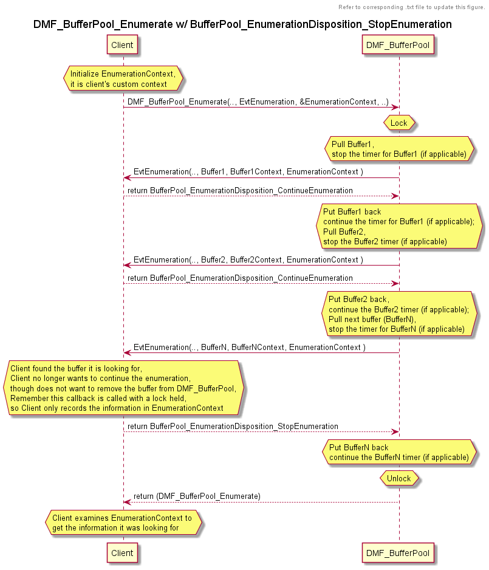
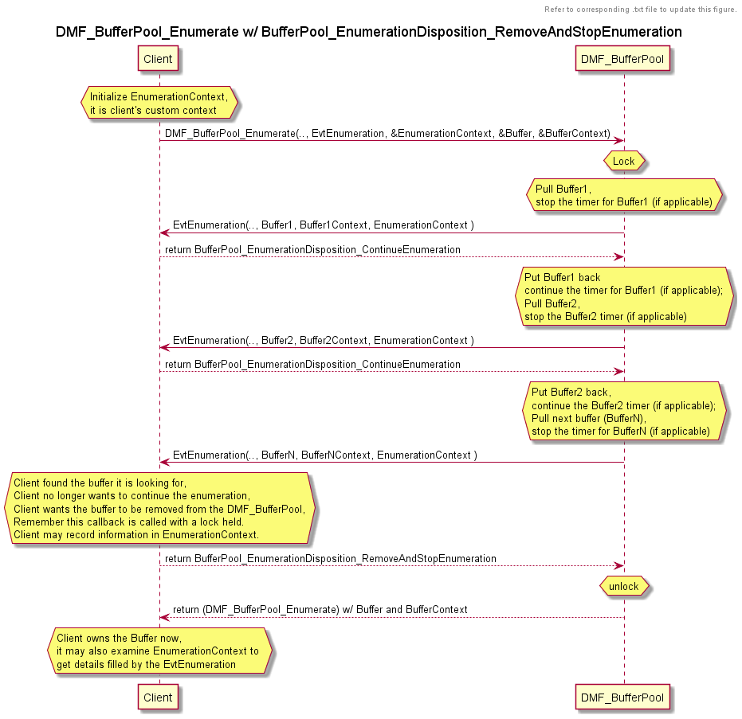
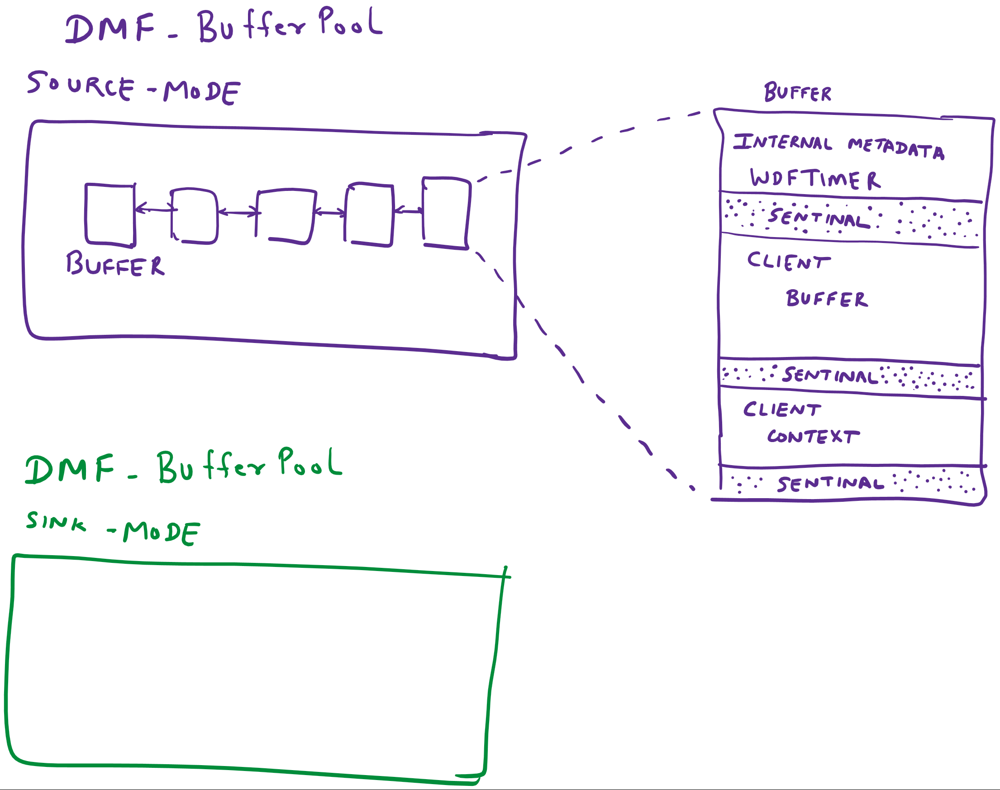
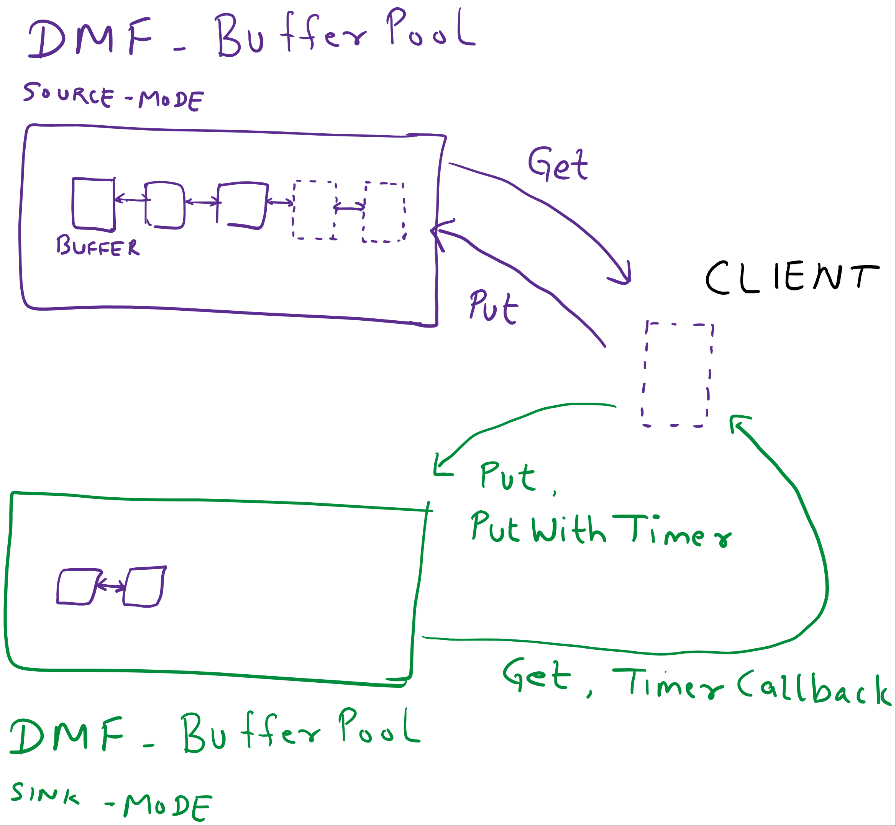

## DMF_BufferPool

-----------------------------------------------------------------------------------------------------------------------------------

#### Module Summary

-----------------------------------------------------------------------------------------------------------------------------------

Manages a pool of buffers. This Module can be instantiated as source-mode or sink-mode buffer pool. 

When instantiated as source-mode, the Client specifies properties such as: size of each buffer, number of buffers, etc. The Module allocates and manages a pool of buffers, allows the Client to retrieve buffers from it or return buffers back to it. 

When instantiated as sink-mode, no buffers are internally allocated. However, the Client may retrieve a buffer from a source-mode instance of this Module, and temporarily insert it in a sink-mode instance. 

This module provides Methods to retrieve (called get operation) or insert (called put operation) buffers from/to the Module instance. Buffers are retrieved in a FIFO order. 

Optionally, a buffer can be inserted to sink mode instance of this Module with a timeout and a timer callback. When the timer expires, the Module removes the buffer from itself and calls the Client's timer callback returning the buffer.  

This Module provides an enumerator method that allows the Client to peek every buffer in the list in a synchronized manner. 

Refer to the remarks section for some additional features provided by this Module.


-----------------------------------------------------------------------------------------------------------------------------------

#### Module Configuration

-----------------------------------------------------------------------------------------------------------------------------------

##### DMF_CONFIG_BufferPool

````
typedef struct
{
  // Indicates the mode of DMF_BufferPool.
  //
  BufferPool_ModeType BufferPoolMode;
  union
  {
    // Each mode has its own settings.
    // NOTE: Currently no custom settings are required for Sink mode.
    //
    BufferPool_SourceSettings SourceSettings;
  } Mode;
} DMF_CONFIG_BufferPool;
````
Member | Description.
----|----
BufferPoolMode | Indicates if the Module is instantiated in source-mode or sink-mode. If source is selected, then Mode.SourceSettings must be properly populated.
Mode.SourceSettings | Indicates the settings for a list created in source-mode.

-----------------------------------------------------------------------------------------------------------------------------------

#### Module Enumeration Types

-----------------------------------------------------------------------------------------------------------------------------------

##### BufferPool_ModeType

These definitions indicate how the Client will use the DMF_BufferPool.
````
typedef enum
{
  BufferPool_Mode_Invalid = 0,
  // Initialized with list of empty buffers.
  //
  BufferPool_Mode_Source,
  // Initialized with zero buffers.
  //
  BufferPool_Mode_Sink,
  BufferPool_Mode_Maximum,
} BufferPool_ModeType;
````
Member | Description.
----|----
BufferPool_Mode_Source | Indicates that a source-mode pool is created. In this case, a specific number of buffers are allocated and added to the pool when the instance of DMF_BufferPool is created. SourceSettings must be populated.
BufferPool_Mode_Sink | Indicates that a sink-mode list is created. In this case, no buffers are allocated and added to the pool when the instance of DMF_BufferPool is created. The Client will add buffers to this list after retrieving them from a source-mode pool.

-----------------------------------------------------------------------------------------------------------------------------------

##### BufferPool_EnumerationDispositionType

These definitions indicate what the enumerator does after calling the Client's enumeration callback.
````
typedef enum
{
  BufferPool_EnumerationDisposition_Invalid = 0,
  // Continue enumerating.
  //
  BufferPool_EnumerationDisposition_ContinueEnumeration,
  // Stop enumerating.
  //
  BufferPool_EnumerationDisposition_StopEnumeration,
  // Remove the enumerated buffer and stop enumerating.
  // (Client now owns the buffer).
  //
  BufferPool_EnumerationDisposition_RemoveAndStopEnumeration,
  // Stop the timer associated with the buffer and stop enumerating.
  //
  BufferPool_EnumerationDisposition_StopTimerAndStopEnumeration,
  // Stop the timer associated with the buffer and continue enumerating.
  //
  BufferPool_EnumerationDisposition_StopTimerAndContinueEnumeration,
  // Reset the timer associated with the buffer and continue enumerating.
  //
  BufferPool_EnumerationDisposition_ResetTimerAndStopEnumeration,
  // Reset the timer associated with the buffer and continue enumerating.
  //
  BufferPool_EnumerationDisposition_ResetTimerAndContinueEnumeration,
  BufferPool_EnumerationDisposition_Maximum,
} BufferPool_EnumerationDispositionType;
````
Member | Description.
----|----
BufferPool_EnumerationDisposition_ContinueEnumeration | After the enumeration callback returns, continue enumerating buffers.
BufferPool_EnumerationDisposition_StopEnumeration | After the enumeration callback returns, stop enumerating buffers.
BufferPool_EnumerationDisposition_RemoveAndStopEnumeration | After the enumeration callback returns, remove the buffer from list and stop enumerating buffers.
BufferPool_EnumerationDisposition_StopTimerAndStopEnumeration | After the enumeration callback returns, stop the timer and stop enumerating buffers. The buffer remains in the list.
BufferPool_EnumerationDisposition_StopTimerAndContinueEnumeration | After the enumeration callback returns, stop the timer and continue enumerating buffers. The buffer remains in the list.
BufferPool_EnumerationDisposition_ResetTimerAndStopEnumeration | After the enumeration callback returns, reset (restart) the timer and stop enumerating buffers. The buffer remains in the list.
BufferPool_EnumerationDisposition_ResetTimerAndContinueEnumeration | After the enumeration callback returns, reset (restart) the timer and continue enumerating buffers. The buffer remains in the list.

-----------------------------------------------------------------------------------------------------------------------------------

#### Module Structures

-----------------------------------------------------------------------------------------------------------------------------------

##### BufferPool_SourceSettings
Settings for BufferPool_Mode_Source.
````
typedef struct
{
  // Maximum number of entries to store.
  //
  ULONG BufferCount;
  // The size of each entry.
  //
  ULONG BufferSize;
  // Size of client buffer context.
  //
  ULONG BufferContextSize;
  // Indicates if a look aside list should be used.
  //
  ULONG EnableLookAside;
  // Indicates if a timer is created with the buffer.
  // Use this flag if the buffers from this list will be added to
  // another list using *WithTimer API.
  //
  ULONG CreateWithTimer;
  // Pool Type.
  // Note: Pool type can be passive if PassiveLevel in Module Attributes is set to TRUE.
  //
  POOL_TYPE PoolType;
} BufferPool_SourceSettings;
````
Member | Description.
----|----
BufferCount | The number of buffers that should be automatically allocated when DMF_BufferPool is created. This number may be not be zero unless EnableLookAside is set to TRUE.  
BufferSize | The size of each buffer.
BufferContextSize | In some cases, the Client may wish to allocate a Client specific meta data for each buffer in the pool. If so, this field indicates the size of that buffer.
EnableLookAside | If set to TRUE, when there are no buffers left in the pool and the Client requests another buffer, a new buffer is allocated internally. Essentially it behaves like a lookaside list. *See remarks below for more information.**
CreateWithTimer | As noted in the module description, a buffer allocated by a source-mode instance of the buffer pool may be inserted to an sink-mode buffer pool. Only a buffer that has a corresponding timer allocated may be inserted into a sink-mode buffer pool. If Create with timer is set to true, a timer instance is created for each of the the buffer allocated by the DMF_BufferPool Module instance. *See remarks below for more information.**
PoolType | The Pool Type attribute of the automatically allocated buffers. If Paged pool is used then this Module must be instantiated as a PASSIVE_LEVEL instance by setting DMF_MODULE_ATTRIBUTES.PassiveLevel = TRUE.

-----------------------------------------------------------------------------------------------------------------------------------

#### Module Callbacks

-----------------------------------------------------------------------------------------------------------------------------------

##### EVT_DMF_BufferPool_Enumeration

Callback function called by DMF_BufferPool_Enumerate.
```
typedef
_IRQL_requires_max_(DISPATCH_LEVEL)
_IRQL_requires_same_
BufferPool_EnumerationDispositionType
EVT_DMF_BufferPool_Enumeration(
    _In_ DMFMODULE DmfModule,
    _In_ VOID* ClientBuffer,
    _In_ VOID* ClientBufferContext,
    _In_opt_ VOID* ClientDriverCallbackContext
    );
```

##### Parameters
Parameter | Description.
----|----
ClientBuffer | The given Client buffer.
ClientBufferContext | The Client buffer context associated with the given Client buffer.
ClientDriverContext | The Client context set during DMF_BufferPool creation.
ClientDriverCallContet | The context set by the Client when the timer associated with the buffer is set.

##### Returns

BufferPool_EnumerationDispositionType

##### Remarks

* The Client decides what to do with the buffer and tells DMF_BufferPool how to dispose of the buffer by setting the corresponding return value.
* This callback is called with an internal lock held. In this callback, typically the Client is only expected to examine the contents of the buffer or the corresponding context, and return the appropiate disposition value. To prevent deadlocks, the Client must be very conservative to call any APIs for this module or other modules. Generally only APIs that are allowed to be called with a lock held are those which are get/set property. After examining the buffer, if the Client needs to remove the buffer from the DMF_BufferPool, it must return RemoveAndStopEnumeration from this callback. Then the buffer is returned to the Client as an output parameter of DMF_BufferPool_Enumerate. 

-----------------------------------------------------------------------------------------------------------------------------------

##### EVT_DMF_BufferPool_TimerCallback

Callback function called when a buffer's timer expires. Called by DMF_BufferPool when a timer associated with a DMF_BufferPool given Client buffer expires. The Client owns the buffer back at this point, and may access the buffer during this callback.
```
typedef
_IRQL_requires_max_(DISPATCH_LEVEL)
_IRQL_requires_same_
VOID
EVT_DMF_BufferPool_TimerCallback(
    _In_ DMFMODULE DmfModule,
    _In_ VOID* ClientBuffer,
    _In_ VOID* ClientBufferContext,
    _In_opt_ VOID* ClientDriverCallbackContext
    );
```

##### Parameters
Parameter | Description.
----|----
ClientBuffer | The given Client buffer.
ClientBufferContext | The Client buffer context associated with the given Client buffer.
ClientDriverContext | The Client context set during DMF_BufferPool creation.
ClientDriverCallContet | The context set by the Client when the timer associated with the buffer is set.

##### Returns

None

##### Remarks

* The Client owns the buffer in this callback. From this callback the client may re-insert this buffer back into the this DMF_BufferPool module instance or any other instance. 

-----------------------------------------------------------------------------------------------------------------------------------

#### Module Methods

-----------------------------------------------------------------------------------------------------------------------------------

##### DMF_BufferPool_ContextGet

Given a DMF_BufferPool buffer, this Method returns its associated Client Buffer Context.
```
_IRQL_requires_max_(DISPATCH_LEVEL)
VOID
DMF_BufferPool_ContextGet(
  _In_ DMFMODULE DmfModule,
  _In_ VOID* ClientBuffer,
  _Out_ VOID** ClientBufferContext
  );
```

##### Parameters
Parameter | Description.
----|----
DmfModule | An open DMF_BufferPool Module handle.
Client Buffer | The given DMF_BufferPool Client Buffer.
ClientBufferContext | The given Client Buffer's associated Client Buffer Context.

##### Returns

None

##### Remarks

* The Client Buffer Context can be used, for example, to store insertion specific information that is needed when the buffer is removed.
* The Client is expected to know the size and type of the buffer context because the Client  specified that information when creating the instance of DMF_BufferPool Module.

-----------------------------------------------------------------------------------------------------------------------------------

##### DMF_BufferPool_Count

Given a DMF_BufferPool instance handle, return the number of buffers in the pool.
```
_IRQL_requires_max_(DISPATCH_LEVEL)
ULONG
DMF_BufferPool_Count(
  _In_ DMFMODULE DmfModule
  );
```

##### Parameters
Parameter | Description.
----|----
DmfModule | An open DMF_BufferPool Module handle.

##### Returns

The number of buffers in the pool.

##### Remarks

* In a multi-threaded environment, the actual number of buffers in the list may change immediately or even while this Method executes. Therefore, this Method is only useful in limited scenarios.

-----------------------------------------------------------------------------------------------------------------------------------

##### DMF_BufferPool_Enumerate

This Method enumerates all the buffers in a DMF_BufferPool instance and calls a given callback for each buffer. 
```
_IRQL_requires_max_(DISPATCH_LEVEL)
VOID
DMF_BufferPool_Enumerate(
  _In_ DMFMODULE DmfModule,
  _In_ EVT_DMF_BufferPool_Enumeration EntryEnumerationCallback,
  _In_opt_ VOID* ClientDriverCallbackContext,
  _Out_opt_ VOID** ClientBuffer,
  _Out_opt_ VOID** ClientBufferContext
  );
```

##### Parameters
Parameter | Description.
----|----
DmfModule | An open DMF_BufferPool Module handle.
EntryEnumerationCallback | The given callback that is called for every buffer in the DMF_BufferPool instance.
ClientDriverCallbackContext | The Client specific context that is passed to the given callback.
ClientBuffer | ClientBuffer is used to return a buffer to the Client for which the client returned BufferPool_EnumerationDisposition_RemoveAndStopEnumeration from the EntryEnumerationCallback. 
ClientBufferContext | ClientBufferContext is used to return the corresponding client context of the ClientBuffer.

##### Returns

None

##### Remarks

* Clients use this Method when they need to search or perform actions on all the buffers in a DMF_BufferPool.
* The EntryEnumerationCallback is called with an internal lock held. Kindly review the documentation for the callback.  
* In case a buffer was inserted in the sink-mode DMF_BufferPool with a timeout, there is a race condition between timer expiring and the Client enumerating the buffers for that DMF_BufferPool. To handle that corretly, this Method will not enumerate a buffer for which a timer has just expired. For that buffer the EVT_DMF_BufferPool_TimerCallback would be called (if it has not already been called).  
* The Client is expected to know the size of the returned buffer and also the corresponding context.
* The Module implementation handles race conditions where different threads are putting, getting or enumerating buffers for a buffer pool instance. This Module handles those race conditions and is multithread safe. 

##### Examples






-----------------------------------------------------------------------------------------------------------------------------------

##### DMF_BufferPool_Get

Remove and return the first buffer from an instance of DMF_BufferPool in FIFO order.
```
_IRQL_requires_max_(DISPATCH_LEVEL)
_Must_inspect_result_
NTSTATUS
DMF_BufferPool_Get(
  _In_ DMFMODULE DmfModule,
  _Out_ VOID** ClientBuffer,
  _Out_ VOID** ClientBufferContext
  );
```

##### Parameters
Parameter | Description.
----|----
DmfModule | An open DMF_BufferPool Module handle.
ClientBuffer | The address of the retrieved Client Buffer. The Client may access the buffer at this address.
ClientBufferContext | The address of the Client Buffer Context associated with the retrieved ClientBuffer.

##### Returns

NTSTATUS. Fails if there is no buffer in the list.

##### Remarks

* Clients use this Method when they need to retrieve a buffer from the list.
* The Client is expected to know the size of the buffer and buffer context because the Client has specified that information when creating the instance of DMF_BufferPool Module.
* If the buffer has an active timer running, the Module implementation ensures that the timer is canceled before the buffer is returned. 
* After a buffer has been retrieved using this Method, the Client owns the buffer. The buffer must be returned to either the Source DMF_BufferPool where it was created or to any sink-mode DMF_BufferPool. Not doing so, results in a memory leak. 

-----------------------------------------------------------------------------------------------------------------------------------

##### DMF_BufferPool_GetWithMemory

Remove and return the first buffer from an instance of DMF_BufferPool in FIFO order. Also, return the WDFMEMORY object associated with the Client Buffer.
```
_IRQL_requires_max_(DISPATCH_LEVEL)
_Must_inspect_result_
NTSTATUS
DMF_BufferPool_GetWithMemory(
  _In_ DMFMODULE DmfModule,
  _Out_ VOID** ClientBuffer,
  _Out_ VOID** ClientBufferContext,
  _Out_ WDFMEMORY* ClientBufferMemory
  );
```

##### Parameters
Parameter | Description.
----|----
DmfModule | An open DMF_BufferPool Module handle.
ClientBuffer | The address of the retrieved Client Buffer. The Client may access the buffer at this address.
ClientBufferContext | The address of the Client Buffer Context associated with the retrieved ClientBuffer.
ClientBufferMemory | Returns the WDFMEMORY associated with the returned buffer.

##### Returns

NTSTATUS. Fails if there is no buffer in the list.

##### Remarks

* Clients use this Method when they need to retrieve a buffer from the list.
* The Client is expected to know the size of the buffer and buffer context because the Client  specified that information when creating the instance of DMF_BufferPool Module.
* If the buffer has an active timer running, the module implementation ensures that the timer is canceled before the buffer is returned. 
* After a buffer has been retrieved using this Method, the Client owns the buffer. The buffer must be returned to either the source-mode DMF_BufferPool where it was created or to any sink-mode DMF_BufferPool. Not doing so, results in a memory leak. 

-----------------------------------------------------------------------------------------------------------------------------------

##### DMF_BufferPool_GetWithMemoryDescriptor

Remove and return the first buffer from an instance of DMF_BufferPool in FIFO order. Also, return the buffer's associated WDF_MEMORY_DESCRIPTOR and Client Buffer Context.
```
_IRQL_requires_max_(DISPATCH_LEVEL)
_Must_inspect_result_
NTSTATUS
DMF_BufferPool_GetWithMemoryDescriptor(
  _In_ DMFMODULE DmfModule,
  _Out_ VOID** ClientBuffer,
  _Out_ PWDF_MEMORY_DESCRIPTOR MemoryDescriptor,
  _Out_ VOID** ClientBufferContext
  );
```

##### Parameters
Parameter | Description.
----|----
DmfModule | An open DMF_BufferPool Module handle.
ClientBuffer | The address of the retrieved Client Buffer. The Client may access the buffer at this address.
MemoryDescriptor | Returns the WDF_MEMORY_DESCRIPTOR associated with the returned buffer. Some WDF APIs need this parameter when working with buffers.
ClientBufferContext | The address of the Client Buffer Context associated with the retrieved ClientBuffer.

##### Returns

NTSTATUS. Fails if there is no buffer in the list.

##### Remarks

* Clients use this Method when they need to retrieve a buffer from the pool and then call other WDF APIs that perform operations on the buffer using the associated WDF_MEMORY_DESCRIPTOR object. For example, use this API when the buffer will be sent to a target device using a WDFREQUEST.
* The Client is expected to know the size of the buffer and buffer context because the Client  specified that information when creating the instance of DMF_BufferPool Module.
* If the buffer has an active timer running, the module implementation ensures that the timer is canceled before the buffer is returned. 
* After a buffer has been retrieved using this Method, the Client owns the buffer. The buffer must be returned to either the source-mode DMF_BufferPool where it was created or to any sink-mode DMF_BufferPool. Not doing so, results in a memory leak. 

-----------------------------------------------------------------------------------------------------------------------------------

##### DMF_BufferPool_ParametersGet

Given a DMF_BufferPool buffer, this Method returns information associated with the buffer.
```
_IRQL_requires_max_(DISPATCH_LEVEL)
VOID
DMF_BufferPool_ParametersGet(
  _In_ DMFMODULE DmfModule,
  _In_ VOID* ClientBuffer,
  _Out_opt_ PWDF_MEMORY_DESCRIPTOR MemoryDescriptor,
  _Out_opt_ WDFMEMORY* ClientBufferMemory,
  _Out_opt_ ULONG* ClientBufferSize,
  _Out_opt_ VOID** ClientBufferContext,
  _Out_opt_ ULONG* ClientBufferContextSize
  );
```

##### Parameters
Parameter | Description.
----|----
DmfModule | An open DMF_BufferPool Module handle.
ClientBuffer | The given DMF_BufferPool buffer.
MemoryDescriptor | Returns the WDF_MEMORY_DESCRIPTOR associated with the given buffer. Some WDF APIs need this parameter when working with buffers.
ClientBufferMemory | Returns the WDFMEMORY associated with the given buffer.
ClientBufferSize | The size of the buffer pointed to by ClientBuffer.
ClientBufferContext | The address of the Client Buffer Context associated with the retrieved ClientBuffer.
ClientBufferContextSize | The size of the buffer pointed to by ClientBufferContext.

##### Returns

None

##### Remarks

* Clients use this Method when they have a DMF_BufferPool buffer and need to call other WDF APIs that perform operations on the buffer using the associated WDFMEMORY object. For example, use this API when the buffer will be sent to a target device using a WDFREQUEST.

-----------------------------------------------------------------------------------------------------------------------------------

##### DMF_BufferPool_Put

Adds a given DMF_BufferPool buffer to an instance of DMF_BufferPool (at the end).
```
_IRQL_requires_max_(DISPATCH_LEVEL)
VOID
DMF_BufferPool_Put(
  _In_ DMFMODULE DmfModule,
  _In_ VOID* ClientBuffer
  );
```

##### Parameters
Parameter | Description.
----|----
DmfModule | An open DMF_BufferPool Module handle.
ClientBuffer | The given DMF_BufferPool buffer to add to the list.

##### Returns

None

##### Remarks

* ClientBuffer *must* have been previously retrieved from an instance of DMF_BufferPool because the buffer must have the appropriate metadata which is stored with ClientBuffer. Buffers allocated by the Client using ExAllocatePool() or WdfMemoryCreate() may not be added Module's list using this API.
* A sink-mode buffer pool instance may accept buffers from different instances of source-mode buffer pool, however a source-mode buffer buffer pool instance only accepts a buffer allocated by that specific instance. Violating this rule will result in unexpected errors. 
* This Method cannot fail because the underlying data structure that stores the buffer is a LIST_ENTRY.
* The Client loses the ownership of the buffer once the buffer has been put into the DMF_BufferPool. The Client must not try to access that buffer after calling the Put Method. Thereby a buffer may never be put to more than one DMF_BufferPool instance at a time. Doing so will cause corruption. This condition is checked in DEBUG mode.

-----------------------------------------------------------------------------------------------------------------------------------

##### DMF_BufferPool_PutInSinkWithTimer

Adds a given DMF_BufferPool buffer to an instance of DMF_BufferPool (at the end). A given timer value specifies that if the buffer is still in the list after the timeout expires, the buffer should be removed, and a given callback called so that the Client knows that the given buffer is being removed.
```
_IRQL_requires_max_(DISPATCH_LEVEL)
VOID
DMF_BufferPool_PutInSinkWithTimer(
  _In_ DMFMODULE DmfModule,
  _In_ VOID* ClientBuffer,
  _In_ ULONGLONG TimerExpirationMilliseconds,
  _In_ EVT_DMF_BufferPool_TimerCallback* TimerExpirationCallback,
  _In_opt_ VOID* TimerExpirationCallbackContext
  );
```

##### Parameters
Parameter | Description.
----|----
DmfModule | An open sink-mode DMF_BufferPool Module handle.
ClientBuffer | The given DMF_BufferPool buffer to add to the list.
TimerExpirationMilliseconds | The given timeout value which indicates how long the buffer will remain in the list before being automatically removed.
TimerExpirationCallback | The given callback that is called when the given buffer is automatically removed from the list. Race conditions associated with the removal are properly handled.
TimerExpirationCallbackContext | The context that is sent to TimerExpirationCallback so the Client can perform Client specific operations due to the automatic removal of the given buffer from DMF_BufferPool.

##### Returns

None

##### Remarks

* ClientBuffer *must* have been previously retrieved from an instance of DMF_BufferPool because the buffer must have the appropriate metadata which is stored with ClientBuffer. Buffers allocated by the Client using ExAllocatePool() or WdfMemoryCreate() may not be added Module's list using this API.
* This Method cannot fail because the underlying data structure that stores the buffer is a LIST_ENTRY.
* The Client loses the ownership of the buffer once the buffer has been put into a DMF_BufferPool. The Client must not try to access that buffer after calling hte Put Method. Thereby a buffer may never be put to more than one DMF_BufferPool instance at a time. Doing so will cause corruption. This condition is checked in DEBUG mode.
* The Module implementation handles race conditions where different threads are putting , getting or enumerating buffers for a buffer pool instance. This Module handles those race conditions and is multithread safe. 

-----------------------------------------------------------------------------------------------------------------------------------

#### Module IOCTLs

* None

-----------------------------------------------------------------------------------------------------------------------------------

#### Module Remarks

* Clients that select any type of paged pool as PoolType must set DMF_MODULE_ATTRIBUTES.PassiveLevel = TRUE. Clients that select any type of paged pool as PoolType must set DMF_MODULE_ATTRIBUTES.PassiveLevel = TRUE.
* Always test the driver using DEBUG builds because many important checks for integrity are performed in DEBUG build that are not performed in RELEASE build.
* The Module Methods check for buffer overrun and underruns when the buffers are retrieved or inserted into a buffer pool instance making it easier to catch bugs sooner thereby ensuring complex race conditions are properly handled.
* Clients may not allocate memory and add that buffer to a DMF_BufferPool because that buffer will not have the appropriate metadata. Buffers added to a sink-mode list must have been created using a source-mode list.
* A sink-mode buffer pool instance can only accept buffers retrieved from a source-mode buffer pool instance.
* A buffer can only be inserted into one buffer pool at a time. If a buffer is inserted into a buffer pool instance, that buffer pool instance is said to own the buffer. If the buffer has been retrieved by the Client explicitly (or implicitly due to a timer callback), the buffer is said to be owned by the Client. The Client must eventually put the buffer back to the buffer queue to avoid a leak. 
* A sink-mode buffer pool instance may accept buffers from different instances of source-mode buffer pool, however a source-mode buffer pool instance only accepts a buffer allocated by that specific instance. 
* DMF_BufferPool has sentinels around both the Client Buffer as well as the Client Context. These sentinels are used to check for buffer overrun and underrun conditions that can be very hard to detect. These checks are made whenever buffers are accessed by DMF_BufferPool. In this way the overrun or underrun error is caught soon after it has happened. Ordinarily, such an error would only be caught when Verifier checks for this condition when the buffer is freed, long after the error has occurred.
* The Module implementation handles race conditions where different threads are putting, getting or enumerating buffers for a DMF_BufferPool instance. In addition, it handles any race conditions related to timer feature. The Client can use this module from a multi-threaded environment.  
* DMF_BufferPool is useful in cases when dynamically allocated memory is needed an IRQL higher than DISPATCH_LEVEL. 
* Many core Modules use DMF_BufferPool to build more complex Modules.
* When a sink-mode buffer pool instance is deleted, all the buffers in that pool are automatically returned to the corresponding source-mode buffer pool instance(s).
* When a source-mode buffer pool instance is deleted, all buffers it allocated are deleted. If any buffer is in other sink-mode buffer pool, the buffer is automatically removed from that sink-mode buffer pool and deleted. Any associated timer is also canceled. If any buffer is owned by the Client, internal reference counting prevents the module instance to be truely deleted until all the buffers are returned back to it by the Client.
* In User-mode, Config parameters EnableLookAside and CreateWithTimer cannot both be set to TRUE. Either can be TRUE, but not both. See the code for more information.

-----------------------------------------------------------------------------------------------------------------------------------

#### Module Children

* None

-----------------------------------------------------------------------------------------------------------------------------------

#### Module Implementation Details

* DMF_BufferPool stores buffers in using LIST_ENTRY. Buffers are created with corresponding metadata when an instance of DMF_BufferPool in Source-mode is created. An optional lookaside list may also be created. In cases where a Client requests a buffer and no buffer is available, and a lookaside list has been created, a buffer is automatically created using the lookaside list. When it is returned, it is automatically put into the lookaside list.
* The pointer to the buffer that a Client receives is directly usable by the Client. It is the beginning of the buffer that is usable by the Client. The metadata that allows the DMF_BufferPool API to function is located before the address of the Client's buffer.

##### DMF_BufferPool Types


##### DMF_BufferPool Typical Operation
  

-----------------------------------------------------------------------------------------------------------------------------------

#### Examples

* DMF_BufferQueue
* DMF_BranchTrack

-----------------------------------------------------------------------------------------------------------------------------------

#### To Do

-----------------------------------------------------------------------------------------------------------------------------------
#### Module Category

-----------------------------------------------------------------------------------------------------------------------------------

Buffers

-----------------------------------------------------------------------------------------------------------------------------------

