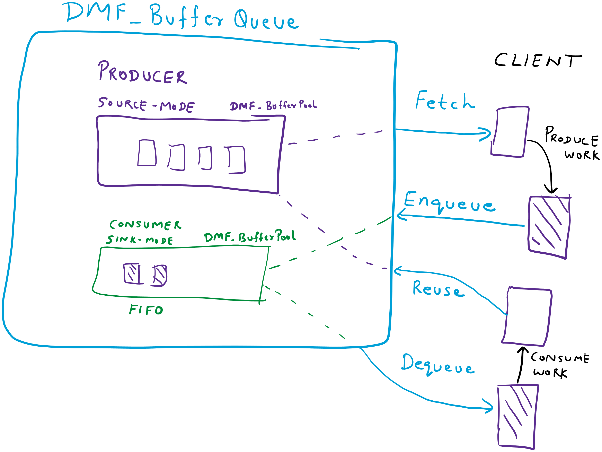

## DMF_BufferQueue

-----------------------------------------------------------------------------------------------------------------------------------

#### Module Summary

-----------------------------------------------------------------------------------------------------------------------------------

Implements a Producer/Consumer data structure that maintains a pool of unused buffers, allows the Client to fetch unused buffers so that it can initialize them with work to be done, and enqueue them back into this Module. Later the Client may dequeue the work, execute on the work to be done, and return the buffers back to the unused pool of this Module. The buffers are enqueued and dequeud in a FIFO order. 

Internally the module is composed of two lists: producer and consumer. The producer list acts as a source of unused buffers and consumer list tracks to-be-done work. 

-----------------------------------------------------------------------------------------------------------------------------------

#### Module Configuration

-----------------------------------------------------------------------------------------------------------------------------------
##### DMF_CONFIG_BufferQueue
````
typedef struct
{
  // DMF_BufferQueue has a source and sink list.
  // Source is configured by Client using these settings.
  //
  BufferPool_SourceSettings SourceSettings;
  // Sink is configured internally.
  //
  // Optional callback for client to finalize buffer before reuse
  //
  EVT_DMF_BufferQueue_ReuseCleanup* EvtBufferQueueReuseCleanup;
} DMF_CONFIG_BufferQueue;
````
Member | Description.
----|----
SourceSettings | Indicates the settings for a producer list. Since the producer list is internally implemented as a DMF_BufferPool source-mode list, kindly refer to the [DMF_BufferPool](Dmf_BufferPool.md) for details of this structure.
EvtBufferQueueReuseCleanup |  The Client may register this callback to do any cleanup needed before the buffer is being flushed / reused.
-----------------------------------------------------------------------------------------------------------------------------------

#### Module Enumeration Types

* None

-----------------------------------------------------------------------------------------------------------------------------------

#### Module Callbacks

##### EVT_DMF_BufferQueue_ReuseCleanup
````
_Function_class_(EVT_DMF_BufferQueue_ReuseCleanup)
_IRQL_requires_max_(DISPATCH_LEVEL)
_IRQL_requires_same_
VOID
EVT_DMF_BufferQueue_ReuseCleanup(_In_ DMFMODULE DmfModule,
                                 _In_ VOID* ClientBuffer,
                                 _In_ VOID* ClientBufferContext);
````

This callback is called when this Module is about to reuse a work buffer. Before the Module puts the work
buffer back in its DMF_BufferQueue Producer list for reuse, the module presents it to the Client via this callback.

##### Parameters
Parameter | Description
----|----
DmfModule | An open DMF_BufferQueue Module handle.
ClientWorkBuffer | This buffer contains the work that needs to be done in this callback. This buffer is owned by Client until this function returns.
ClientWorkBufferContext | An optional context associated with ClientWorkBuffer.

##### Remarks

* Use callback to free or reference count decrement resources associated with buffers.

-----------------------------------------------------------------------------------------------------------------------------------

#### Module Structures

* None

-----------------------------------------------------------------------------------------------------------------------------------

#### Module Methods

-----------------------------------------------------------------------------------------------------------------------------------

##### DMF_BufferQueue_ContextGet

```
_IRQL_requires_max_(DISPATCH_LEVEL)
VOID
DMF_BufferQueue_ContextGet(
  _In_ DMFMODULE DmfModule,
  _In_ VOID* ClientBuffer,
  _Out_ VOID** ClientBufferContext
  );
```

Given a DMF_BufferQueue buffer, this Method returns its associated Client Buffer Context.

##### Parameters
Parameter | Description.
----|----
DmfModule | An open DMF_BufferQueue Module handle.
Client Buffer | The given DMF_BufferQueue Client Buffer.
ClientBufferContext | The given Client Buffer's associated Client Buffer Context.

##### Returns

None

##### Remarks

* The Client Buffer Context can be used, for example, to store insertion specific information that is needed when the buffer is removed.
* The Client is expected to know the size and type of the buffer context because the Client  specified that information when creating the instance of DMF_BufferQueue Module.

-----------------------------------------------------------------------------------------------------------------------------------

##### DMF_BufferQueue_Count

````
_IRQL_requires_max_(DISPATCH_LEVEL)
ULONG
DMF_BufferQueue_Count(
  _In_ DMFMODULE DmfModule
  );
````

Given a DMF_BufferQueue instance handle, return the number of entries in the Consumer list.

##### Returns

The number of entries in the list.

##### Parameters
Parameter | Description
----|----
DmfModule | An open DMF_BufferQueue Module handle.

##### Remarks

* The number of buffers in the DMF_BufferQueue's Consumer list may change immediately after or during this call if other threads are using the same Module instance.

-----------------------------------------------------------------------------------------------------------------------------------

##### DMF_BufferQueue_Dequeue

````
_IRQL_requires_max_(DISPATCH_LEVEL)
_Must_inspect_result_
NTSTATUS
DMF_BufferQueue_Dequeue(
  _In_ DMFMODULE DmfModule,
  _Out_ VOID** ClientBuffer,
  _Out_opt_ VOID** ClientBufferContext
  );
````

Remove and retrieve the first buffer from an instance of DMF_BufferQueue's Consumer list in FIFO order.

##### Returns

NTSTATUS. Fails if there is no buffer in the list.

##### Parameters
Parameter | Description
----|----
DmfModule | An open DMF_BufferQueue Module handle.
ClientBuffer | The address of the retrieved Client Buffer. The Client may access the buffer at this address.
ClientBufferContext | The address of the Client Buffer Context associated with the retrieved ClientBuffer.

##### Remarks

* After retrieving a buffer using this Method, the Client usually reads the contents of the buffer and performs processing using that data. Afterward, the Client returns the buffer to the DMF_BufferQueue's Producer.
* The Client is expected to know the size and type of the buffer context because the Client specified that information when creating the instance of DMF_BufferQueue Module.

-----------------------------------------------------------------------------------------------------------------------------------

##### DMF_BufferQueue_DequeueWithMemoryDescriptor

````
_IRQL_requires_max_(DISPATCH_LEVEL)
_Must_inspect_result_
NTSTATUS
DMF_BufferQueue_DequeueWithMemoryDescriptor(
  _In_ DMFMODULE DmfModule,
  _Out_ VOID** ClientBuffer,
  _Out_ PWDF_MEMORY_DESCRIPTOR MemoryDescriptor,
  _Out_ VOID** ClientBufferContext
  );
````

Remove and retrieve the first buffer from an instance of DMF_BufferQueue's Consumer in FIFO order along with its corresponding WDF memory descriptor.

##### Returns

NTSTATUS. Fails if there is no buffer in the list.

##### Parameters
Parameter | Description
----|----
DmfModule | An open DMF_BufferQueue Module handle.
ClientBuffer | The address where the address of the retrieved buffer is written.
MemoryDescriptor | The address where the WDF memory descriptor associated with the retrieved buffer is written.
ClientBufferContext | The address where the Client Context associated with the retrieved buffer is written.

##### Remarks

* Clients use this Method when they need to retrieve a buffer from the list and then call other WDF APIs that perform operations on the buffer using the associated WDF_MEMORY_DESCRIPTOR object. For example, use this API when the buffer will be sent to a target device using a WDF_REQUEST.
* After retrieving a buffer using this Method, the Client usually reads the contents of the buffer and performs processing using that data. Afterward, the Client returns the buffer to the DMF_BufferQueue's Producer.
* The Client is expected to know the size and type of the buffer context because the Client specified that information when creating the instance of DMF_BufferQueue Module.

-----------------------------------------------------------------------------------------------------------------------------------

##### DMF_BufferQueue_Enqueue

````
_IRQL_requires_max_(DISPATCH_LEVEL)
VOID
DMF_BufferQueue_Enqueue(
  _In_ DMFMODULE DmfModule,
  _In_ VOID* ClientBuffer
  );
````

Adds a given DMF_BufferQueue buffer to an instance of DMF_BufferQueue's Consumer (at the end). This list is consumed in FIFO order.

##### Returns

None

##### Parameters
Parameter | Description
----|----
DmfModule | An open DMF_BufferQueue Module handle.
ClientBuffer | The given DMF_BufferQueue buffer to add to the list.

##### Remarks

* ClientBuffer *must* have been previously retrieved from the same instance of DMF_BufferQueue because the buffer must have the appropriate metadata which is stored with ClientBuffer. Buffers allocated by the Client using ExAllocatePool() or WdfMemoryCreate() may not be added Module's list using this API.

-----------------------------------------------------------------------------------------------------------------------------------

##### DMF_BufferQueue_EnqueueAtHead

````
_IRQL_requires_max_(DISPATCH_LEVEL)
VOID
DMF_BufferQueue_EnqueueAtHead(
  _In_ DMFMODULE DmfModule,
  _In_ VOID* ClientBuffer
  );
````

Adds a given DMF_BufferQueue buffer to an instance of DMF_BufferQueue's Consumer (at the head). This list is consumed in LIFO order.

##### Returns

None

##### Parameters
Parameter | Description
----|----
DmfModule | An open DMF_BufferQueue Module handle.
ClientBuffer | The given DMF_BufferQueue buffer to add to the list.

##### Remarks

* ClientBuffer *must* have been previously retrieved from the same instance of DMF_BufferQueue because the buffer must have the appropriate metadata which is stored with ClientBuffer. Buffers allocated by the Client using ExAllocatePool() or WdfMemoryCreate() may not be added Module's list using this API.

-----------------------------------------------------------------------------------------------------------------------------------

##### DMF_BufferQueue_Enumerate

````
_IRQL_requires_max_(DISPATCH_LEVEL)
VOID
DMF_BufferQueue_Enumerate(
  _In_ DMFMODULE DmfModule,
  _In_ EVT_DMF_BufferPool_Enumeration EntryEnumerationCallback,
  _In_opt_ VOID* ClientDriverCallbackContext,
  _Out_opt_ VOID** ClientBuffer,
  _Out_opt_ VOID** ClientBufferContext
  );
````

This Method enumerates all the buffers in a DMF_BufferQueue's Consumer list and calls a given callback for each buffer.

##### Returns

None

##### Parameters
Parameter | Description
----|----
DmfModule | An open DMF_BufferPool Module handle.
EntryEnumerationCallback | The given callback that is called for every buffer in the DMF_BufferQueue instance.
ClientDriverCallbackContext | The Client specific context that is passed to the given callback.
ClientBuffer | ClientBuffer is used to return a DMF_BufferQueue buffer to the Client after the buffer has been removed from the list.
ClientBufferContext | ClientBufferContext is used to return a DMF_BufferQueue buffer's Context-buffer to the Client after the buffer has been removed from the list.

##### Remarks

* Clients use this Method when they need to search or perform actions on all the buffers in a DMF_BufferQueue's Consumer list.
* Since the consumer list is implemented as a DMF_BufferPool, the enumeration callback type is defined by the [DMF_BufferPool](Dmf_BufferPool.md). It is important to note that the DMFMODULE handle received in the callback is the handle of the internal DMF_BufferPool and not DMF_BufferQueue object. The Client must call DMF_ParentModuleGet to retrieve the handle to DMF_BufferQueue. The Client must not use the handle to the internal DMF_BufferPool Module for any other purpose. 
* The EntryEnumerationCallback is called with an internal lock held. Kindly review the documentation for the [callback](Dmf_BufferPool.md).  

-----------------------------------------------------------------------------------------------------------------------------------

##### DMF_BufferQueue_Fetch

````
_IRQL_requires_max_(DISPATCH_LEVEL)
_Must_inspect_result_
NTSTATUS
DMF_BufferQueue_Fetch(
  _In_ DMFMODULE DmfModule,
  _Out_ VOID** ClientBuffer,
  _Out_ VOID** ClientBufferContext
  );
````

Remove and retrieve an unused buffer from instance of DMF_BufferQueue's Producer list.

##### Returns

NTSTATUS. Fails if there is no buffer in the list and a new one could not be allocated. See Remarks.

##### Parameters
Parameter | Description
----|----
DmfModule | An open DMF_BufferQueue Module handle.
ClientBuffer | The address of the retrieved Client Buffer. The Client may access the buffer at this address.
ClientBufferContext | The address of the Client Buffer Context associated with the retrieved ClientBuffer.

##### Remarks

*  If the Client set SourceSettings.EnableLookAside configuration option to TRUE, and there is no buffer in the producer pool, this Method tries to allocate a new unused buffer.  
* After retrieving a buffer using this Method, the Client usually populates this buffer with data to be used later and then enqueues the buffer into the DMF_BufferQueue's Consumer. That buffer is later dequeued from the DMF_BufferQueue's Consumer and processed in some way. Afterward, the Client returns the buffer to the DMF_BufferQueue's Producer.
* Since the producer list is implemented as a DMF_BufferPool the unused buffers are returned in a FIFO order, however a typical Client does not really care about that. 

-----------------------------------------------------------------------------------------------------------------------------------

##### DMF_BufferQueue_Flush

````
_IRQL_requires_max_(DISPATCH_LEVEL)
VOID
DMF_BufferQueue_Flush(
  _In_ DMFMODULE DmfModule
  );
````

Removes all the buffers in a DMF_BufferQueue's Consumer list and returns those buffers to the DMF_BufferQueue's Producer list.

##### Returns

None

##### Parameters
Parameter | Description
----|----
DmfModule | An open DMF_BufferQueue Module handle.

##### Remarks

* Use this Method in cases when the pending work in the Consumer list does not need to be done or cannot be done.

-----------------------------------------------------------------------------------------------------------------------------------

##### DMF_BufferQueue_Reuse

````
_IRQL_requires_max_(DISPATCH_LEVEL)
VOID
DMF_BufferQueue_Reuse(
  _In_ DMFMODULE DmfModule,
  _In_ VOID* ClientBuffer
  );
````

Returns a given DMF_BufferQueue buffer back to the instance of DMF_BufferQueue to be added to its pool of unused buffers, i.e. the Producer list.

##### Returns

None

##### Parameters
Parameter | Description
----|----
DmfModule | An open DMF_BufferQueue Module handle.
ClientBuffer | The given DMF_BufferQueue buffer to add to the list.

##### Remarks

* ClientBuffer *must* have been previously retrieved from the same instance of DMF_BufferQueue because the buffer must have the appropriate metadata which is stored with ClientBuffer. Buffers allocated by the Client using ExAllocatePool() or WdfMemoryCreate() or by another instance of DMF_BufferQueue module may not be added Module's list using this API.

-----------------------------------------------------------------------------------------------------------------------------------

#### Module IOCTLs

* None

-----------------------------------------------------------------------------------------------------------------------------------

#### Module Remarks

* Clients that select any type of paged pool as PoolType must set DMF_MODULE_ATTRIBUTES.PassiveLevel = TRUE. Clients that select any type of paged pool as PoolType must set DMF_MODULE_ATTRIBUTES.PassiveLevel = TRUE.
* The Module implements internal synchronization allowing the Client to interact with the module in multi-threaded environment without worrying about synchronization.
* Any buffers that are part of the internal producer or consumer list are said to be owned by the DMF_BufferQueue Module. Any buffers that the Client retrieved from the DMF_BufferQueue and have not yet returned those to the DMF_BufferQueue module are said to be owned by the Client. When the DMF_BufferQueue Module instance is deleted, all the corresponding buffers that are in the producer or consumer list are automatically deleted. Internal reference counting prevents the module from getting actually deleted until all be Client owned buffers are pushed back to the DMF_BufferQueue. 
* *It is important to note* that when the DMF_BufferQueue Module instance is deleted, any buffers in the consumer list are silently deleted. Client must account for this since there may have been pending to-be-done work in the consumer list. 


-----------------------------------------------------------------------------------------------------------------------------------

#### Module Children

* DMF_BufferPool (2)

-----------------------------------------------------------------------------------------------------------------------------------

#### Module Implementation Details

* Internally the module is composed of two lists: producer and consumer. The producer list acts as a source of unused buffers and consumer list tracks to-be-done work. During creation, a specificed set of empty buffers are allocated and added to the producer list and the consumer list is empty.
* This Module instantiates two instances of DMF_BufferPool. The Producer is a source-mode [DMF_BufferPool](Dmf_BufferPool.md) instance. The Consumer is a sink-mode DMF_BufferPool instance.




-----------------------------------------------------------------------------------------------------------------------------------

#### Examples

* DMF_QueuedWorkItem
* DMF_ThreadedBufferQueue
* DMF_NotifyUserWithRequest

-----------------------------------------------------------------------------------------------------------------------------------

#### To Do

-----------------------------------------------------------------------------------------------------------------------------------
#### Module Category

-----------------------------------------------------------------------------------------------------------------------------------

Buffers

-----------------------------------------------------------------------------------------------------------------------------------

